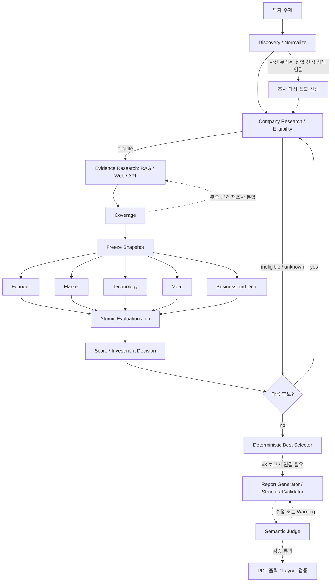

# AI Startup Investment Evaluation Agent

Physical AI / Robotics 스타트업의 투자 조사·평가를 위한 **LangGraph Multi-Agent RAG** 프로젝트입니다.

## Overview

### Objective

투자 주제에 맞는 기업을 조사하고 스타트업 여부를 확인한 뒤, 출처가 있는 근거로 후보를 비교하고 투자 검토 보고서를 생성하는 것을 목표로 합니다.

### Method

- **근거 기반 조사:** 승인된 문서의 RAG 검색과 Web·API 자료를 Evidence로 연결하고 출처·페이지·검색 기록을 보존합니다.
- **병렬 평가:** Founder, Market, Technology, Moat, Business & Deal의 5개 branch가 6개 영역을 평가합니다.
- **결정적 계산:** 창업자 5 / 시장성 30 / 제품·기술력 25 / 경쟁 우위 20 / 실적 10 / 투자조건 10의 비중을 사용합니다. LLM은 항목별 판단과 근거를 생성하고, 점수·투자 판단·최종 선정은 코드가 계산합니다.
- **결측·실패 구분:** Missing은 분모에 남기고 정당한 N/A만 제외합니다. 기술 실패를 투자 비추천이나 임의 점수로 바꾸지 않습니다.

> 단일 기업 **Physical Intelligence 로컬 라이브 데모(#180)**는 준비된 실제 자료 검색 → 모델 분석 → 보고서·PDF 생성 경로입니다. [아래](#로컬-라이브-데모-재현-180) 재현 가이드를 따르세요. 임의 기업 탐색·적격성·정량 점수·추천을 포함하는 **전체 live 실행은 미완료**이며, 이 데모로 그 완료를 주장하지 않습니다.

## Features

| 기능                    | 현재 상태                                                                                               | 구현 근거                                                                                                        |
| ----------------------- | ------------------------------------------------------------------------------------------------------- | ---------------------------------------------------------------------------------------------------------------- |
| 후보 탐색·정규화·적격성 | fixture 흐름과 기업 조사 adapter 구현                                                                   | [agents](src/skala_rag/agents/), [company_research.py](src/skala_rag/tools/company_research.py)                  |
| 출처 추적형 Evidence    | 검색 provenance·승인 corpus gate·근거 수집 구현                                                         | [rag](src/skala_rag/rag/), [evidence_collector.py](src/skala_rag/agents/evidence_collector.py)                   |
| PDF 원문 추출           | 페이지·locator 보존 추출 및 로컬 runner 구현; OCR·시각 자료 미지원                                      | [extraction.md](src/skala_rag/rag/extraction.md)                                                                 |
| Coverage·불변 snapshot  | 결측 검사·근거 참조 검증·평가 입력 고정                                                                 | [coverage_v3.py](src/skala_rag/scoring/coverage_v3.py), [snapshot.py](src/skala_rag/graph/snapshot.py)           |
| 병렬 평가·최종 선정     | v3 fixture controller와 결정적 점수·selector 구현                                                       | [evaluation_v3.py](src/skala_rag/graph/evaluation_v3.py), [selector_v3.py](src/skala_rag/scoring/selector_v3.py) |
| 외부 호출 제어          | readiness·예산·retry runtime과 structured-output adapter 구현                                           | [runtime.py](src/skala_rag/tools/runtime.py), [runtime_llm.py](src/skala_rag/tools/runtime_llm.py)               |
| 보고서 생성·검증        | v3 Generator/Judge·한글 HTML/PDF 구현; #180 단일 기업 무점수 live 데모 검증, 전체 투자 평가 통합과 구분 | [reporting](src/skala_rag/reporting/), [로컬 데모](docs/implementation/local-demo.md)                            |

## Tech Stack

| 구분                 | 기술 및 상태                                                                                                                                   |
| -------------------- | ---------------------------------------------------------------------------------------------------------------------------------------------- |
| Language / Package   | Python 3.11+, uv                                                                                                                               |
| Framework            | LangGraph `StateGraph`, LangChain Core                                                                                                         |
| LLM / Generator      | OpenAI `gpt-4.1-mini-2025-04-14` structured-output adapter. #180 무점수 데모에서 실제 보고서 생성 검증; 전체 투자 평가 완료를 뜻하지 않습니다. |
| LLM / Judge          | #180에서 별도 실제 Judge 호출 검증. fixture 테스트는 주입형 stub과 구분합니다.                                                                 |
| Retrieval / VectorDB | `GuardedRetriever`와 provenance 검증, #180 로컬 BGE 인덱스 준비·검색 사용. **운영 VectorDB 미선정.**                                           |
| Retrieval Metrics    | **Hit Rate@K: 미실측 / MRR: 미실측.**                                                                                                          |
| Embedding            | **`BAAI/bge-m3` 선정.** #180은 revision 고정 로컬 인덱스를 사용합니다. 데모 성공을 검색 품질 벤치마크나 E5/KURE 비교 결과로 표시하지 않습니다. |
| Data / Documents     | Pydantic v2, pypdf, langchain-text-splitters                                                                                                   |
| HTTP / Quality       | httpx, ruff, pytest                                                                                                                            |

## Agents

| Agent                      | 역할                                                | 주요 데이터           |
| -------------------------- | --------------------------------------------------- | --------------------- |
| **1. 스타트업 판별 Agent** | 투자 단계, Exit 여부 등을 확인해 평가 대상인지 판별 | DB + 외부 조회        |
| **2. 투자 평가 Agent**     | 창업자·기술·시장·재무 등의 투자 지표 평가           | **DB + RAG**          |
| **3. 보고서 평가 Agent**   | 생성된 투자 보고서의 근거성·일관성·누락 검증        | **DB + RAG + 보고서** |
| **4. 스타트업 탐색 Agent** | 뉴스/검색 결과에서 기업을 찾아 후보를 추출          | 검색 결과             |

## Architecture

아래는 **v3 목표 흐름과 구현 경계**입니다. 실선은 fixture 중심 후보 controller·평가·선정 흐름이고, 점선은 별도 통합이 필요한 목표입니다. 개별 adapter 구현이 전체 live 연결 완료를 의미하지 않습니다.



상세 목표는 [아키텍처 문서](docs/implementation/architecture.md)를 참조합니다.

## Directory Structure

```text
skala-rag/
├── configs/                # 점수 정책·rubric
├── docs/
│   ├── design/             # 설계 자료
│   ├── implementation/     # 계약·정책·승인·검증 기록
│   └── raws/               # 원문 (읽기 전용)
├── src/skala_rag/
│   ├── agents/             # 탐색·적격성·근거 추출·평가
│   ├── contracts/          # DTO·State·공통 인터페이스
│   ├── graph/              # 후보·병렬 평가·snapshot·보고서 흐름
│   ├── prompts/            # 사실 추출·기술 평가 prompt
│   ├── rag/                # corpus gate·검색·PDF 추출 runner
│   ├── reporting/          # context·생성·구조 검증
│   ├── scoring/            # coverage·점수·판단·selector
│   └── tools/              # 외부 adapter·안전한 fetch·runtime
├── tests/                  # unit·contract·integration·가상 fixture
├── pyproject.toml
└── uv.lock
```

## Usage

### 설치 및 자동 검증

Python 3.11 이상과 uv가 필요합니다. 저장소 루트에서 실행합니다.

```bash
uv sync
uv run ruff check .
uv run ruff format --check .
uv run pytest
```

기본 테스트는 fixture·mock 중심입니다. 실제 원문이나 API가 필요한 opt-in 테스트는 조건이 없으면 건너뜁니다. fixture 통과를 live 성능 검증으로 해석하지 않습니다.

### 로컬 라이브 데모 재현 (#180)

앱·자료·검색은 로컬이지만 모델 분석에는 OpenAI API와 인터넷이 필요합니다.
최초 실행은 원문·BGE-M3 모델 다운로드가 필요하므로 시연 전에 준비합니다.

1. 저장소 루트에서 설치·자료 준비:

   ```bash
   uv sync
   uv run playwright install chromium
   uv run python -c 'from pathlib import Path; from skala_rag.demo_prepare import prepare_demo; print(prepare_demo(root=Path.cwd()))'
   ```

   기존 manifest의 π0·π0.5 논문과 검토 텍스트 해시를 검증하고 검색 인덱스를 준비합니다.
   원문/모델은 `data/local/`, 인덱스는 `outputs/issue180-local-bge/`에 저장합니다.
   Linux에서 Chromium OS 의존성이 없으면 `uv run playwright install --with-deps chromium`이 필요합니다.

2. `OPENAI_API_KEY`를 환경변수 또는 프로젝트 `.env`에 설정합니다. 키를 이슈·로그에 게시하지 않습니다.
   **실행자의 명시적 비용 승인을 받은 뒤**, [승인 파일 작성과 재승인 절차](docs/implementation/local-demo.md#키와-승인)에 따라
   `data/local/demo180-approval.json`을 준비합니다. 저장소에는 키·개인 승인 파일이 포함되지 않습니다.
   한도는 누적 **US$3 / LLM 30회 / 20분**, 자동 재시도 없음입니다.

3. 로컬 서버 실행:

   ```bash
   uv run python -c 'from skala_rag.demo_web import serve; serve()'
   ```

4. `http://127.0.0.1:8765` 접속 → **Physical Intelligence** 또는 **피지컬 인텔리전스** 입력 → 실행.
   검색·다섯 역할 분석·Generator·Judge·PDF 진행 후 완료 상태를 확인합니다.
5. 기업명과 보고서를 확인하고 근거별 발췌·페이지·원문 출처를 확인합니다.
   **Evidence(근거)와 Source(원문)는 다릅니다.** 한 논문에서 여러 근거가 검색될 수 있으며,
   검색된 모든 근거가 최종 보고서에서 인용되는 것은 아닙니다.
6. **PDF 다운로드** → 해당 파일을 PDF 뷰어에서 열어 기업명·한글·근거 목록·참고문헌을 확인합니다.
   생성 결과는 `outputs/demo180-<run-id>/`의 `report.html`, `report.md`, `report.pdf`와
   `run-result.json`에 남습니다. 실패/Warning은 성공이 아니며 PDF 파일 존재만으로 검증하지 않습니다.

재시작은 서버 프로세스를 종료한 뒤 같은 명령으로 실행합니다. 과거 실행 UI는 복원되지 않으며
과거 산출물은 디스크에 유지됩니다. **재시작으로 승인 시간·예산은 초기화되지 않습니다.**
실패/만료 시 자동 재실행하지 말고 영수증과 승인 상태를 확인합니다.
오류별 조치·데이터 위치·검증 범위는 [상세 데모 안내](docs/implementation/local-demo.md)를 참조하세요.

## Contributors

| GitHub                 | 수행 역할                                                                                                                                                                                                                   |
| ---------------------- | --------------------------------------------------------------------------------------------------------------------------------------------------------------------------------------------------------------------------- |
| luk0715 (박태준)       | 협업 규칙·프로젝트 초기 설정(#1, #4), 입력·후보·근거 DTO(#5), v3 설계 정합화·v3 DTO·운영 정책(#35, #73, #82), Coverage(#20), Graph 골격·병렬 평가 단계(#23, #24), 기준일 판정 수정(#99), M2 provider·RAG 실험 승인(#43)     |
| xxhigh (김근홍)        | M0 정책 결정 승인(#3), 평가·점수·보고서 DTO와 결정적 ID(#6), RAG 코퍼스·페이지 산정(#13), 보고서 목차·인용 계약(#14), 평가 snapshot 고정(#21)                                                                               |
| heojiwon2 (허지원)     | InvestmentState(#7), Tool·LLM·clock 주입 인터페이스(#8), 후보 탐색·적격성(#17, #18), retrieve·Evidence Collector(#19), 재조사 loop(#25), 보고서 생성·수정 loop(#28), 코퍼스 manifest gate(#44, #91), 안전한 외부 fetch(#46) |
| wjd990819-ops (정순욱) | criterion catalog·정책 fixture(#9), 공통 가상 fixture(#12), State reducer(#15), retrieve·Evidence Collector(#19)                                                                                                            |
| XXXXXim (심혁)         | 23개 criterion rubric·재무 단위 규칙(#10, #11), 점수 집계·투자 판단과 DTO 어댑터(#16, #68), 영역 평가 wrapper(#22), ReportContext(#26), Structural Validator(#27), 재무 Evidence 단위·기간 검증(#53)                        |
| hanyujin2002 (한유진)  | 데이터·RAG 설계 및 문서화, 문서 유형별 Chunking·Embedding 전략 정리, DB/RAG 데이터 흐름 및 평가 Agent 연계 구조 설계                                                                                                        |
