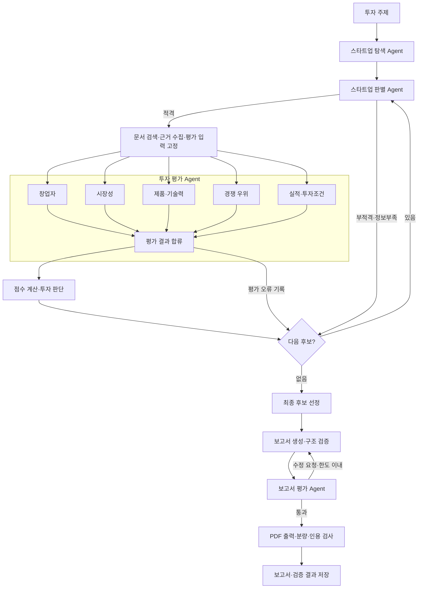

# AI Startup Investment Evaluation Agent

Physical AI / Robotics 스타트업의 투자 가능성을 조사·평가하는 **LangGraph Multi-Agent RAG** 실습 프로젝트다. 기업 정보와 기술 문서에서 근거를 수집하고, 평가 항목별 분석과 출처를 포함한 투자 검토 보고서를 생성한다.

## Overview

**현재 목표: 전체 actual-v3 완성.** [현재 구현·실제 검증·남은 작업](docs/implementation/actual-v3-status.md)을 기준으로 읽는다. #219/#220의 [Offline v3 합성 데모](docs/implementation/offline-delivery.md)는 완료 이력이다. #222에서 보유 실제 기업 자료를 새 로컬 `ToolResult`로 변환해 public Source-only graph에 연결했지만, 두 후보는 `unknown`이며 점수·선정·보고서는 없다. 실제 5개 평가 branch, 의미 심사, 점수·선정, Judge·최종 PDF와 재현은 아직 완료되지 않았다. #96/#168은 OPEN/blocked다.

본문 5절과 마지막 REFERENCE 목차는 승인됐으며 #223/PR #225로 구현·병합·검증됐다: `SUMMARY` → `COMPANY & TEAM` → `TECHNOLOGY` → `MARKET` → `INVESTMENT ASSESSMENT & RISKS` → `REFERENCE`. 현재 main 기준은 `a830c7d7271544eefe4a9447401291e788fdfb74`다. 합성 PDF·캐시 기반 clean clone 재현 검증은 실제 기업 평가·유료 실행·최종 발행 승인이나 전체 actual-v3 완료가 아니다.

- **Objective:** 비상장·Seed~Series C·Exit 미완료 스타트업을 대상으로 창업자, 시장성, 제품·기술력, 경쟁 우위, 실적, 투자조건을 분석한다.
- **Method:** AI Agent의 역할 분담과 Agentic RAG를 결합한다. PDF·웹·API에서 수집한 근거로 LLM이 항목별 분석을 작성하고, 점수 계산·후보 선정·인용 검증은 코드가 수행한다.
- **평가 기준:** 창업자 5 / 시장성 30 / 제품·기술력 25 / 경쟁 우위 20 / 실적 10 / 투자조건 10의 가중치를 사용한다. 자료가 부족한 항목은 결측으로 보존하고, 적용 제외 근거가 있는 항목만 계산 분모에서 제외한다.

여러 후보의 조사·평가·선정 흐름은 가상 데이터로 실행할 수 있다. 기존 **Physical Intelligence 단일 기업 로컬 데모**는 실제 논문 검색, 다섯 역할의 모델 분석, 보고서 생성·검증과 PDF 출력 경로를 제공한다. 이 경로의 구현과 과거 실행 이력은 전체 actual-v3 성공과 별개다. 실행 방법과 실측 한계는 [로컬 라이브 데모 재현 가이드](#로컬-라이브-데모-재현-180)를 참조한다.

## Features

| 기능 | 구현 내용 |
| --- | --- |
| PDF 자료 기반 정보 추출 | 페이지와 원문 위치를 보존한 텍스트 추출, 승인 문서·텍스트 해시 검증 |
| 문서 검색·근거 추적 | BGE-M3 임베딩, SQLite 인덱스, cosine 검색, 기업·출처·기준일 필터, 검색 결과와 보고서 인용 연결 |
| 기업 조사·적격성 판별 | 후보 정규화·중복 제거, 공식 홈페이지·OpenDART 조회, 투자 단계·상장·Exit 여부 검사 |
| 투자 지표 평가 | 여섯 영역·23개 항목 평가, 가상 후보의 가중 점수·최종 후보 선정, 로컬 데모의 역할별 100점 환산 |
| 보고서 생성·평가 | 요약, 기업·팀, 기술, 시장, 투자 평가·위험, 참고문헌 생성. 별도 LLM Judge가 근거성·일관성·평가 근거 검사 |
| 한글 HTML·PDF 출력 | 점수표, 원문 발췌·페이지·참고문헌 제공. A4·최대 5페이지·요약 반 페이지 이내 검증 |
| 실행 기록·비용 제어 | 검색·모델 호출·평가 결과·파일 해시 저장, 호출·시간·비용 상한과 재승인 처리 |

PDF 검색은 텍스트를 대상으로 한다. 로컬 데모는 준비된 π0·π0.5 논문을 사용하며, 근거가 없는 역할의 점수는 공란으로 표시한다. 임의 기업의 자동 탐색부터 투자 추천까지 연결하는 실제 데이터 통합은 후속 작업이다.

## Tech Stack

| 구분 | 기술·버전 |
| --- | --- |
| Language / Package | Python `>=3.11`, uv |
| Framework | LangGraph `1.2.12`, LangChain Core `1.6.6` |
| LLM / Generator | OpenAI Responses API, `gpt-4.1-mini-2025-04-14` |
| LLM / Judge | `gpt-4.1-mini-2025-04-14`를 별도로 호출하여 보고서와 평가 근거 검증 |
| Retrieval / VectorDB | SQLite 로컬 dense 인덱스, exact cosine 검색, metadata 필터·cache |
| Retrieval Metrics | **Hit Rate@K: 미실측 / MRR: 미실측** |
| Embedding | `BAAI/bge-m3` 고정 revision, 1024차원·L2 정규화; sentence-transformers `5.7.0`, PyTorch `2.14.0` |
| Data / Documents | Pydantic `2.13.5`, pypdf `6.19.0`, langchain-text-splitters `1.1.2` |
| HTML / PDF | Playwright `1.63.0`·Chromium, ReportLab `4.4.9` |
| HTTP / Quality | httpx `0.28.1`, pytest `9.1.1`, Ruff `0.16.9` |

패키지 버전은 [uv.lock](uv.lock), 의존성 설정은 [pyproject.toml](pyproject.toml)을 기준으로 한다. 모델 준비·인덱스 검증은 [로컬 임베딩 안내](docs/implementation/local-bge-validation.md)에 정리되어 있다.

## Agents

| Agent                      | 역할                                                | 주요 데이터           |
| -------------------------- | --------------------------------------------------- | --------------------- |
| **1. 스타트업 판별 Agent** | 투자 단계, Exit 여부 등을 확인해 평가 대상인지 판별 | DB + 외부 조회        |
| **2. 투자 평가 Agent**     | 창업자·기술·시장·재무 등의 투자 지표 평가           | **DB + RAG**          |
| **3. 보고서 평가 Agent**   | 생성된 투자 보고서의 근거성·일관성·누락 검증        | **DB + RAG + 보고서** |
| **4. 스타트업 탐색 Agent** | 뉴스/검색 결과에서 기업을 찾아 후보를 추출          | 검색 결과             |

투자 평가 Agent 내부에서는 Founder, Market, Technology, Moat, Business & Deal의 다섯 역할이 여섯 평가 영역을 담당한다. Business & Deal은 실적과 투자조건을 함께 다룬다.

## Architecture

가상 후보로 실행하는 전체 평가 흐름이다. 후보는 순차 처리하고 후보 내부의 다섯 평가는 병렬로 실행한다.



로컬 라이브 데모는 **단일 기업 입력 → 로컬 문서 검색 → 다섯 역할의 순차 분석 → 보고서 생성 → Judge → 한글 PDF** 경로를 사용한다. 실행 구조는 [후보 평가 graph](src/skala_rag/graph/)와 [로컬 데모](src/skala_rag/local_demo.py)에서 확인할 수 있다.

## Directory Structure

```text
skala-rag/
├── data/                   # 문서 metadata·로컬 원문·임베딩 모델
├── configs/                # 평가 기준·점수 정책·PDF 설정
├── docs/                   # 설계·구현·실행 안내, 읽기 전용 원문
├── examples/               # 한글 보고서 생성 예제
├── src/skala_rag/
│   ├── agents/             # 기업 탐색·판별·투자 평가
│   ├── contracts/          # 공통 데이터 모델·인터페이스
│   ├── graph/              # 후보 처리·병렬 평가·보고서 흐름
│   ├── prompts/            # 정보 추출·평가 프롬프트
│   ├── rag/                # PDF 추출·임베딩·인덱스·검색
│   ├── reporting/          # 보고서 생성·평가·HTML/PDF
│   ├── scoring/            # 근거 충족 검사·점수 계산·후보 선정
│   ├── tools/              # 외부 API·자료 수집·호출 예산
│   ├── demo_prepare.py     # 원문·모델·검색 인덱스 준비
│   ├── local_demo.py       # 실제 모델을 사용하는 단일 기업 분석
│   └── demo_web.py         # 로컬 웹 앱 실행
├── tests/                  # 단위·계약·통합·브라우저 테스트
├── outputs/                # 검색·평가 결과·보고서·실행 기록
├── README.md
├── pyproject.toml
└── uv.lock
```

## Usage

### 설치·테스트·빌드

Python 3.11 이상과 uv를 사용하며, 아래 명령은 저장소 루트 기준이다.

```bash
uv sync --frozen
uv run ruff check .
uv run ruff format --check .
uv run pytest -ra
uv build
```

브라우저 테스트는 Chromium 설치 후 실행한다. 실제 기업조사·기술평가 테스트는 각각 `SKALA_LIVE_COMPANY_RESEARCH=1`, `SKALA_LIVE_TECHNOLOGY_EVAL=1`과 해당 입력·API 설정을 요구한다. 브라우저 제외 실행은 `uv run pytest -m "not browser"`, 브라우저만 실행은 `uv run pytest -m browser`를 사용한다.

**과거 검증 이력:** 기준 커밋 `a4abe79`의 전체 테스트는 **2,748개 통과·4개 실패·2개 건너뜀**이었다. 당시 실패는 기본 ReportLab 보고서의 페이지 제한 검사와 관련되며, 한글 HTML·Chromium PDF와 로컬 데모의 모의 응답 통합 테스트는 통과했다. 현재 tree의 실패 목록이 아니다. #222 최종 tree의 과거 gate와 별도 실제 source-proof 검증은 [현재 상태 문서](docs/implementation/actual-v3-status.md#검증-이력과-해석)에 구분해 기록한다.

API 없는 합성 데모는 준비된 의존성 캐시에서 `uv sync --frozen --offline` 후 `uv run --offline --frozen python examples/v3_offline_demo.py`로 실행한다. fresh clone만으로 실제 기업 archive·승인 PDF·모델·index가 생기지는 않는다. 캐시와 로컬 자산, opt-in actual 테스트의 환경변수 및 재배포 권한 전제는 [팀원 재현 전제](docs/implementation/actual-v3-status.md#팀원-재현-전제)를 따른다.

가상 후보 전체 실행은 [Python 실행 예제](docs/implementation/python-execution.md), API 호출 없는 한글 보고서 예제는 `uv run python examples/korean_report_fixture.py`를 사용한다. Docker·Compose·GitHub Actions·배포 설정은 현재 저장소에 추가되어 있지 않다.

### 로컬 라이브 데모 재현 (#180)

macOS/Linux에서 앱·자료·검색을 로컬로 실행하고, 모델 분석·Generator·Judge는 OpenAI API를 사용한다. 최초 원문·BGE-M3 다운로드는 시연 전에 준비한다.

1. 저장소 루트에서 설치·자료 준비:

   ```bash
   uv sync --frozen
   uv run playwright install chromium
   uv run python -c 'from pathlib import Path; from skala_rag.demo_prepare import prepare_demo; print(prepare_demo(root=Path.cwd()))'
   ```

   π0·π0.5 논문과 검토 텍스트 해시를 검증하고 검색 인덱스를 준비한다.
   원문·모델은 `data/local/`, 인덱스는 `outputs/issue180-local-bge/`에 저장한다.
   Linux에서 Chromium OS 의존성이 없으면 `uv run playwright install --with-deps chromium`을 실행한다.

2. `OPENAI_API_KEY`를 환경변수 또는 프로젝트 `.env`에 설정한다.
   **실행자의 명시적 비용 승인을 받은 뒤**, [승인 파일 작성과 재승인 절차](docs/implementation/local-demo.md#키와-승인)에 따라
   `data/local/demo180-approval.json`을 준비한다. 키와 승인 파일은 로컬에서 관리한다.
   한도는 누적 **US$3 / LLM 30회 / 20분**이며, 자동 재시도는 비활성화되어 있다.

3. 로컬 서버 실행:

   ```bash
   uv run python -c 'from skala_rag.demo_web import serve; serve()'
   ```

4. `http://127.0.0.1:8765` 접속 → **Physical Intelligence** 또는 **피지컬 인텔리전스** 입력 → 실행.
   검색·다섯 역할 분석·Generator·Judge·PDF 진행 상태를 확인한다.
5. 기업명·역할별 점수·분석 내용과 근거별 발췌·페이지·원문 출처를 확인한다.
   Evidence는 인용 근거, Source는 원문 문서 단위이며 한 논문에서 여러 근거가 검색될 수 있다.
   보고서의 근거 목록은 실제 인용한 항목으로 구성한다.
6. 완료 후 **PDF 다운로드** → PDF 뷰어에서 기업명·한글·점수표·근거 목록·참고문헌을 확인한다.
   생성 결과는 `outputs/demo180-<run-id>/`의 `report.html`, `report.md`, `report.pdf`와
   `run-result.json`에 남는다. 완료 여부는 `status`, `report_verified`, `pdf_verified`로 확인한다.
   역할별 점수와 산정 근거는 `role-scores.json`, `scoring-rubric.json`에 저장한다.

서버는 같은 명령으로 재시작한다. 실행 화면은 새로 시작하며, 과거 산출물과 누적 사용량·승인 기한은 디스크에 유지된다. 실패·만료 후에는 실행 기록과 승인 상태를 확인하고 [재승인 절차](docs/implementation/local-demo.md#키와-승인)를 따른다.

**검증 범위:** 역할별 점수 산정과 PDF 출력은 모의 응답을 사용하는 통합 테스트로 검증했다. 점수 기능 추가 후 기록된 실제 API 실행은 원문 인용 검증에서 중단되어, 점수를 포함한 실제 보고서·PDF는 추가 실측이 필요하다. 오류별 조치와 실행 기록은 [상세 데모 안내](docs/implementation/local-demo.md)를 참조한다.

### 설정·자료 관리

평가 기준은 [configs/rubrics/](configs/rubrics/), 가중치·PDF 설정은 [configs/](configs/), 원문과 검토 metadata는 [data/manifests/](data/manifests/)에서 관리한다. 로컬 데모 외의 OpenDART 조회는 `OPENDART_API_KEY`를 별도로 사용한다. 데모의 `.env` 읽기는 해당 실행 함수에서 처리하며, 다른 Python 직접 호출에는 환경변수를 명시적으로 전달한다.

## Contributors

병합된 코드·커밋과 PR 기록을 기준으로 정리한 개인별 수행 내용이다.

| 이름 | GitHub | 수행 내용 |
| --- | --- | --- |
| 박태준 | luk0715 | 프로젝트 초기 설정·설계·공통 데이터 계약, 병렬 평가·최종 후보 선정, 경쟁 우위·사업/투자조건 평가, 로컬 라이브 데모, 한글 HTML/PDF와 점수 시각화 |
| 김근홍 | xxhigh | 평가·보고서 데이터 모델, 평가 근거 고정·외부 호출 예산, BGE-M3 임베딩·SQLite 검색, 실행 결과 저장과 보고서 Generator·Judge 연결 |
| 허지원 | heojiwon2 | 후보 탐색·적격성 판별, State·도구 인터페이스, 웹 자료 수집·근거 추출, 부족 자료 재조사, 보고서 수정 흐름 |
| 정순욱 | wjd990819-ops | 평가 항목·공통 테스트 데이터, 상태·근거 병합과 근거 충족 검사, PDF 페이지·구조 보존 추출, 구조화 LLM 응답 처리, ReportLab PDF 생성·검증 |
| 심혁 | XXXXXim | 23개 항목 평가 기준·재무 규칙, 점수 계산·투자 판단, 기술 평가, OpenDART 재무 조회·단위 검증, 보고서 입력 조립·구조 검증 |
| 한유진 | hanyujin2002 | 데이터·RAG 설계, 문서 분할·임베딩 전략, 창업자 평가, 전체 흐름 시나리오 테스트, 검색 응답·환율·보고서 상태·Markdown 검증 개선 |
