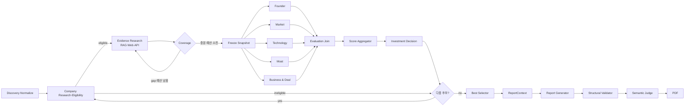

# skala-rag

Physical AI / Robotics 스타트업의 투자 조사·평가를 위한 수업용
LangGraph Multi-Agent RAG 프로젝트다. 실제 투자 실행 시스템은 아니다.

[#35 전환 승인](https://github.com/rice-steamed-water/skala-rag/issues/35#issuecomment-5902877317)에 따라 새 구현은 **v3**를 따른다. baseline 승인 기록·코드는 호환성/이력으로 보존한다. 후속 [#82 운영 승인](https://github.com/rice-steamed-water/skala-rag/issues/82)은 Missing/N/A·0분모·최종 selector·exact 점수 경계·재조사 회계·completed Warning/CLI2를 확정했다. [사전 선정 승인](https://github.com/rice-steamed-water/skala-rag/issues/35#issuecomment-5903574761)은 **평가 전 조사·평가 대상 집합을 무작위로 선정**하는 것이며 단순 순서 shuffle도 최종 selector의 무작위 변경도 아니다. dedup·Eligibility는 유지한다. 새 후보 수·난수/seed·보충 선정, rubric rule/품질·Evidence gate·PDF 상세·provider/corpus/live 예산은 OPEN으로 추적한다. 승인과 구현 가용성은 [결정 목록](docs/implementation/decisions.md)에서 구별한다.

## Overview

Physical AI / Robotics 투자 주제를 입력하면 후보 스타트업을 찾고, 적격성(비상장·Seed~Series C·Exit 없음)을 확인한 뒤, 출처가 있는 근거(RAG·Web·API)로 6개 영역을 평가하고 결정적 규칙으로 점수·투자 판단을 내려 **투자 검토 보고서**를 만드는 LangGraph Multi-Agent + Agentic RAG 시스템이다. 수업 과제이며 실제 투자 실행 시스템이 아니다.

- 평가 영역·비중: 창업자 5 / 시장성 30 / 제품·기술력 25 / 경쟁 우위 20 / 실적 10 / 투자조건 10 (D01)
- 점수와 label은 LLM이 아니라 순수 함수가 계산한다. LLM은 criterion별 판단(rating·근거·결측 사유)만 만든다.
- 현재 구현은 **fixture(가상 데이터) 기반 전체 흐름**까지다. live 수집·embedding index·실제 PDF는 M2·M3 진행 중이다.

## Features

| 기능 | 상태 | 위치 |
| --- | --- | --- |
| 공통 계약(DTO)·결정적 ID·State·reducer | 구현 | `contracts/`, `graph/reducers*.py` |
| 후보 탐색·정규화, 기업 조사·적격성 판정 | fixture 구현 | `agents/discovery.py`, `agents/eligibility.py` |
| RAG 검색·Evidence 수집(provenance), 코퍼스 manifest·200페이지 gate | fixture 구현 | `rag/`, `agents/evidence_collector.py` |
| Coverage·ResearchGap, 재조사 loop와 후보별 예산 | fixture 구현 | `scoring/coverage*.py`, `graph/` |
| 평가 snapshot 고정·참조 폐쇄성 | 구현 | `graph/snapshot.py` |
| 영역 평가 wrapper(LLM 출력 검증·구조 수정 1회·failure envelope) | fixture LLM 구현 | `agents/evaluation.py` |
| 5개 병렬 평가·합류(v3 atomic branch) | 구현 | `graph/evaluation_v3.py` |
| 23개 criterion rubric(1–5), 재무 단위·기간 검증(T21) | 제안 rubric·구현 | `configs/rubrics/`, `scoring/finance.py` |
| 점수 집계·투자 판단(결측 분모·저점수·임계값) | 구현 | `scoring/aggregate.py`, `decide.py`, `summary.py`, `v3_policy.py` |
| ReportContext 조립·구조 검증(SV01–SV09), 보고서 생성·수정 loop | fixture 구현 | `reporting/` |
| 안전한 외부 fetch·출처 snapshot | 구현 | `tools/` |
| CLI runner·live adapter·Semantic Judge·PDF | 진행 중 | #29, #45, #94, #95 |

## Tech Stack

| 구분 | 사용 |
| --- | --- |
| 언어·패키지 | Python 3.11+, uv |
| Agent·workflow | LangGraph (StateGraph, 병렬 fan-out/join), LangChain Core |
| 데이터 계약 | Pydantic v2 (strict DTO, Decimal 점수) |
| 문서 처리 | langchain-text-splitters, pypdf |
| HTTP | httpx |
| Embedding | BGE-M3 선정 기록(#43); 버전 고정 index 구축은 #52 |
| 품질 | ruff, pytest |

## Agents

| Agent / Node | 책임 | 구현 |
| --- | --- | --- |
| Startup Discovery · Candidate Normalize | 투자 주제로 후보 탐색·중복 제거·정규화 | fixture |
| Company Research · Eligibility | 기업 식별·상장/Exit/라운드 근거로 적격성 판정 | fixture |
| Evidence Research (RAG / Web / API) | 근거 수집, RAG provenance, 부족 근거 재조사 | fixture |
| Coverage · Freeze Snapshot | 결측 비중 판정, 평가용 불변 snapshot 생성 | 구현 |
| Founder / Market / Technology / Moat / Business & Deal Evaluation | rubric 기준 criterion 판단(병렬 5개, 6개 영역) | fixture LLM |
| Score Aggregator · Investment Decision | 결정적 점수 계산과 label·grade 판정 | 구현 |
| Best Candidate Selector | 전체 후보 중 최종 선정 | 진행 중(#89) |
| Report Generator · Structural Validator · Semantic Judge | 보고서 작성, 구조·인용 검증, 의미 검증·수정 | 생성·구조 검증 fixture, Judge 진행 중 |

## Architecture

전체 흐름은 [아키텍처 문서](docs/implementation/architecture.md#2-전체-graph--승인된-v3-방향운영-규칙의-구현-목표)의 Mermaid에 있다. 요약:



## Directory Structure

```text
skala-rag/
├── configs/            # draft 점수 정책(scoring.draft.json), rubric(core/finance.yaml)
├── docs/
│   ├── implementation/ # 아키텍처·계약·점수·데이터/RAG·보고서·결정 목록
│   └── raws/           # 원문(수정 금지)
├── src/skala_rag/
│   ├── contracts/      # 공통 DTO·ID·State(baseline·v3)
│   ├── graph/          # 후보 Graph·평가 병렬 단계·snapshot·reducer
│   ├── agents/         # 탐색·적격성·근거 수집·영역 평가 wrapper
│   ├── tools/          # fixture 도구·안전한 fetch
│   ├── rag/            # 코퍼스 manifest·검색
│   ├── scoring/        # 집계·판정·coverage·재무 검증
│   ├── reporting/      # ReportContext·형식·생성·구조 검증
│   └── prompts/
└── tests/              # unit·contract·integration·fixtures(가상 데이터)
```

## 설치

pinned 통합 기준 `906312a`에는 baseline DTO/State/reducer/catalog/점수·재무 helper·DTO adapter뿐 아니라 #17 발견/Normalize, #18 fixture 조사·Eligibility, #19 GuardedRetriever/EvidenceCollector, #22 dimension 평가 wrapper, #23 fixture 후보 Graph, #26 ReportContext, #27 baseline Structural Validator 및 #73/PR #74의 독립 `contracts.v3` 구조 DTO가 있다. #23은 baseline 첫 추천 인계이며 v3 전 후보 selector가 아니다. v3 구조 DTO는 계산·selector·0분모/Warning controller·State/Graph 연결을 실행하지 않는다. CLI·보고서 생성/Judge·실 PDF·live RAG는 여전히 목표다.

Python 3.11 이상과 [uv](https://docs.astral.sh/uv/getting-started/installation/)가
필요하다. 저장소 루트에서 실행한다.

```bash
uv sync
```

런타임 직접 의존성은 아래 7개뿐이며 개발 도구는 `ruff`, `pytest`뿐이다.
Python `>=3.11`을 유지하며 uv가 해석한 호환 버전을 `uv.lock`에 기록한다.
tutorial의 과거 하한 버전이나 전체 의존성 목록은 복사하지 않았다.
`.env.example`은 향후 설정 이름 안내용이며 현재 코드에서 읽지 않는다.
검증에는 API key나 `.env`가 필요하지 않다.

## 의존성 선택과 경계

| 직접 의존성 | 용도와 제한 |
| --- | --- |
| `langgraph` | State reducer 및 fixture 후보 Graph; v3 workflow 연결은 미구현 |
| `pydantic` | baseline 및 독립 v3 구조 DTO 검증; v3 정책 실행은 아님 |
| `langchain-core` | 중립적인 Document·message·prompt 인터페이스; 가상 Document·HumanMessage와 ChatPromptTemplate의 변수 포맷팅·invoke 결과를 검증, 모델 client 없음 |
| `langchain-text-splitters` | 문서 분할 유틸리티; 명시적 테스트 전용 크기·overlap은 운영 chunk 정책 선택이 아님 |
| `httpx` | HTTP client; MockTransport만 검증하며 특정 API·provider를 선택하지 않음 |
| `python-dotenv` | `dotenv_values(stream=StringIO(...))`로 가짜 값만 명시적 파싱; 환경 변경·자동 `load_dotenv()`·실제 `.env` 읽기 없음 |
| `pypdf` | PDF 읽기와 페이지 metadata 확인; BytesIO 빈 페이지 write/read만 검증, renderer·OCR·투자 보고서 생성이 아님 |

`langchain-core`와 `httpx`는 이미 `langgraph`의 전이 의존성이었다.
호환성 테스트에서 명시적으로 사용하고 향후 공통 경계에서도 사용할 유틸리티이므로
직접 의존성으로 선언했다. 애플리케이션 기능을 추가한 것은 아니다.

tutorial의 omnibus/community/experimental, deepagents·supervisor·swarm·MCP는
현재 골격에 필요하지 않아 보류한다. provider 통합·Tavily는 서비스와 접근 조건 검토 전,
FAISS·embedding·PyTorch는 모델·저장소 선택 전, Postgres·Redis는 checkpoint 설계 전이므로
추가하지 않는다. notebook/Jupyter, 금융 데이터, plotting, RAG 평가 패키지와
추가 Office/PDF 도구도 아직 구현·검증할 사용 경로가 없어 보류한다.
[공통 계약](docs/implementation/contracts.md)과
[데이터·RAG 설계](docs/implementation/data-rag.md)의 경계를 따르며,
[결정 목록](docs/implementation/decisions.md)의 OPEN 상태는 바꾸지 않는다.
특히 D07(embedding·vector store), D09(renderer)는 승인하지 않았다.
`pypdf` 페이지 metadata 검증은 PDF 렌더링 품질 검증이 아니다.

## Usage

설치 후 아래 명령으로 패키지·구조 DTO·fixture를 검증한다. 초기 패키지 작업에서 확인한 명령이며,
각 PR은 해당 head에서 실행한 명령·환경·결과를 별도로 기록한다. 애플리케이션 실행 명령은 아직 없다.

```bash
uv run ruff check .
uv run ruff format --check .
uv run pytest
uv lock --check
.venv/bin/python -I -m pytest
```

초기 패키지 작업(#4)의 검증 환경은 Python 3.11.9이며 당시 `uv sync --python 3.11.9`도 확인했다.
호환성 테스트는 가상 문자열, `MockTransport`의 `fixture.invalid` 응답,
가짜 dotenv `StringIO`, 빈 PDF `BytesIO`만 사용한다. 네트워크 연결·모델 다운로드·
실제 기업 자료·비밀 설정 없이 설치된 공개 API를 검증하며 운영 RAG 성능 검증은 아니다.

## 구조와 문서

- `src/skala_rag/contracts/`: #5·#6 baseline DTO·결정적 ID·State와 별도 `v3.py` 구조 DTO
- `src/skala_rag/scoring/catalog.py`, `configs/scoring.draft.json`: #9 fixture 전용 draft catalog 로더·설정; v3 집계·판정 구현 아님
- `src/skala_rag/graph/reducers.py`: ID 병합·충돌 검증 및 State 연결; `graph/candidates.py`에 baseline fixture 후보 Graph
- `src/skala_rag/scoring/aggregate.py`, `decide.py`: baseline 집계·판정 순수 함수; v3 계약과 다름
- `src/skala_rag/scoring/summary.py`: baseline 계산값을 #6 ScoreSummary·InvestmentDecision으로 연결하는 adapter
- `src/skala_rag/scoring/finance.py`: 재무 파생값·검증 helper; rating/rubric 승인과 별개
- `agents`, `tools`, `rag`, `reporting`: fixture 조사/수집·평가 wrapper·보고서 context/구조 검증; live·생성/Judge·PDF는 미구현
- `tests/contract/`, `tests/fixtures/contracts.json`: 구조 DTO/state 검증 fixture·tests; 테스트 총수는 실행 결과로만 보고
- `tests/unit/`, `tests/integration/`: 각 작업의 별도 검증 범위
- [구현 가이드](docs/README.md): 승인된 v3 방향과 미결정 세부 설계
- [협업 규칙](CONTRIBUTING.md): 이슈·브랜치·개발 환경 규칙

## Contributors

닫힌 이슈 담당·PR 작성 기록 기준 개인별 수행 역할(D10: 실명 매핑은 제출 전 팀 확인, PM/PL 역할 제외).

| GitHub | 수행 역할 |
| --- | --- |
| luk0715 | 협업 규칙·프로젝트 초기 설정(#1, #4), 입력·후보·근거 DTO(#5), v3 설계 정합화·v3 DTO·운영 정책(#35, #73, #82), Coverage(#20), Graph 골격·병렬 평가 단계(#23, #24), 기준일 판정 수정(#99), M2 provider·RAG 실험 승인(#43) |
| xxhigh | M0 정책 결정 승인(#3), 평가·점수·보고서 DTO와 결정적 ID(#6), RAG 코퍼스·페이지 산정(#13), 보고서 목차·인용 계약(#14), 평가 snapshot 고정(#21) |
| heojiwon2 (허지원) | InvestmentState(#7), Tool·LLM·clock 주입 인터페이스(#8), 후보 탐색·적격성(#17, #18), retrieve·Evidence Collector(#19), 재조사 loop(#25), 보고서 생성·수정 loop(#28), 코퍼스 manifest gate·200페이지 한도(#44, #91), 안전한 외부 fetch(#46) |
| wjd990819-ops | criterion catalog·정책 fixture(#9), 공통 가상 fixture(#12), State reducer(#15), retrieve·Evidence Collector(#19) |
| XXXXXim (심혁) | 23개 criterion rubric·재무 단위 규칙(#10, #11), 점수 집계·투자 판단과 DTO 어댑터(#16, #68), 영역 평가 wrapper(#22), ReportContext(#26), Structural Validator(#27), 재무 Evidence 단위·기간 검증(#53) |

## Fixture CLI (#29)

저장소 루트에서 다음 명령을 실행한다.

```bash
uv run python -m skala_rag.cli --theme 'Physical AI robotics' --config tests/fixtures/cli-input.json
```

고정된 가상 후보 두 개를 v3 controller와 다섯 병렬 평가 branch로 처리한다.
입력 주제는 manifest에 기록하며, 실제 검색이나 주제별 기업 발견은 수행하지 않는다.
`outputs/<run_id>/`에 `candidate-result.json`, `trace.json`, `draft.md`,
`manifest.json`을 저장한다. 점수는 반올림 없이 decimal 문자열로 보존한다.
산출물은 가상 데이터이고 외부 호출·유료 LLM·모델 다운로드는 없다.

현재 #94의 v3 보고서 context adapter가 없어 draft는 진단용이며 검증된 보고서가
아니다. adapter가 없는 실행은 `failed`/`technical_failure`, CLI exit 1로
종료하고 `run-result.json`에 `REPORT_ADAPTER_UNAVAILABLE` 사유를 저장한다. 보고서 수정 소진의 `completed`+Warning+exit 2와 구별한다.
구조·의미·PDF 검증과 final 발행은 미실행이다.
프로그램 주입용 `ReportCompletion` fixture 경계는 같은 draft/context/hash의 검사만
받는다. 구조·의미 수정 2회 소진은 `completed`+Warning+exit 2와 현재 draft/findings를
보존한다. fixture 통과도 `acceptance=fixture_only`, `publication_allowed=false`이며
검증된 제출용 final을 발행하지 않는다. 실제 v3 adapter 연결은 #94 이후 작업이다. `--mode live` 또는 live 설정은
실행 전에 거절한다. 전체 live runner는 #96 범위다.
