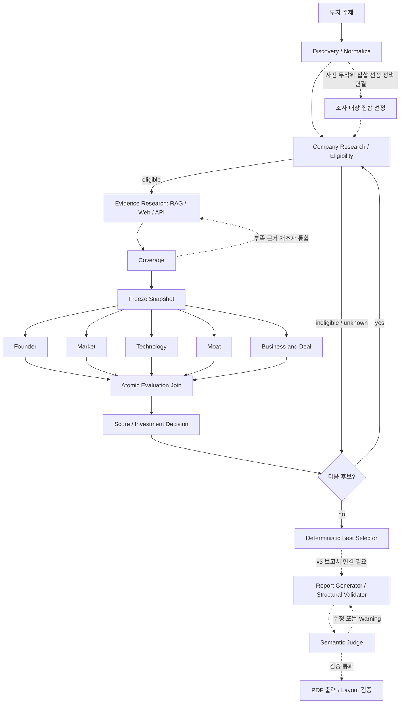

# AI Startup Investment Evaluation Agent

Physical AI / Robotics 스타트업의 투자 조사·평가를 위한 **LangGraph Multi-Agent RAG** 프로젝트입니다. 수업용 투자 검토 시스템이며 실제 투자 실행 시스템은 아닙니다.

## Overview

### Objective

투자 주제에 맞는 스타트업을 조사하고 비상장·Seed~Series C·Exit 미완료 여부를 확인한 뒤, 출처가 있는 근거로 후보를 비교하고 투자 검토 보고서를 생성하는 것을 목표로 합니다.

### Method

- **근거 기반 조사:** 승인된 문서의 RAG 검색과 Web·API 자료를 Evidence로 연결하고 출처·페이지·검색 기록을 보존합니다.
- **병렬 평가:** Founder, Market, Technology, Moat, Business & Deal의 5개 branch가 6개 영역을 평가합니다.
- **결정적 계산:** 창업자 5 / 시장성 30 / 제품·기술력 25 / 경쟁 우위 20 / 실적 10 / 투자조건 10의 비중을 사용합니다. LLM은 항목별 판단과 근거를 생성하고, 점수·투자 판단·최종 선정은 코드가 계산합니다.
- **결측·실패 구분:** Missing은 분모에 남기고 정당한 N/A만 제외합니다. 기술 실패를 투자 비추천이나 임의 점수로 바꾸지 않습니다.

> 현재는 fixture 기반 v3 후보 처리·병렬 평가·점수·최종 selector와 개별 외부 adapter·PDF 원문 추출이 구현되어 있습니다. 실제 embedding index, v3 보고서 연결, Semantic Judge·최종 PDF 출력까지 포함한 **전체 live 실행은 미완료**입니다.

## Features

| 기능 | 현재 상태 | 구현 근거 |
| --- | --- | --- |
| 후보 탐색·정규화·적격성 | fixture 흐름과 기업 조사 adapter 구현 | [agents](src/skala_rag/agents/), [company_research.py](src/skala_rag/tools/company_research.py) |
| 출처 추적형 Evidence | 검색 provenance·승인 corpus gate·근거 수집 구현 | [rag](src/skala_rag/rag/), [evidence_collector.py](src/skala_rag/agents/evidence_collector.py) |
| PDF 원문 추출 | 페이지·locator 보존 추출 및 로컬 runner 구현; OCR·시각 자료 미지원 | [extraction.md](src/skala_rag/rag/extraction.md) |
| Coverage·불변 snapshot | 결측 검사·근거 참조 검증·평가 입력 고정 | [coverage_v3.py](src/skala_rag/scoring/coverage_v3.py), [snapshot.py](src/skala_rag/graph/snapshot.py) |
| 병렬 평가·최종 선정 | v3 fixture controller와 결정적 점수·selector 구현 | [evaluation_v3.py](src/skala_rag/graph/evaluation_v3.py), [selector_v3.py](src/skala_rag/scoring/selector_v3.py) |
| 외부 호출 제어 | readiness·예산·retry runtime과 structured-output adapter 구현 | [runtime.py](src/skala_rag/tools/runtime.py), [runtime_llm.py](src/skala_rag/tools/runtime_llm.py) |
| 보고서 생성·검증 | baseline fixture 생성·구조 검증·수정 loop 구현; v3 연결·실제 Judge·출력 PDF는 후속 작업 | [reporting](src/skala_rag/reporting/), [report.py](src/skala_rag/graph/report.py) |

## Tech Stack

| 구분 | 기술 및 상태 |
| --- | --- |
| Language / Package | Python 3.11+, uv |
| Framework | LangGraph `StateGraph`, LangChain Core |
| LLM / Generator | 승인된 추출·평가용 snapshot: OpenAI `gpt-4.1-mini-2025-04-14`. Structured-output adapter 구현. 보고서 Generator는 주입형 fixture 구현으로, 이 모델의 승인 범위가 전체 live 보고서 생성 완료를 뜻하지는 않습니다. |
| LLM / Judge | Semantic Judge 인터페이스·fixture stub 제공. 실제 Judge 전용 모델 선정·live 연결은 미완료입니다. |
| Retrieval / VectorDB | `GuardedRetriever`·fixture 검색 및 provenance 검증 구현. **운영 VectorDB 미선정, 실제 embedding index 미구축.** SQLite dense store는 과거 실험 제안이며 채택된 운영 저장소가 아닙니다. |
| Retrieval Metrics | **Hit Rate@K: 미실측 / MRR: 미실측.** fixture 결과를 검색 성능으로 표시하지 않습니다. |
| Embedding | **`BAAI/bge-m3` 선정.** revision 고정·실제 embedding/index 구축·품질 검증은 별도 작업입니다. E5/KURE와의 3종 비교는 수행하지 않습니다. |
| Data / Documents | Pydantic v2, pypdf, langchain-text-splitters |
| HTTP / Quality | httpx, ruff, pytest |

모델·저장소 결정은 [M2 승인 기록](docs/implementation/m2-live-approval-proposal.md), 정책과 남은 OPEN 항목은 [결정 목록](docs/implementation/decisions.md), 실제 의존성은 [pyproject.toml](pyproject.toml)을 참조합니다.

## Agents

| Agent / Node | 역할 | 구현 범위 |
| --- | --- | --- |
| Startup Discovery / Normalize | 후보 발견·중복 제거·정규화 | fixture·주입 인터페이스 |
| Company Research / Eligibility | 기업 식별·라운드·상장·Exit 확인 | 조사·사실 추출 adapter 및 적격성 판정 |
| Evidence Research / Coverage | 근거 수집·검색 추적·부족 근거 확인 | fixture 흐름·추출·Coverage 구현 |
| Founder Evaluation | 창업자 인물 귀속을 확인한 근거 평가 | 전용 fixture wrapper |
| Market Evaluation | 시장 규모·성장성·진입 시점 평가 | 공통 평가 wrapper·fixture |
| Technology Evaluation | 기업 RAG 근거로 기술 평가, criterion→Evidence→Chunk 추적 | 전용 adapter; live는 승인 rubric·입력·예산 조건 필요 |
| Moat Evaluation | 경쟁 우위·방어력 평가 | 공통 평가 wrapper·fixture |
| Business & Deal Evaluation | 실적·투자조건 두 차원을 원자적으로 반환 | v3 branch·합류 계약 |
| Score / Decision / Best Selector | 점수·label 계산, 전체 후보 처리 후 최종 선정 | v3 구현 |
| Report Generator / Validator / Judge | 보고서 생성·구조·인용·의미 검증 | baseline fixture loop; 실제 Judge·v3 연결 미완료 |

## Architecture

아래는 **v3 목표 흐름과 구현 경계**입니다. 실선은 fixture 중심 후보 controller·평가·선정 흐름이고, 점선은 별도 통합이 필요한 목표입니다. 개별 adapter 구현이 전체 live 연결 완료를 의미하지 않습니다.



[v3 후보 controller](src/skala_rag/graph/candidates_v3.py)는 보고서 호환성 공백을 명시합니다. [baseline 보고서 graph](src/skala_rag/graph/report.py)는 별도 fixture 경로입니다. PDF **원문 추출**과 최종 보고서 PDF **렌더링**은 다른 기능입니다. 상세 목표는 [아키텍처 문서](docs/implementation/architecture.md)를 참조합니다.

## Directory Structure

```text
skala-rag/
├── configs/                # 점수 정책·rubric
├── docs/
│   ├── design/             # 설계 자료
│   ├── implementation/     # 계약·정책·승인·검증 기록
│   └── raws/               # 원문 (읽기 전용)
├── src/skala_rag/
│   ├── agents/             # 탐색·적격성·근거 추출·평가
│   ├── contracts/          # DTO·State·공통 인터페이스
│   ├── graph/              # 후보·병렬 평가·snapshot·보고서 흐름
│   ├── prompts/            # 사실 추출·기술 평가 prompt
│   ├── rag/                # corpus gate·검색·PDF 추출 runner
│   ├── reporting/          # context·생성·구조 검증
│   ├── scoring/            # coverage·점수·판단·selector
│   └── tools/              # 외부 adapter·안전한 fetch·runtime
├── tests/                  # unit·contract·integration·가상 fixture
├── pyproject.toml
└── uv.lock
```

## Usage

### 설치 및 자동 검증

Python 3.11 이상과 uv가 필요합니다. 저장소 루트에서 실행합니다.

```bash
uv sync
uv run ruff check .
uv run ruff format --check .
uv run pytest
```

기본 테스트는 fixture·mock 중심입니다. 실제 원문이나 API가 필요한 opt-in 테스트는 조건이 없으면 건너뜁니다. fixture 통과를 live 성능 검증으로 해석하지 않습니다.

### 구현된 실행 경로

전체 투자 평가용 `app.py`·`cli.py`는 아직 없습니다. 독립 실행 가능한 PDF 추출 runner의 옵션은 다음 명령으로 확인합니다.

```bash
uv run python -m skala_rag.rag.extraction_runner --help
```

실제 추출에는 승인 manifest·원문·Source·설정 JSON이 필요합니다. [추출 실행 안내](src/skala_rag/rag/extraction.md)에 필수 인자와 종료 코드가 정리되어 있습니다. 원문은 `data/local/`, 결과는 `outputs/`에 두고 커밋하지 않습니다. 이 runner는 embedding이나 최종 투자 보고서를 생성하지 않습니다.

개발·통합 시에는 [구현 가이드](docs/README.md), [공통 데이터 계약](docs/implementation/contracts.md), [Adapter runtime](docs/implementation/adapter-runtime.md), [협업 규칙](CONTRIBUTING.md)을 확인합니다. API key·`.env`·원문·생성 index는 커밋하지 않습니다.

## Contributors

닫힌 이슈 담당·PR 작성 기록 기준 개인별 수행 역할(D10: 실명 매핑은 제출 전 팀 확인, PM/PL 역할 제외).

| GitHub | 수행 역할 |
| --- | --- |
| luk0715 (박태준) | 협업 규칙·프로젝트 초기 설정(#1, #4), 입력·후보·근거 DTO(#5), v3 설계 정합화·v3 DTO·운영 정책(#35, #73, #82), Coverage(#20), Graph 골격·병렬 평가 단계(#23, #24), 기준일 판정 수정(#99), M2 provider·RAG 실험 승인(#43) |
| xxhigh (김근홍) | M0 정책 결정 승인(#3), 평가·점수·보고서 DTO와 결정적 ID(#6), RAG 코퍼스·페이지 산정(#13), 보고서 목차·인용 계약(#14), 평가 snapshot 고정(#21) |
| heojiwon2 (허지원) | InvestmentState(#7), Tool·LLM·clock 주입 인터페이스(#8), 후보 탐색·적격성(#17, #18), retrieve·Evidence Collector(#19), 재조사 loop(#25), 보고서 생성·수정 loop(#28), 코퍼스 manifest gate(#44, #91), 안전한 외부 fetch(#46) |
| wjd990819-ops (정순욱) | criterion catalog·정책 fixture(#9), 공통 가상 fixture(#12), State reducer(#15), retrieve·Evidence Collector(#19) |
| XXXXXim (심혁) | 23개 criterion rubric·재무 단위 규칙(#10, #11), 점수 집계·투자 판단과 DTO 어댑터(#16, #68), 영역 평가 wrapper(#22), ReportContext(#26), Structural Validator(#27), 재무 Evidence 단위·기간 검증(#53) |
