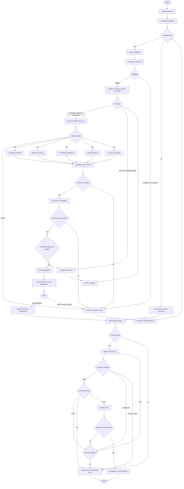

# 아키텍처와 실행 흐름

[문서 홈](../README.md) · [공통 계약](contracts.md) · [결정 목록](decisions.md)

근거: 원문 §2, §4, §8 및 §12 교수님 노션 D. 아래는 **D03·D04·D08 승인을 전제로 한 구현 제안**이다. 원문의 Mermaid 복사본이 아니라, 누락된 종료·합류·실패 경로를 보완한 구현용 흐름이다.

## 1. 역할을 나누는 기준

| 종류 | 책임 | 예 |
| --- | --- | --- |
| Tool-using Agent | 제한된 도구 집합에서 조사 계획·도구 선택·근거 추출 | Discovery, Company Research, Evidence Collector, Targeted Research |
| Structured-output LLM Node | 제공된 근거를 정해진 schema로 해석 | 영역 평가, 투자조건 평가, 판단 설명, 보고서, Semantic Judge |
| Deterministic Node | 검증·산술·상태 전이 | Normalize, Eligibility, Coverage, Merge, Aggregate, Router, Structural Validator |

LLM이 산술을 수행하거나 정책 임계값을 변경하지 않는다. 도구 결과의 본문은 분석 대상 데이터이며 에이전트 지시문이 아니다.

## 2. 전체 Graph — 제안



오류 처리 공통 규칙은 §6에 정의한다. 그림에 모든 API 오류선을 넣지는 않았다. 적격성 정보 부족에 대한 보강 조사는 `Company Research` 내부의 bounded 작업이며 공통 후보 조사 예산에 포함된다.

## 3. 노드별 입출력과 완료 조건

| 노드 | 읽기 | 쓰기 / 완료 조건 |
| --- | --- | --- |
| Discovery | theme, 국가/언어 범위, 후보 상한 | DiscoveryBundle의 후보와 Source payload를 저장; discovery_source_ids 참조 확인, 검색 실패와 0건 구별 |
| Normalize | 원시 후보 | `Candidate[]`; 동일 법인 중복 제거, 동명이인 임의 병합 금지 |
| Select Candidate | candidates, candidate_index | current_candidate_id, 후보 상태; 리스트 밖 접근 방지 |
| Company Research | Candidate, 수집 도구 | CompanyProfile, StageInfo, Evidence, RetrievalRecord |
| Eligibility | CompanyProfile와 관련 Evidence | `eligible/ineligible/unknown`; 각 조건의 이유·근거 |
| Evidence Collector | 후보, 평가 기준, 문서 manifest | 검증된 Evidence와 수집 기록; 실제 RAG 호출 포함 |
| Coverage | criterion catalog, 후보 Evidence | CoverageResult와 ResearchGap; 판단 기준은 scoring 문서 |
| Targeted Research / Merge | 구체적인 gap, 잔여 예산 | 신규 Evidence와 새 수집 provenance 병합; snapshot에서 보이는 내용/경로가 바뀌면 evidence_revision 증가 |
| Freeze Evidence Revision | 현 후보 근거·평가 정책·Source/Chunk/수집 기록, 최종 EligibilityResult | 세대 증가 후 EvaluationSnapshot payload 복사·참조 검증·저장; 이후 불변. 참조 누락 또는 적격성 근거 무효화는 `SNAPSHOT_INVALID`로 해당 후보 failed → archive → advance |
| 5 Evaluation Nodes | 같은 후보·세대·근거 snapshot | wrapper가 각자의 `EvaluationResult` 반환; 자료 missing과 기술 failure 구별 |
| Evaluation Join | 해당 세대의 다섯 terminal result | 모두 성공일 때만 evaluations 저장. failure가 있으면 후보 failed → archive → advance; 누락은 전체 timeout/오류 처리 |
| Deal Terms Evaluation | 같은 근거 snapshot, 투자조건 rubric | 여섯 번째 영역 EvaluationResult. 성공 저장 후 gap 검사, 실패 시 집계 없이 후보 archive |
| Missing Check | 여섯 평가 결과, 조사 예산 | 재조사할 gap 합집합 또는 집계 진입 |
| Score Aggregator | 여섯 영역, 승인된 정책 | ScoreSummary; 순수 함수로 구현 |
| Decision Policy + 설명 | ScoreSummary, Eligibility | 정책이 label 결정, LLM은 근거·리스크·한계 서술만 추가 |
| Candidate Archive / Advance | 판정 또는 적격성·오류 사유 | 후보 결과 보존; index를 정확히 한 번 증가 |
| Record selection + ReportInput | RECOMMEND 판정, 후보 결과 이력 | 선택 후보 outcome·selected_candidate_id 기록, 미처리 후보 `not_evaluated` outcome 기록, `single_candidate` ReportInput 생성 |
| Summary | 종료된 후보 결과 전체 | 추천 없음 또는 조사 미완료를 구별한 `no_recommendation` ReportInput |
| Build ReportContext | ReportInput, 최종 State의 평가/판정·snapshot·출처 | 모든 참조를 해소한 payload context 고정. 불완전/모순이면 CONTEXT_INVALID로 실패 |
| Report Generator | 검증된 ReportContext, 직전 feedback | ReportDraft; context의 실제 근거·서지정보만 사용 |
| Structural Validator | ReportDraft, 같은 ReportContext, 승인 policy | 섹션·schema·인용·Reference와 원래 점수/판정 일치 검증 |
| Semantic Judge | draft, 같은 ReportContext | 원래 평가·실제 근거와 대조해 pass/revise/fail. upstream 오류는 fail |
| PDF Renderer / Layout Validator | 검증된 draft, 고정 템플릿 | PDF와 페이지/요약영역 검증; 렌더링 실패는 완료가 아님 |

## 4. 병렬 실행과 데이터 소유권

원문은 공유 State의 dictionary에 `operator.or_`, 이력에 `operator.add`를 제안한다. 실제 구현에서는 **동일 키 충돌과 재실행**을 먼저 다룬다.

- 후보는 직렬, Founder / Market / Technology / Moat / Traction만 병렬로 시작한다.
- 평가 wrapper는 `evaluation_results`에 자신의 key와 terminal result만 반환한다. `current_candidate_id`, index, retry count, 공통 gap 목록, 성공 `evaluations`를 동시에 수정하지 않는다. 오류 객체도 failure envelope로 보내 join controller가 State.errors에 기록한다.
- 모든 branch는 같은 `candidate_id`, `evaluation_round`, `evidence_revision`, `snapshot_id`와 그 payload 복사본을 읽는다. 현재 State.evidence를 다시 읽어 snapshot에 없는 근거를 끼워 넣지 않는다.
- 합류는 **이번 세대의 다섯 terminal result**를 기다린다. 다섯 성공일 때만 평가 결과를 승격하고, 하나라도 failure이면 후보를 실패 처리한다. 과거 세대 결과가 dictionary에 있다는 이유로 통과하지 않는다.
- 다섯 성공을 확인한 합류 노드가 gap을 단독 생성한다. 직렬 투자조건 controller가 여섯 번째 성공 결과와 gap을 추가한다. 어느 단계의 기술 실패도 일부 점수 집계로 이어지지 않는다.
- 재조사 후 MVP는 다섯 노드 전체와 투자조건을 새 세대로 다시 평가한다. 영향 영역만 재평가하는 최적화는 나중에 한다.

**공식 API 확인 [LG1, LG2]:** State의 각 key는 reducer에 따라 갱신된다. 여러 시작 노드 이름을 받는 `add_edge([...], end)`는 모든 시작 노드 완료를 기다린다. 고정 다섯 노드 합류는 이 형태로 표현하고, 실제 설치 버전의 통합 테스트로 동작을 확인한다.

```python
# 연결 형태 설명용: builder와 각 노드는 아직 저장소에 구현되지 않았다.
builder.add_edge(
    ["founder", "market", "technology", "moat", "traction"],
    "evaluation_join",
)
```

일반 결과 map은 동일 ID·동일 payload 재삽입을 무시하고, 동일 ID·다른 payload는 오류로 처리한다. **Evidence는 동일 core에서 provenance 집합 병합을 허용하고, Source는 같은 core의 최초 수집 시각을 보존하는 예외**를 둔다([계약 §3](contracts.md)). 신규 RAG 경로가 추가되면 새 snapshot 세대에 반영하되 기존 snapshot은 변경하지 않는다. 새로운 평가에는 새로운 세대 key를 부여한다. 전체 State가 아닌 변경 부분만 반환한다.

## 5. 반복 예산과 종료 — D08 제안

| 설정 | 제안값 | 의미 |
| --- | --- | --- |
| `max_candidates` | 5 | normalize 이후 후보 상한; 후보 고갈 때 무한 재발견하지 않음 |
| `max_research_retries_per_candidate` | 2 | 적격성 보강·coverage 보강·평가 후 보강을 합친 **추가 조사 batch 수**; 최초 수집 제외 |
| `max_tool_calls_per_research_batch` | 8 | 최초 수집/추가조사 각 batch 안의 도구 호출 상한; 네트워크 재시도도 호출로 계산 |
| `max_report_revisions` | 2 | 최초 생성 이후 구조·의미·layout 실패에 대한 **공유 수정 횟수** |
| `max_tool_retries` | 2 | 일시 오류에 한해 최초 시도 이후 추가 네트워크 시도 |
| `tool_timeout_seconds` | 30 | 단일 도구 시도 제한 |
| `run_timeout_seconds`, `max_llm_calls`, `max_cost` | 미정 | live 실행 전 환경·모델 기준으로 승인·설정. 비어 있으면 live 시작 거절 |

조사 횟수는 요청 **전에** 단독 controller가 올린다. 도구 오류로 신규 Evidence가 없어도 사용한 batch는 되돌리지 않는다. 반복 횟수, 도구 호출, LLM 호출, 비용·총시간 한도를 모두 적용하고, 먼저 소진된 제한을 따른다. 예상 비용을 확인할 수 없으면 임의 무제한 실행 대신 중단한다.

- coverage 부족 + 조사 여유: 부족 항목만 검색.
- coverage 부족 + 예산 소진/유효한 신규 근거 없음: 더 돌지 않고 missing을 유지해 평가·보류 또는 추천 없음 요약으로 이동.
- `WATCHLIST/PASS`: 결과 저장 후 다음 후보. 같은 후보를 다시 선택하지 않음.
- 모든 후보가 부적격/unknown/보류/비추천: 사유가 있는 요약 생성. 후보 자체가 0건이어도 빈 성공 보고서 대신 “평가 후보 없음”을 명시.
- 첫 `RECOMMEND`: 단일 기업 보고서. 나머지는 `not_evaluated`로 남기고 전체 후보 중 최고라는 표현을 쓰지 않음.
- 보고서 수정 한도 소진: `workflow_status=failed`, 초안·검증 오류 저장; 최종본으로 내보내지 않음.

Graph 전체 step 제한은 보조 안전장치다. 이를 정상 종료 정책이나 후보별 예산 대신 사용하지 않는다.

## 6. 실패와 관측

| 상황 | 처리 |
| --- | --- |
| 검색 0건 | `empty` 수집 기록, missing gap. 실제 조회 자체는 성공 |
| API timeout / 일시 오류 | 제한된 backoff 재시도; 초과 시 `ToolFailure` |
| 인증·권한 부족 | `unavailable`; 반복 로그인·무한 재시도 금지 |
| 일부 보조 도구 실패 | failure를 기록하고 대체 근거만 사용. 신뢰도를 지어내지 않음 |
| 핵심 RAG 미구축 / 정책 미승인 / 필수 provider 전부 실패 | 정상 투자 결과 대신 workflow failed; 진단 산출물 보존 |
| LLM 출력 schema 오류 | 제한된 구조 수정 1회 제안; 계속 실패하면 실패 표시. 검증 실패를 0점으로 대체하지 않음 |
| 평가 branch 실패 | wrapper가 failure envelope 반환, join이 오류를 저장하고 후보 archive → advance; 일부 성공만으로 추천 금지 |
| 직렬 Deal Terms 실패 | 같은 failure envelope를 직렬 controller가 저장하고 후보 archive → advance; 집계 금지 |
| Semantic Judge `fail` | 재수정으로 보내지 않고 workflow failed, draft·findings·오류 보존. `revise`만 공유 수정 예산 사용 |
| 평가 snapshot 참조 누락 / 적격성 근거 무효화 | `SNAPSHOT_INVALID` 오류 저장, 해당 후보만 failed → archive → advance. 불완전 snapshot으로 평가 LLM을 호출하지 않음 |
| 보고서 context 참조 불일치 또는 upstream 평가·점수 오류 | CONTEXT_INVALID/UPSTREAM_INVALID로 workflow failed. 보고서 loop가 upstream 사실·평가·점수를 수정하지 않음 |
| PDF 렌더러 실패 | 원인 기록, 일시 실패면 도구 재시도 적용. 최종 실패는 workflow failed |
| 실행 총예산/시간 소진 | 신규 호출 중지, 현재 결과·오류 보존, workflow failed. 검증되지 않은 보고서는 draft |

노드별 `run_id`, candidate, step, duration, input/output ID, 모델·prompt·policy 버전, 사용량, 오류 코드를 남긴다. key와 비공개 원문은 로그에 기록하지 않는다. 모든 후보가 도구 오류로 실패했다면 “투자비추천”이 아니라 “조사 실패”이며 workflow도 failed다.

## 공식 기술 참고

2026-09-29 확인. 버전 고정과 실행 검증은 M0/M1 담당 업무이며, 문서 확인은 구현 완료 증거가 아니다.

```text
[LG1] LangChain — Graph API overview, State / Reducers
https://docs.langchain.com/oss/python/langgraph/graph-api
[LG2] LangChain Reference — StateGraph.add_edge
https://reference.langchain.com/python/langgraph/graph/state/StateGraph/add_edge
```
