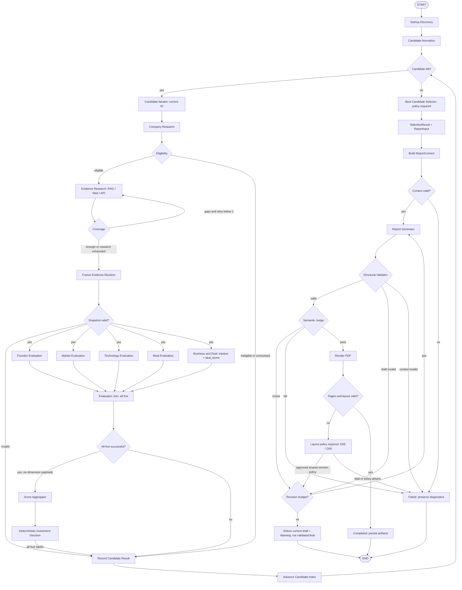

# 아키텍처와 실행 흐름

[문서 홈](../README.md) · [공통 계약](contracts.md) · [결정 목록](decisions.md)

근거: [v3](../design/design-v3.html) B-1, D-1–D-3, E. **Evidence Research 단일 책임, 5 branch/6 dimension, 전 후보 처리 후 selector, 재조사·수정 최대 2회와 Warning 반환은 v3 목표**다. snapshot·atomic envelope·오류 controller·PDF 경로 등 보완 계약은 D03·D04·D08·D09의 승인 전 제안이다. 현재 구현 여부는 [기준 snapshot](design-v3-alignment.md)과 구별한다.

## 1. 역할을 나누는 기준

| 종류 | 책임 | 예 |
| --- | --- | --- |
| Tool-using Agent | 제한된 도구 집합에서 조사 계획·도구 선택·근거 추출 | Discovery, Company Research, Evidence Research(RAG/Web/API 초기·gap 조사) |
| Structured-output LLM Node | 제공된 근거만 해석, 직접 검색 없음 | 5개 평가 branch, 선택적 판단 설명, 보고서, Semantic Judge |
| Deterministic Node | 검증·산술·상태 전이 | Normalize, Iterator, Eligibility, Coverage, Merge, Join, Aggregate, Decision, Best Candidate Selector, Validator |

LLM이 산술을 수행하거나 정책 임계값을 변경하지 않는다. 도구 결과의 본문은 분석 대상 데이터이며 에이전트 지시문이 아니다.

## 2. 전체 Graph — 제안



오류 처리 공통 규칙은 §6이다. 그림은 승인 정책이 주입된 실행 형태를 설명하며 없는 정책을 노드가 생성하지 않는다. Company Research의 적격성 unknown 보강·최소 Evidence gate와 Evidence Research의 Coverage 재조사는 구별한다(D05·D06·D08 OPEN). 모든 normalize된 후보를 처리하고 적격 후보만 평가한다. 예산/취소 등의 예외 중단을 전 후보 정상 처리로 표시하지 않는다. 별도 Targeted Research나 평가 후 재조사 화살표는 v3 기본 흐름에 없다.

## 3. 노드별 입출력과 완료 조건

| 노드 | 읽기 | 쓰기 / 완료 조건 |
| --- | --- | --- |
| Discovery | theme, 국가/언어 범위, 후보 상한 | DiscoveryBundle의 후보와 Source payload를 저장; discovery_source_ids 참조 확인, 검색 실패와 0건 구별 |
| Normalize | 원시 후보 | `Candidate[]`; 동일 법인 중복 제거, 동명이인 임의 병합 금지 |
| Candidate Iterator | candidates, candidate_index | current_candidate_id, 후보 상태; 리스트 밖 접근 방지. 최종 selected ID를 쓰지 않음 |
| Company Research | Candidate, 수집 도구 | CompanyProfile, StageInfo, Evidence, RetrievalRecord |
| Eligibility | CompanyProfile와 관련 Evidence | `eligible/ineligible/unknown`; 각 조건의 이유·근거 |
| Evidence Research | 후보, 평가 기준, manifest, Coverage gaps | 최초 수집·부족 근거 재조사 모두 수행; 실제 RAG/Web/API 이력과 Evidence |
| Coverage | criterion catalog, 후보 Evidence | CoverageResult와 ResearchGap; 판단 기준은 scoring 문서 |
| Evidence Research의 Merge controller | 신규 Evidence, Source/Chunk, provenance | 참조 검증 후 병합; snapshot에서 보이는 내용/경로가 바뀌면 evidence_revision 증가 |
| Freeze Evidence Revision | 현 후보 근거·평가 정책·Source/Chunk/수집 기록, 최종 EligibilityResult | 세대 증가 후 EvaluationSnapshot payload 복사·참조 검증·저장; 이후 불변. 참조 누락 또는 적격성 근거 무효화는 `SNAPSHOT_INVALID`로 해당 후보 failed → archive → advance |
| 5 Evaluation Branches | 같은 후보·세대·근거 snapshot | founder/market/technology/moat/business_deal 각각 terminal envelope; 마지막은 traction·deal_terms 둘 다 필수 |
| Evaluation Join | 해당 세대의 다섯 terminal result | 모두 성공일 때 여섯 dimension Evaluation을 원자적으로 저장. failure/부분 payload면 후보 failed → archive → advance; 누락은 전체 timeout/오류 처리 |
| Score Aggregator | 여섯 영역, 승인된 정책 | ScoreSummary; 순수 함수로 구현 |
| Decision Policy + 설명 | ScoreSummary, Eligibility | 정책이 label 결정, LLM은 근거·리스크·한계 서술만 추가 |
| Candidate Archive / Advance | 판정 또는 적격성·오류 사유 | 후보 결과 보존; index를 정확히 한 번 증가 |
| Best Candidate Selector | 전 후보 outcome, 적격 후보 판정·점수, 승인 selection policy | deterministic SelectionResult와 selected_candidate_id; 모든 후보 처리 전 호출 금지, 순위·동점 등 D03 OPEN |
| ReportInput controller | SelectionResult, 전 후보 이력 | 적격 후보 없음은 selected=None 및 사유. 전부 WATCHLIST/PASS·평가 실패의 선택/mode는 D03 정책에 따름 |
| Build ReportContext | ReportInput, 최종 State의 평가/판정·snapshot·출처 | 모든 참조를 해소한 payload context 고정. 불완전/모순이면 CONTEXT_INVALID로 실패 |
| Report Generator | 검증된 ReportContext, 직전 feedback | ReportDraft; context의 실제 근거·서지정보만 사용 |
| Structural Validator | ReportDraft, 같은 ReportContext, 승인 policy | 섹션·schema·인용·Reference와 원래 점수/판정 일치 검증 |
| Semantic Judge | draft, 같은 ReportContext | 원래 평가·실제 근거와 대조해 pass/revise/fail. upstream 오류는 fail |
| PDF Renderer / Layout Validator | 검증된 draft, 고정 템플릿 | PDF와 페이지/요약영역 검증; 렌더링 실패는 완료가 아님 |

## 4. 병렬 실행과 데이터 소유권

원문은 공유 State의 dictionary에 `operator.or_`, 이력에 `operator.add`를 제안한다. 실제 구현에서는 **동일 키 충돌과 재실행**을 먼저 다룬다.

- 후보는 직렬, Founder / Market / Technology / Moat / Business & Deal의 다섯 branch는 병렬로 시작한다.
- 평가 wrapper는 `evaluation_results`에 자신의 key와 terminal result만 반환한다. `current_candidate_id`, index, retry count, 공통 gap 목록, 성공 `evaluations`를 동시에 수정하지 않는다. 오류 객체도 failure envelope로 보내 join controller가 State.errors에 기록한다.
- 모든 branch는 같은 `candidate_id`, `evaluation_round`, `evidence_revision`, `snapshot_id`와 그 payload 복사본을 읽는다. 현재 State.evidence를 다시 읽어 snapshot에 없는 근거를 끼워 넣지 않는다.
- 합류는 **이번 세대의 다섯 terminal result**를 기다린다. 다섯 성공일 때만 평가 결과를 승격하고, 하나라도 failure이면 후보를 실패 처리한다. 과거 세대 결과가 dictionary에 있다는 이유로 통과하지 않는다.
- branch ID는 `founder/market/technology/moat/business_deal`, dimension ID는 `founder/market/technology/moat/traction/deal_terms`다. [계약 §4](contracts.md)의 envelope/key 매핑을 따른다. Business & Deal의 둘 중 하나만 정상이어도 branch 성공으로 처리하지 않는다.
- Join만 여섯 성공 Evaluation을 저장한다. 평가 gap은 감사/최종 결측 계산용이며 사전 Coverage의 actionable gap을 덮어쓰지 않는다. 평가 뒤 재조사·재평가는 기본 경로가 아니다. 세대와 immutable snapshot은 재실행·중복 전달·향후 확장에도 혼입을 막기 위해 유지한다.

**연결 제안 [LG1, LG2]:** 고정 다섯 노드의 합류는 아래 형태로 표현하고, 실제 설치 버전에서 다섯 terminal result 대기·부분실패 처리를 통합 테스트로 검증한다. API 문서 참조나 기존 import smoke test는 이 Graph가 실행됐다는 증거가 아니다.

```python
# 연결 형태 설명용: builder와 각 노드는 아직 저장소에 구현되지 않았다.
builder.add_edge(
    ["founder", "market", "technology", "moat", "business_deal"],
    "evaluation_join",
)
```

일반 결과 map은 동일 ID·동일 payload 재삽입을 무시하고, 동일 ID·다른 payload는 오류로 처리한다. **Evidence는 동일 core에서 provenance 집합 병합을 허용하고, Source는 같은 core의 최초 수집 시각을 보존하는 예외**를 둔다([계약 §3](contracts.md)). 신규 RAG 경로가 추가되면 새 snapshot 세대에 반영하되 기존 snapshot은 변경하지 않는다. 새로운 평가에는 새로운 세대 key를 부여한다. 전체 State가 아닌 변경 부분만 반환한다.

## 5. 반복 예산과 종료 — v3 목표와 D08 제안

| 설정 | 값의 상태 | 의미 |
| --- | --- | --- |
| `max_candidates` | 미정; 과거 제안 5 | 승인 상한으로 확정한 normalize 목록은 모두 처리; 첫 추천 조기종료 금지, 고갈 후 무한 재발견 금지 |
| `max_research_retries_per_candidate` | 최대 2회는 v3 명시 | Coverage 부족 시 동일 Evidence Research가 재조사. 최초 제외 추가 batch 2회 해석·회차 소비 규칙은 OPEN |
| `max_tool_calls_per_research_batch` | 미정; 과거 제안 8 | 도구 retry를 호출 예산에 포함할지 정책으로 고정 |
| `max_report_revisions` | 최대 2회는 v3 명시 | 구조·의미가 공유. 최초 생성 제외 제안; PDF layout 포함 여부는 D08·D09 OPEN |
| `max_tool_retries` | 미정; 과거 제안 2 | 네트워크 retry는 Evidence 재조사와 별도 개념 |
| `tool_timeout_seconds` | 미정; 과거 제안 30초 | 단일 도구 시도 제한 |
| `run_timeout_seconds`, `max_llm_calls`, `max_cost` | 미정 | live 실행 전 환경·모델 기준으로 승인·설정. 비어 있으면 live 시작 거절 |

**회차 산정 제안(미승인):** 최초 수집 제외, Coverage retry 요청 **전에** 후보별 count 증가, 빈 결과/오류 batch도 소비하며 rollback하지 않는다. Company Research 적격성 보강은 별도 한도를 두는 안이며 Coverage count와 자동 합산하지 않는다. 네트워크 retry, LLM schema 수정, Evidence 재조사, 보고서 수정은 각각 다른 카운터다. 후보 A에서 B로 이동해도 A count를 지우지 않고 B는 0에서 시작한다. 승인 정책에 횟수·호출·비용·총시간 제한과 소진 경로를 명시한다. live에서는 값/승인/readiness가 비어 있으면 시작을 거절한다.

- coverage 부족 + 조사 여유: 부족 항목만 검색.
- Coverage 부족 + 재조사 2회 소진: missing 유지 후 freeze→평가→최종 결측 재계산으로 진행. 빈 batch 조기 소진 여부는 별도 승인 정책이며 평가 후 research loop를 만들지 않는다.
- `RECOMMEND_PRIORITY/RECOMMEND/WATCHLIST/PASS` 모두 결과 저장 후 다음 후보. index는 한 번만 증가한다.
- 모든 후보 처리 뒤 selector: label 우선/점수 우선·동점·모두 WATCHLIST/PASS·성공 평가 없음의 선택 규칙은 D03 OPEN이다. candidate_id나 입력 순서 tie-break를 기본값으로 숨기지 않는다. 실패/unknown 후보를 추천으로 승격하지 않는다.
- 적격 후보가 한 건도 없으면 selected=None과 “투자 평가 가능한 적격 후보 없음” 사유 보고서를 생성한다(v3 D-3). 후보 0건·전부 부적격·전부 unknown을 구별한다. 적격이었으나 평가 실패한 경우는 “적격 후보 없음”과 다르다.
- 구조/의미 수정 2회 소진: Warning과 현재 draft/findings를 반환한다. 이는 **검증된 final 아님**이다. workflow_status·run_outcome·CLI/manifest 매핑은 [계약 §5](contracts.md)의 D08 OPEN 경계이며 임의 completed/새 enum으로 정하지 않는다.

Graph 전체 step 제한은 보조 안전장치다. 이를 정상 종료 정책이나 후보별 예산 대신 사용하지 않는다.

## 6. 실패와 관측

| 상황 | 처리 |
| --- | --- |
| 검색 0건 | `empty` 수집 기록, missing gap. 실제 조회 자체는 성공 |
| API timeout / 일시 오류 | 제한된 backoff 재시도; 초과 시 `ToolFailure` |
| 인증·권한 부족 | `unavailable`; 반복 로그인·무한 재시도 금지 |
| 일부 보조 도구 실패 | failure를 기록하고 대체 근거만 사용. 신뢰도를 지어내지 않음 |
| 핵심 RAG 미구축 / 정책 미승인 / 필수 provider 전부 실패 | 정상 투자 결과 대신 workflow failed; 진단 산출물 보존 |
| LLM 출력 schema 오류 | 제한된 구조 수정 1회 제안; 계속 실패하면 실패 표시. 검증 실패를 0점으로 대체하지 않음 |
| 평가 branch 실패 | wrapper가 failure envelope 반환, join이 오류를 저장하고 후보 archive → advance; 일부 성공만으로 추천 금지 |
| Business & Deal 일부 payload 실패 | 두 차원 전체를 branch failure로 처리, 어떤 일부 점수도 집계 금지 |
| Semantic Judge `fail` | context/upstream 파손은 fatal 종료. 수정 가능한 품질 문제는 `revise`이며 소진 시 Warning; 품질 실패를 fatal로 재분류해 Warning 경로 우회 금지 |
| 평가 snapshot 참조 누락 / 적격성 근거 무효화 | `SNAPSHOT_INVALID` 오류 저장, 해당 후보만 failed → archive → advance. 불완전 snapshot으로 평가 LLM을 호출하지 않음 |
| 보고서 context 참조 불일치 또는 upstream 평가·점수 오류 | CONTEXT_INVALID/UPSTREAM_INVALID로 workflow failed. 보고서 loop가 upstream 사실·평가·점수를 수정하지 않음 |
| PDF 렌더러 실패 / layout 위반 | 렌더러 장애는 진단·bounded retry 후 fatal 제안. layout의 공유 수정/소진 처리는 D08·D09 OPEN; 실제 PDF 미통과 상태로 final 발행 금지 |
| 실행 총예산/시간 소진 | 신규 호출 중지, 현재 결과·오류 보존, workflow failed. 검증되지 않은 보고서는 draft |

노드별 `run_id`, candidate, branch/dimension, step, duration, input/output ID, 모델·prompt·policy 버전, 사용량, 오류 코드를 남긴다. key와 비공개 원문은 로그에 기록하지 않는다. 모든 후보가 도구 오류로 실패했다면 “투자비추천”이 아니라 “조사 실패”다. 성공 평가 없는 경우의 selector/result 반환 형식은 D03·D08 OPEN이지만 기술 실패를 정상 투자 판단/검증된 final로 승격할 수 없다.

## 공식 기술 참고

아래는 이전 가이드가 2026-09-29에 남긴 참고 위치다. 이번 문서 정합화에서 외부 API 동작을 재검증하지 않았다. 설치 의존성은 lock에 있지만 실제 합류 검증은 M1 업무다.

```text
[LG1] LangChain — Graph API overview, State / Reducers
https://docs.langchain.com/oss/python/langgraph/graph-api
[LG2] LangChain Reference — StateGraph.add_edge
https://reference.langchain.com/python/langgraph/graph/state/StateGraph/add_edge
```
