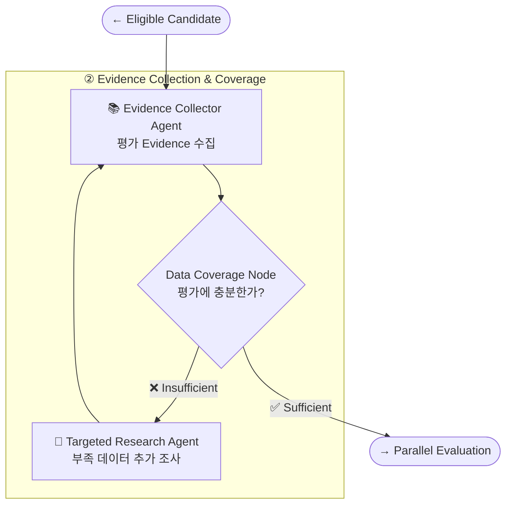
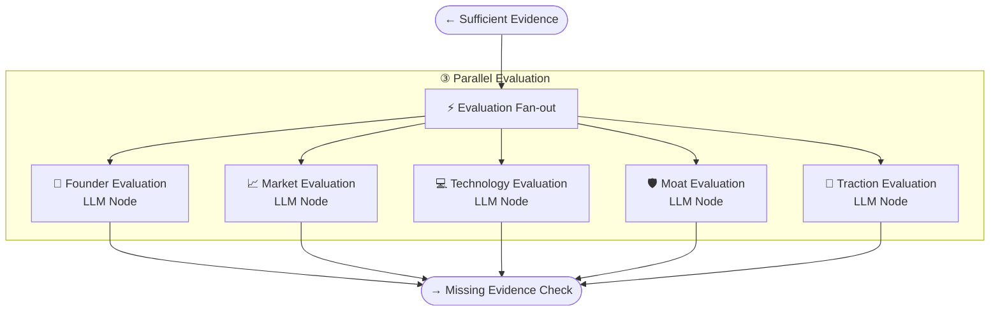
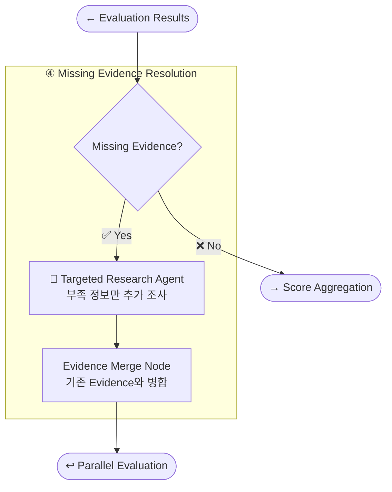
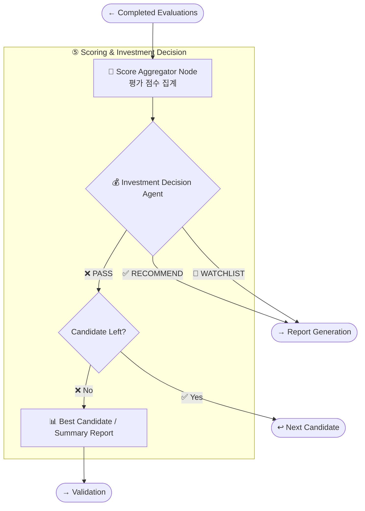
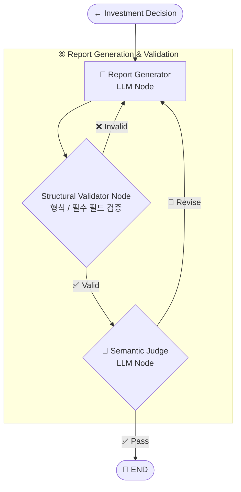

# robotics_startup_agentic_rag_notion_integrated

# 로보틱스 스타트업 투자 평가 Agentic RAG — 통합 설계 문서

> 이 문서는 기존 7개 Markdown/Notion 문서를 **하나의 작업 문서로 통합**한 버전이다.
> 
> 
> 본문에서는 중복 내용을 정리하고 실제 설계 흐름에 맞게 재배열했으며, **삭제하거나 사용하지 않은 내용도 문서 하단 `원본 보관소`에 파일별 원문 그대로 보존**했다.
> 
> **정리 원칙**
> 
> - 교수님 가이드와 팀 설계를 구분한다.
> - 현재 설계에 직접 쓰이는 내용은 본문에 노출한다.
> - 상세 근거·참고 기준·세부 Mermaid·초안은 Toggle로 접는다.
> - 서로 다른 문서에서 상태가 다른 내용은 임의로 하나로 합치지 않고 `미결정 / 정합성 확인 필요`에 남긴다.

---

## 목차

1. 프로젝트 정의와 과제 요구사항
2. 스타트업 탐색 및 적격성 기준
3. 투자 평가 기준과 점수 체계
4. Multi-Agent / LangGraph Architecture
5. 데이터 수집 도구와 API
6. RAG 및 Embedding 설계
7. 투자 단계 판별
8. LangGraph State Schema
9. 투자 보고서 요구사항
10. 제출물 및 평가 체크리스트
11. 미결정 사항 / 정합성 확인 필요
12. 원본 보관소

---

# 1. 프로젝트 정의와 과제 요구사항

## 1.1 실습 목표

- LangGraph 기반 **Multi-Agent + Agentic RAG** 설계 및 개발
- 외부 정보 검색, 문서 요약 등 목적에 맞는 Tool 정의
- 국내외 AI 스타트업을 조사하고 기술력·시장성·경쟁력 등을 분석하여 투자 평가 보고서 생성
- 팀의 선택 도메인: **Physical AI / Robotics**

## 1.2 과제에서 허용된 도메인

- Agriculture (AgTech)
- Energy
- Healthcare AI
- **Physical AI / Robotics**
- Semiconductor
- 📘 스타트업의 정의 및 일반 중소기업과의 차이
    - 스타트업은 새롭고 혁신적인 아이디어를 바탕으로 빠르게 성장하려는 초기 기업을 전제로 한다.
    - 아이디어나 기술을 검증하고 시장에 빠르게 자리 잡는 것이 목표다.
    
    | 항목 | 일반 중소기업 | 스타트업 |
    | --- | --- | --- |
    | 목적 | 안정적인 수익과 생존 | 빠른 확장과 시장 선점 |
    | 성장 속도 | 점진적 성장 | 상당히 빠름 (10배 성장 등) |
    | 아이디어 | 제품/서비스 기반 | 혁신적이고 독창적인 기술, 서비스 중심 |
    | 불확실성 | 비교적 낮음 | 매우 높음 (시장, 기술, 고객 관점) |
    | 자금 조달 | 자체 수익, 은행 대출, 투자 | 투자 중심 (VC, 엔젤 등) |
    | 최종 목표 | 운영과 지속 성장 | M&A, IPO 등 |

## 1.3 RAG / Embedding 필수 조건

- RAG 적용 대상으로 정의된 Agent 중 **최소 1개 Agent에 RAG를 실제 적용**
- RAG 문서는 문서 개수와 무관하게 **총 200페이지 한정**
- Embedding은 경제성을 고려하여 **오픈소스 임베딩 모델을 반드시 적용**
- Embedding 후보군을 선정하고 **최종 선택 기준과 이유를 문서화**

---

# 2. 스타트업 탐색 및 적격성 기준

## 2.1 탐색 흐름

```
Startup Discovery
→ Candidate Normalize
→ Company Research
→ Eligibility 판정
→ Eligible 후보만 Evidence Collection으로 전달
```

초기 메모에서는 “있는 거 다 들고와” 방식의 넓은 후보 탐색 후 스타트업 적격성을 판별하는 방향으로 시작했으며, 현재 Architecture에서는 `Startup Discovery Agent → Candidate Normalize Node → Company Research Agent → Eligibility Node`로 구체화되어 있다.

## 2.2 스타트업 적격성

후보 기업은 다음 기준을 만족해야 한다.

- **비상장 기업**: 코스피·코스닥 등 상장사 제외
- **투자 단계**: Seed ~ Series C
- **Exit 미완료**: M&A 등으로 Exit 완료 기업 제외
- 이후 평가를 수행할 수 있을 만큼의 **최소 데이터 확보 가능성** 확인
- 📘 과제 가이드의 제외 예시
    - 배달의민족: 딜리버리히어로에 M&A되어 Exit 완료 → 제외
    - 루닛, 뷰노: 의료 AI 기업이지만 코스닥 상장사 → 제외

## 2.3 후보 반복 처리

- 부적격 후보 → 다음 후보 탐색/검증
- 적격 후보 → Evidence 수집
- 투자 판단이 `PASS`인 경우 → 다음 후보
- 최종적으로 후보가 남지 않으면 Summary/검증 흐름으로 이동

---

# 3. 투자 평가 기준과 점수 체계

## 3.1 현재 팀 평가표

| 조건 | 보고서등급 | 분기 |
| --- | --- | --- |
| 총점 80이상 | 투자 우선 검토 | 투자 |
| 총점 70~79 | 투자 검토 | 투자 |
| 총점 60~69 | 보류 | 보류 |
| 총점 60 미만 | 투자비추천 | 보류 |
| 특정 항목 2점이하 | 보류 (총점무관) | 보류 |
| 결측 비중 합 30%이상 | 보류 (정보 부족) | 보류 |

| 항목 | 비중(%) | 평가 포인트 |
| --- | --- | --- |
| 창업자 (Owner) | 5% | 도메인 전문성(2), 관련 산업 경험(2), 창업/사업화 경험(1) |
| 시장성 (Opportunity Size) | 30% | 목표 시장 규모(10), 시장 성장성(10), 시장 수요/확장성(10) |
| 제품/기술력 | 25% | 핵심 기술 완성도(10), 실제 환경 성능/안정성(5), AI/HW/SW 통합 역량(5), 확장/상용화 가능성(5) |
| 경쟁 우위 | 20% | 경쟁사 대비 차별성(5), 기술/특허 진입장벽(5), 데이타/학습 경쟁력(5), 고객 락인/생태계 경쟁력(5) |
| 실적 | 10% | 매출성장률(3), 매출총이익률(2), 번레이트(1),런웨이(2), 고객집중도(1), Ruld of 40(1) |
| 투자조건 (Deal Terms) | 10% | 투자시리즈(2),Valuation(5), 지분율(3) |

> `Ruld of 40`은 원문 표기이며, 같은 문서의 상세 기준에서는 `Rule of 40`으로 표기되어 있다.
> 

## 3.2 투자 판단 분기 기준

| 조건 | 보고서 등급 | 분기 |
| --- | --- | --- |
| 총점 80 이상 | 투자 우선 검토 | 투자 |
| 총점 70~79 | 투자 검토 | 투자 |
| 총점 60~69 | 보류 | 보류 |
| 총점 60 미만 | 투자비추천 | 보류 |
| 특정 항목 2점 이하 | 보류 (총점 무관) | 보류 |
| 결측 비중 합 30% 이상 | 보류 (정보 부족) | 보류 |

## 3.3 평가 차원

현재 Agent Architecture에서는 5개 병렬 Evaluation Node로 구성되어 있다.

| Evaluation Node | 팀 평가표와의 대응 |
| --- | --- |
| Founder Evaluation | 창업자 |
| Market Evaluation | 시장성 |
| Technology Evaluation | 제품/기술력 |
| Moat Evaluation | 경쟁 우위 |
| Traction Evaluation | 실적 중심 |
| Score / Investment Decision | 위 결과 + 투자조건을 종합 |
- 🔍 상세 평가 기준 — 창업자 / 시장성 / 제품·기술력 / 경쟁 우위
    
    ```
    ### 창업자(owner)
    
    | 평가 포인트 | 판단 기준 | 확인할 수 있는 정보 |
    | --- | --- | --- |
    | **① 도메인 전문성** | 창업자가 AI·Robotics 분야의 전문성을 보유했는가 | 관련 전공, 연구경력, 산업경력 |
    | **② 관련 산업 경험** | 실제 AI·로봇 제품/기술 개발 경험이 있는가 | 이전 직장, 프로젝트, 연구실, 담당 분야 |
    | **③ 창업·사업화 경험** | 기술을 제품이나 사업으로 연결한 경험이 있는가 | 이전 창업, 제품 출시, 사업화, Exit 경험 |
    
    | 평가 포인트 | 필요한 데이터 | 추천 소스 | 수집 방식 |
    | --- | --- | --- | --- |
    | **① 도메인 전문성** | 전공, 학위, 연구분야, 논문, 특허, AI/Robotics 관련 활동 | OpenAlex, Semantic Scholar, 회사 공식 홈페이지 | **API + Web** |
    | **② 관련 산업 경험** | 이전 회사, 직무, 로봇/AI 프로젝트, 연구소 경력 | 회사 홈페이지, 창업자 인터뷰, 공식 프로필 | **Web/RAG** |
    | **③ 창업·사업화 경험** | 이전 창업, 제품 출시, PoC, 고객 확보, 이전 Exit/사업화 경험 | 회사 홈페이지, 투자유치 기사, 공식 인터뷰 | **Web/RAG** |
    
    ### 시장성 (Opportunity Size)
    
    | 평가 포인트 | 판단 기준 | 확인할 수 있는 정보 |
    | --- | --- | --- |
    | **① 목표 시장 규모** | 스타트업이 실제 진입하려는 세부 시장이 충분한 규모를 가지고 있는가 | **TAM(전체 잠재 시장 규모)**, **SAM(실제로 공략 가능한 시장 규모)**, 현재 시장규모, 예상 시장규모 |
    | **② 시장 성장성** | 해당 시장이 향후 지속적으로 성장할 가능성이 있는가 | **CAGR(연평균 성장률)**, 연도별 시장규모 전망, 산업 성장 추세 |
    | **③ 시장 수요·확장성** | 해결하려는 문제가 실제 산업에서 요구되고 있으며 다른 고객·산업으로 확장 가능한가 | 주요 적용 산업, 도입 수요, **Use Case(실제 활용 사례)**, 적용 분야 확대 가능성 |
    
    | 평가 포인트 | 필요한 데이터 | 추천 소스 | 수집 방식 |
    | --- | --- | --- | --- |
    | **① 목표 시장 규모** | **TAM(전체 잠재 시장)**, **SAM(실제 공략 가능 시장)**, 현재·향후 시장규모 | 산업·시장조사 보고서, 정부·공공기관 자료, 시장조사기관 자료 | **Web / RAG** |
    | **② 시장 성장성** | **CAGR(연평균 성장률)**, 연도별 시장규모 전망, 산업 투자·성장 추세 | 산업보고서, 정부기관 자료, 시장조사기관 보고서 | **Web / RAG** |
    | **③ 시장 수요·확장성** | 산업의 문제점, 로봇 도입 필요성, 적용 산업, **Use Case(활용 사례)**, 산업별 도입 사례 | 산업보고서, 기업 공식자료, 고객사 사례, 산업 뉴스 | **Web / RAG** |
    
    ### 제품/기술력
    
    | 평가 포인트 | 판단 기준 | 확인할 수 있는 정보 |
    | --- | --- | --- |
    | **① 핵심 기술 완성도** | 기술이 아이디어·연구 단계를 넘어 실제 제품으로 구현 가능한 수준인가 | **Prototype(시제품)** 존재 여부, 제품 개발 단계, **TRL(기술성숙도)**, 제품 시연·검증 결과 |
    | **② 실제 환경 성능·안정성** | 실험실이 아닌 실제 환경에서도 목표 작업을 안정적으로 수행할 수 있는가 | 작업 성공률, 정확도, 작업 속도, 오류율, 연속 가동시간, 실제 환경 테스트 결과 |
    | **③ AI·HW·SW 통합 역량** | AI 모델·센서·제어 SW·로봇 HW가 하나의 시스템으로 효과적으로 통합되어 있는가 | AI 모델, 센서 구성, 제어 방식, 로봇 HW 구조, **System Architecture(전체 시스템 구성)** |
    | **④ 확장·상용화 가능성** | 현재 제품을 실제 고객에게 공급할 수 있으며 향후 생산·고객·적용 분야를 확대할 수 있는가 | **PoC(기술검증)** 진행 단계, 제품 출시 단계, **Roadmap(제품 개발 계획)**, 고객 도입 계획, 생산 확대 계획 |
    
    | 평가 포인트 | 필요한 데이터 | 추천 소스 | 수집 방식 |
    | --- | --- | --- | --- |
    | **① 핵심 기술 완성도** | Prototype(시제품), TRL(기술성숙도), 제품 개발 단계, 시연·검증 결과 | 기업 공식 홈페이지, 기술 백서, 논문, IR 자료, 공식 제품 발표자료 | **Web / RAG** |
    | **② 실제 환경 성능·안정성** | 작업 성공률, 정확도, 작업속도, 오류율, 연속 가동시간, 현장 테스트 결과 | 논문, 기업 기술자료, 고객사 적용 사례, PoC(기술검증) 자료, 실증 보고서 | **Web / RAG** |
    | **③ AI·HW·SW 통합 역량** | AI 모델, 센서, 제어 SW, HW 구조, 시스템 구성 및 연동 방식 | 기업 기술문서, 논문, 기술 블로그, 개발자 문서, GitHub(공개된 경우) | **Web / RAG** |
    | **④ 확장·상용화 가능성** | 제품 출시 단계, PoC→상용화 계획, 제품 Roadmap, 고객 확대 계획, 생산 확대 계획, 투자금 활용 계획 | **Pitch Deck(투자유치 발표자료), IR 자료(투자자 대상 기업소개 자료), Demo Day(투자자 대상 발표자료), Accelerator(스타트업 육성기관) 자료**, 기업 홈페이지, 투자유치 보도자료, 고객사 자료 | **RAG + Web 교차검증** |
    
    ### 경쟁 우위
    
    | 평가 포인트 | 판단 기준 | 확인할 수 있는 정보 |
    | --- | --- | --- |
    | **① 경쟁사 대비 차별성** | 동일한 문제를 해결하는 경쟁사와 비교했을 때 제품·기술·비용·성능 측면에서 명확한 차별점이 있는가 | 경쟁 제품 대비 성능, 가격·운영비, 작업 범위, 설치·운영 방식, 주요 기능 차이 |
    | **② 기술·특허 진입장벽** | 핵심 기술이 특허 등으로 보호되고 있으며 경쟁사가 쉽게 모방하기 어려운가 | **특허 보유 건수**, 핵심기술 관련 특허 비중, 등록 여부, **Patent Family(동일 발명의 해외 출원 묶음)**, **Forward Citation(후속 특허의 피인용 횟수)**, 독자 알고리즘·기술 |
    | **③ 데이터·학습 경쟁력** | 실제 로봇 운용 과정에서 확보한 데이터와 학습체계가 지속적인 기술 향상으로 이어지는가 | 자체 데이터 보유 여부·규모, 실제 현장 데이터, 데이터 수집·학습 구조, **Data Flywheel(데이터 축적→AI 성능 향상의 선순환 구조)** |
    | **④ 고객 락인·생태계 경쟁력** | 고객이 제품을 도입한 후 경쟁사 제품으로 쉽게 전환하기 어렵거나 지속적으로 사용할 구조가 있는가 | **Switching Cost(제품 변경에 필요한 비용·시간)**, 기존 시스템 연동 수준, 전용 SW·플랫폼, 파트너십, 고객·개발 생태계 |
    
    | 평가 포인트 | 필요한 데이터 | 추천 소스 | 수집 방식 |
    | --- | --- | --- | --- |
    | **① 경쟁사 대비 차별성** | 주요 경쟁사, 제품별 성능·가격·기능·작업범위·설치방식 비교 데이터 | 기업·경쟁사 공식 홈페이지, 제품 사양서, 기술자료, 논문, Pitch Deck·IR 자료, 산업 보고서 | **Web / RAG** |
    | **② 기술·특허 진입장벽** | **특허 보유 건수**, 핵심기술 관련 특허 수, 출원·등록 상태, Patent Family, Forward Citation, 독자 기술 보유 여부 | **KIPRIS(국내 특허), Google Patents, WIPO PATENTSCOPE(국제특허), Espacenet(유럽특허)**, 기업 IR·기술자료 | **Web / 특허 DB / RAG** |
    | **③ 데이터·학습 경쟁력** | 자체 데이터 규모·종류, 실제 현장 데이터 확보 여부, 데이터 수집·재학습 방식, 자체 데이터셋 | 기업 기술자료, Pitch Deck·IR 자료, 논문, 기술 블로그, 공식 인터뷰 | **Web / RAG** |
    | **④ 고객 락인·생태계 경쟁력** | 고객 시스템 연동 방식, 전용 플랫폼·SW, 장기 사용 구조, 파트너십, 전환비용 발생 요소 | 기업 제품자료, Pitch Deck·IR 자료, 고객사 적용 사례, 파트너사 발표자료, 산업 기사 | **Web / RAG** |
    ```
    
- 💰 상세 평가 기준 — 실적 / 투자조건
    
    ```
    | 구분 | 지표 | 의미 | 통상 기준 | 데이터 | 비중 |
    | --- | --- | --- | --- | --- | --- |
    | 실적 | 매출 성장률 (YoY) | 1년 전 대비 매출 증가 | 초기엔 연 2~3배, Series B 이후에도 연 100% 이상이면 우수 | DART 감사보고서 2개년 | 없으면 기사에서 매출 언급 | 3 |
    | 실적 | 매출총이익률 | 매출에서 원가를 뺀 비율 | SaaS 70~80%, 하드웨어 30~50% | DART 감사보고서 손익계산서의 매출원가 | 2 |
    | 실적 | 번레이트 | 매달 순수하게 나가는 현금 | 절대값보다 런웨이와 함께 봄 | DART감사보고서 현금흐름표, 또는 국민연금 고지금액으로 인건비 역산 (근사치) | 1 |
    | 실적 | 런웨이 | 보유 현금 ÷ 월 번레이트 | 18~24개월 이상 권장, 12개월 미만이면 위험 신호 | DART 감사보고서 현금 ÷ 연간 영업현금유출 | 2 |
    | 실적 | 고객 집중도 | 상위 고객 한 곳의 매출 비중 | 한 고객이 절반 가까이 차지하면 리스크 | DART 기사에 고객사가 1~2곳만 반복 등장하는지 정성 판단 | 1 |
    | 실적 | Rule of 40 | 성장률 + 이익률 | 40% 이상 (주로 후기 단계에서 봄) | DART 감사보고서로 성장률 + 영업이익률 계산 | 1 |
    
    | 구분 | 지표 | 의미 | 통상 기준 | 데이터 | 비중 |
    | --- | --- | --- | --- | --- | --- |
    | 투자 | 시리즈 A < B < C | 투자를 얼마나 받고 있나 | 기사에 나오는 표현구간엔젤, 프리시드, 시드, TIPS 선정, 프리A초기시리즈A, A+, A 브릿지, 프리B초기시리즈B, B+, B 브릿지, 프리C후기시리즈C, C+, C 브릿지후기시리즈D 이상, 프리IPO자격 검증에서 제외 | 검색 agent | 2 |
    | 투자-valuation(기업가치) | **Pre-money**: 투자받기 전 기업가치**Post-money**: 투자금이 들어온 후 기업가치 (= Pre-money + 투자금) | 투자 시점에 이 회사가 얼마짜리인지 매긴 값 |  | 검색 agent | 5 |
    | 투자 - 지분율 | 지분율 = 투자금/(post-money) | 투자자가 투자 후 회사의 몇 %를 갖게 되는지 |  | 검색 agent | 3 |
    ```
    
- 📚 참고용 VC 지표 / 로보틱스 특화 신호
    
    ```
    ## VC가 보는 핵심 지표와 통상 기준
    
    아래 기준은 주로 SaaS 업계에서 굳어진 경험칙이에요. 절대 규칙은 아니고, 로봇처럼 하드웨어가 섞인 사업은 기준을 낮춰 봐야 해요
    
    | 구분 | 지표 | 의미 | 통상 기준 |
    | --- | --- | --- | --- |
    | 성장 | 매출 성장률 (YoY) | 1년 전 대비 매출 증가 | 초기엔 연 2~3배, Series B 이후에도 연 100% 이상이면 우수 |
    | 성장 | 반복 매출 (ARR/MRR) | 구독·RaaS처럼 매년 반복되는 매출 | 전체 매출 중 비중이 높을수록 좋음 |
    | 수익 구조 | 매출총이익률 | 매출에서 원가를 뺀 비율 | SaaS 70~80%, 하드웨어 30~50% |
    | 생존 | 번레이트 | 매달 순수하게 나가는 현금 | 절대값보다 런웨이와 함께 봄 |
    | 생존 | 런웨이 | 보유 현금 ÷ 월 번레이트 | 18~24개월 이상 권장, 12개월 미만이면 위험 신호 |
    | 효율 | 번 멀티플 | 순현금소모 ÷ 순증 ARR | 1 미만 훌륭, 1~2 양호, 3 이상 경고 |
    | 효율 | LTV/CAC | 고객 생애가치 ÷ 고객 획득비용 | 3 이상 |
    | 효율 | CAC 회수기간 | 고객 획득비용을 회수하는 기간 | 12~18개월 이내 |
    | 고객 | 순매출유지율 (NRR) | 기존 고객의 매출이 1년 뒤 얼마나 남고 늘었나 | 100% 이상, 120% 이상이면 우수 |
    | 고객 | 고객 집중도 | 상위 고객 한 곳의 매출 비중 | 한 고객이 절반 가까이 차지하면 리스크 |
    | 종합 | Rule of 40 | 성장률 + 이익률 | 40% 이상 (주로 후기 단계에서 봄) |
    
    ### 로보틱스라면 추가로 보는 지표
    
    로봇은 소프트웨어와 달리 원가, 양산, 현장 도입이 걸려 있어서 특화 지표가 따로 있어요.
    
    | 지표 | 의미 | 왜 중요한가 |
    | --- | --- | --- |
    | 파일럿 → 상용 전환율 | PoC를 한 고객 중 실제 구매·계약으로 넘어간 비율 | 로봇 업계는 "PoC만 하다 끝나는" 경우가 많아서 가장 중요한 신호 |
    | 수주잔고·LOI | 확정됐지만 아직 매출로 잡히지 않은 계약 | 매출이 작아도 미래 매출을 보여줌 |
    | 대당 유닛 이코노믹스 | 로봇 1대의 판가, 부품원가(BOM), 공헌이익 | 팔수록 손해인 구조인지 확인 |
    | 고객 투자회수기간 | 고객이 로봇 도입비를 인건비 절감 등으로 회수하는 기간 | 짧을수록 영업이 쉬움. 통상 2년 안쪽을 선호 |
    | 배치 대수·가동률 | 현장에 깔린 로봇 수와 실제 운영 시간 | 기술이 실제 환경에서 버티는지 보여줌 |
    | RaaS 비중 | 판매 대신 월 구독으로 받는 매출 비중 | 반복 매출과 높은 기업가치로 연결 |
    | 원가 절감 곡선 | 양산 물량이 늘 때 대당 원가가 떨어지는 속도 | 하드웨어 스타트업의 확장성 판단 기준 |
    
    ### 초기 스타트업에서 에이전트가 볼 수 있는 신호
    
    재무 대신 이런 공개 신호들로 평가할 수 있어요.
    
    | 신호 | 의미 | 데이터 소스 |
    | --- | --- | --- |
    | 창업자 이력 | 로봇·AI 연구 경력, 대기업·연구소 출신, 이전 창업 경험 | 홈페이지 팀 소개, 인터뷰 기사, 논문 |
    | 특허 출원 | 매출이 없어도 기술 자산은 쌓여 있음 | KIPRIS (출원인·발명자) |
    | 논문·오픈소스 | 창업자와 팀의 기술 깊이 | Semantic Scholar, GitHub |
    | 누가 투자했나 | 좋은 VC나 전략적 투자자(대기업)가 들어왔다는 것 자체가 검증 신호 | 투자 유치 기사 |
    | 정부·기관 선정 | TIPS, 액셀러레이터 프로그램 등은 외부 심사를 통과했다는 뜻 | 뉴스, 기관 발표 |
    | 수상·전시 | CES 혁신상 같은 수상은 기술 완성도의 외부 평가 | 뉴스 |
    | 파일럿·MOU | 매출 전 단계의 고객 검증 신호 | 뉴스 |
    | 인원 증가 | 투자금을 받아 실제로 팀을 키우고 있는지 | 국민연금 가입자 수 |
    ```
    
- 🧪 투자 단계별 가중치 조정안 — 현재 확정안이 아닌 제안
    
    ```
    가이드가 "설계 목적에 따라 추가/변경"을 허용하니까, 투자 단계별로 비중을 다르게 두는 걸 제안해요.
    
    | 항목 | 원안 | Seed~Series A | Series B~C |
    | --- | --- | --- | --- |
    | 창업자·팀 | 30 | 30 | 25 |
    | 시장성 | 25 | 25 | 20 |
    | 제품·기술력 | 15 | **20** | 15 |
    | 경쟁 우위 | 10 | 10 | 10 |
    | 실적 | 10 | **5** | **20** |
    | 투자조건 | 10 | 10 | 10 |
    | 합계 | 100 | 100 | 100 |
    - 시리즈 별 >>
    
    ### 투자단계 판별 순서 (3단계 폴백)
    
    **1순위: 투자 유치 기사의 라운드 명칭**
    
    국내 스타트업은 투자를 받으면 대부분 "○○, 시리즈A 50억 원 투자 유치" 같은 기사를 내요. Tavily를 `topic=news`로 `"{회사명} 투자 유치 시리즈"` 같이 검색하면 게시일과 함께 나오고, **가장 최근 기사의 라운드 명칭**을 쓰면 돼요. 더브이씨 같은 스타트업 DB 페이지가 검색 결과에 잡히면 거기 적힌 단계도 참고할 수 있어요 (API가 없으니 검색 결과로 노출되는 정보까지만).
    
    **2순위: 라운드 명칭이 없으면 추정**
    
    금액만 나오거나 "투자 유치"라고만 나오는 경우가 꽤 있어요. 이땐 누적 투자금, 설립 연차, 국민연금 인원을 조합해서 추정해요. 예를 들어 "누적 투자금 약 100억 원 이상이거나 인원 50명 이상이면 후기" 같은 규칙인데, 이 기준선은 국내 통념 수준의 대략적인 값이라 팀에서 정해야 해요.
    
    **3순위: 그래도 모르면 원안 비중**
    
    끝까지 판별이 안 되면 `unknown`으로 두고 **가이드 원안 비중(30/25/15/10/10/10)**을 그대로 적용해요. 단계별 조정은 판별됐을 때만 쓰는 거죠. 원안이 자연스러운 기본값이 돼서 깔끔해요.
    
    ### 라운드 명칭 정규화
    
    국내 라운드 이름은 제각각이라 두 구간으로 묶는 규칙이 필요해요.
    
    | 기사에 나오는 표현 | 구간 |
    | --- | --- |
    | 엔젤, 프리시드, 시드, TIPS 선정, 프리A | 초기 |
    | 시리즈A, A+, A 브릿지, 프리B | 초기 |
    | 시리즈B, B+, B 브릿지, 프리C | 후기 |
    | 시리즈C, C+, C 브릿지 | 후기 |
    | 시리즈D 이상, 프리IPO | 자격 검증에서 제외 |
    
    브릿지 라운드와 "프리" 라운드는 **아직 다음 라운드를 받기 전**이니까 앞 단계로 묶었어요. 프리B 기업은 A를 마친 상태라 초기로 보는 게 맞아요.
    
    ### 조심할 점
    
    기사가 여러 개일 때 옛날 기사를 잡으면 단계를 낮게 판단하니까, **게시일 기준 최신 기사**를 쓰고 출처를 남겨야 해요. 그리고 비공개로 투자를 받는 경우도 있어서 판별 결과엔 방법(기사 명시 / 추정 / 미상)과 신뢰도를 같이 기록해요. 이게 보고서 한계점에 "단계 판별은 공개 기사 기준"이라고 적을 근거가 돼요.
    ```
    

---

# 4. Multi-Agent / LangGraph Architecture

## 4.1 전체 흐름

```mermaid
    flowchart TB

        %% =====================================================
        %% START
        %% =====================================================

        START([🚀 START])
        START --> A

        %% =====================================================
        %% 1. Discovery & Eligibility
        %% =====================================================

        subgraph DISCOVERY["① Startup Discovery & Eligibility"]
            direction TB

            A["🔎 Startup Discovery Agent<br/>스타트업 후보 탐색"]
            B["Candidate Normalize Node<br/>회사명 / 식별자 정규화"]
            C["🔍 Company Research Agent<br/>Eligibility Evidence 수집"]
            D{"Eligibility Node<br/>투자 대상인가?"}

            E{"Candidate Left?"}

            A --> B
            B --> C
            C --> D

            D -->|❌ Not Eligible| E
        end

        %% =====================================================
        %% 2. Evidence Collection
        %% =====================================================

        subgraph EVIDENCE["② Evidence Collection & Coverage"]
            direction TB

            F["📚 Evidence Collector Agent<br/>평가 Evidence 수집"]

            G{"Data Coverage Node<br/>평가에 충분한가?"}

            H["🔎 Targeted Research Agent<br/>부족 데이터 추가 조사"]

            F --> G

            G -->|❌ Insufficient| H
            H --> F
        end

        D -->|✅ Eligible| F

        %% =====================================================
        %% 3. Parallel Evaluation
        %% =====================================================

        subgraph EVALUATION["③ Parallel Evaluation"]
            direction TB

            I["⚡ Evaluation Fan-out"]

            J1["👤 Founder Evaluation<br/>LLM Node"]
            J2["📈 Market Evaluation<br/>LLM Node"]
            J3["💻 Technology Evaluation<br/>LLM Node"]
            J4["🛡️ Moat Evaluation<br/>LLM Node"]
            J5["🚀 Traction Evaluation<br/>LLM Node"]

            I --> J1
            I --> J2
            I --> J3
            I --> J4
            I --> J5
        end

        G -->|✅ Sufficient| I

        %% =====================================================
        %% 4. Missing Evidence Resolution
        %% =====================================================

        subgraph MISSING["④ Missing Evidence Resolution"]
            direction TB

            K{"Missing Evidence?"}

            L["🎯 Targeted Research Agent<br/>부족 정보만 추가 조사"]

            M["Evidence Merge Node<br/>기존 Evidence와 병합"]

            K -->|✅ Yes| L
            L --> M
        end

        J1 --> K
        J2 --> K
        J3 --> K
        J4 --> K
        J5 --> K

        M --> I

        %% =====================================================
        %% 5. Scoring & Investment Decision
        %% =====================================================

        subgraph DECISION["⑤ Scoring & Investment Decision"]
            direction TB

            N["🧮 Score Aggregator Node<br/>평가 점수 집계"]

            O{"💰 Investment Decision Agent"}

            Q{"Candidate Left?"}

            R["📊 Best Candidate / Summary Report"]

            N --> O

            O -->|❌ PASS| Q
            Q -->|No| R
        end

        K -->|❌ No| N

        %% =====================================================
        %% 6. Report Generation & Validation
        %% =====================================================

        subgraph REPORT["⑥ Report Generation & Validation"]
            direction TB

            P["📝 Report Generator<br/>LLM Node"]

            S{"Structural Validator Node<br/>형식 / 필수 필드 검증"}

            T{"🧠 Semantic Judge<br/>LLM Node"}

            P --> S

            S -->|❌ Invalid| P
            S -->|✅ Valid| T

            T -->|🔄 Revise| P
        end

        O -->|✅ RECOMMEND| P
        O -->|👀 WATCHLIST| P

        R --> S

        %% =====================================================
        %% Candidate Loop
        %% =====================================================

        E -->|Yes| C
        E -->|No| END1([🏁 END])

        Q -->|Yes| C

        T -->|✅ Pass| END2([🏁 END])

        %% =====================================================
        %% Styles
        %% =====================================================

        classDef startEnd fill:#1e293b,color:#fff,stroke:#0f172a,stroke-width:2px;
        classDef agent fill:#dbeafe,stroke:#2563eb,stroke-width:1.5px;
        classDef node fill:#f8fafc,stroke:#64748b,stroke-width:1.5px;
        classDef decision fill:#fef3c7,stroke:#d97706,stroke-width:1.5px;
        classDef report fill:#dcfce7,stroke:#16a34a,stroke-width:1.5px;

        class START,END1,END2 startEnd;

        class A,C,F,H,J1,J2,J3,J4,J5,L,O,T agent;

        class B,I,M,N node;

        class D,E,G,K,Q,S decision;

        class P,R report;
    ```

## 4.2 구성 요소

| 성격 | 단계 | 구성 |
| --- | --- | --- |
| Agent | Discovery | Startup Discovery Agent |
| Agent | Eligibility 수집 | Company Research Agent |
| Node | Eligibility | Eligibility Node |
| Agent | 평가자료 수집 | Evidence Collector Agent |
| Node | Coverage | Coverage Node |
| LLM Structured Output | 평가 | 5 Evaluation Nodes |
| Agent | 부족자료 보강 | Targeted Research Agent |
| Node | 점수 계산 | Score Aggregator |
| LLM Structured Output | 투자판단 | Investment Decision Agent |
| LLM Node | 보고서 | Report Generator |
| Node | 검증 | Structural Validator |
| LLM Node | 검증 | Semantic Judge |

## 4.3 단계별 책임

### ① Startup Discovery & Eligibility

- `Startup Discovery Agent`: 투자 주제에 맞는 후보 탐색
- `Candidate Normalize Node`: 회사명 / 식별자 정규화
- `Company Research Agent`: 상장 여부, 투자 단계, Exit 여부 등 Eligibility Evidence 수집
- `Eligibility Node`: 투자 대상 여부를 deterministic하게 판정

### ② Evidence Collection & Coverage

- `Evidence Collector Agent`: 평가에 사용할 Evidence 수집
- `Data Coverage Node`: 평가에 필요한 데이터 충족 여부 판단
- 부족 시 `Targeted Research Agent`가 필요한 정보만 추가 수집
- 수집 결과는 공통 `Evidence Store`로 합쳐 평가 Agent가 공유

### ③ Parallel Evaluation

- Founder / Market / Technology / Moat / Traction 평가를 병렬 수행
- 각 평가 결과에서 부족 Evidence가 발견되면 추가 조사 후 재평가

### ④ Scoring & Investment Decision

- `Score Aggregator Node`: deterministic한 점수 집계
- `Investment Decision Agent`: 투자 판단 결과 생성
- PASS 후보는 다음 후보로 이동
- RECOMMEND / WATCHLIST 후보는 보고서 생성 단계로 이동

### ⑤ Report Generation & Validation

- `Report Generator`: 투자 보고서 생성
- `Structural Validator`: 필수 구조·필드 검증
- `Semantic Judge`: 보고서 의미 품질 평가
- 실패 시 보고서 수정 Loop

<details>
<summary>🗺️ 단계별 Mermaid 원본 보기</summary>

### 1 - 발견

```mermaid
flowchart TB

    START([🚀 START])
    START --> A

    subgraph DISCOVERY["① Startup Discovery & Eligibility"]
        direction TB

        A["🔎 Startup Discovery Agent<br/>스타트업 후보 탐색"]

        B["Candidate Normalize Node<br/>회사명 / 식별자 정규화"]

        C["🔍 Company Research Agent<br/>Eligibility Evidence 수집"]

        D{"Eligibility Node<br/>투자 대상인가?"}

        E{"Candidate Left?"}

        A --> B
        B --> C
        C --> D

        D -->|❌ Not Eligible| E
        E -->|✅ Yes| C
    end

    D -->|✅ Eligible| OUT([→ Evidence Collection])
    E -->|❌ No| END([🏁 END])
```

### 2. 평가 자료 수집



### 3. 평가



#### 3 - 2 부족한 평가 정보 수집



### 4. 점수



### 5. 보고서 생성



---

- 📝 초기 Agent Raw 메모
    
    ```markdown
    # Agent - Raw
    
    ## 수집
    
    ### 1. 스타트업 탐색
    
    -있는거 다 들고와 - #later
    
    ### 2. 스타트업인지 판별 #Node
    
    -기준
        -비상장 기업 - 코스피, 코스닥 등 상장사 제외 #Node
        -투자 단계가 Seed ~ Series C 수준 #AGENT
        -M&A 등으로 Exit이 완료되지 않았을 것 #AGENT
    
    ### 3. 후보 선정
    
    -최소한의 데이터가 있는지?
        -평가 가능성
    
    ## 평가
    
    ### 1. 투자 판단 #Agent
    
    -Tool
        -DART
        -스타트업 정보 읽을 수 있게 == RAG
        -
    
    ## 보고서
    
    ### 1. 보고서 생성 #Node
    
    ### 2. 보고서 평가 #Agent
    ```
    

---

# 5. 데이터 수집 도구와 API

## 5.1 Tool / API 목록

| Tool | 목적 | 비용/접근성 |
| --- | --- | --- |
| **Naver News Search API** | 후보발견, 투자, 창업자, PoC, 고객 | 무료/키 필요 |
| **KRX Open API** | 상장 여부 | 인증키 필요 |
| **OpenDART API** | 기업/공시/재무 | 무료/키 필요 |
| **중기부 벤처기업 API** | 벤처기업 확인 | 무료 |
| **KIPRISPlus API** | 특허 | API 신청 |
| **OpenAlex API** | 논문/연구자 | 무료 key 가능 |
| **KOSIS API** | 산업/시장 통계 | 무료/키 필요 |
| **RAG Vector Store** | IR/Pitch Deck/백서/보고서 | 직접 구축 |
| Crunchbase | 투자 라운드/기업/창업자 보강 | **선택, 유료** |

## 5.2 평가 영역별 대표 데이터

| 평가 영역 | 대표 데이터 | 대표 수집 방식 |
| --- | --- | --- |
| 창업자 | 전공, 학위, 연구, 논문, 특허, 이전 회사, 창업 이력 | API + Web + RAG |
| 시장성 | TAM/SAM, CAGR, 산업 수요, Use Case | Web + RAG + KOSIS |
| 기술력 | Prototype, TRL, 성능, 안정성, 시스템 구조, Roadmap | Web + RAG |
| 경쟁 우위 | 경쟁 제품, 특허, Patent Family, Forward Citation, 데이터 Flywheel | Web + 특허 DB + RAG |
| 실적 | 매출, 원가, 현금흐름, 고객 집중도 | DART + 기사 |
| 투자조건 | 최근 라운드, 투자금, Valuation, 지분율 | News / Startup DB 검색 |

---

# 6. RAG 및 Embedding 설계

## 6.1 RAG 적용 대상

| 데이터/업무 | 이유 |
| --- | --- |
| 기술 백서 / 제품 문서 | 긴 비정형 문서에서 기술 근거 추출 |
| IR 자료 | 사업·기술·시장·traction 근거 추출 |
| 논문 / 기술 보고서 | 기술성숙도, 차별성, 성능 근거 |
| 산업 보고서 | 시장규모, CAGR, 경쟁구조 근거 |
| 특허 문서 | 기술 차별성·Moat 판단에 활용 |
| 사내/프로젝트에 미리 저장한 기업 자료 | 반복 검색 없이 공통 Evidence 생성 |

## 6.2 문서별 Chunk 전략

| 데이터 | Chunk 기준 | Embedding에서 중요한 것 |
| --- | --- | --- |
| Pitch Deck | slide 단위 | multimodal, multilingual |
| IR PDF | section/page | long context, multilingual |
| 기술 백서 | heading/section | technical semantic retrieval |
| 논문 | abstract/section | scientific terminology |
| 특허 | 청구항/발명 설명 section | hybrid, exact terminology |
| 시장보고서 | section/table 주변 | long-context, table context |
| 홈페이지 | heading별 | multilingual |
| 뉴스 | 기사 단위 또는 500~800 token | freshness + metadata |

## 6.3 Embedding 후보군

| 모델 | 성격 | 현재 문서에서의 위치 |
| --- | --- | --- |
| `text-embedding-3-small` | 저비용 text embedding | MVP 참고 후보 |
| `text-embedding-3-large` | 고성능 multilingual text | 일반 문서 RAG 참고 후보 |
| `BAAI/bge-m3` | multilingual + dense/sparse/multi-vector | 특허/기술문서 Hybrid RAG 후보 |
| `jina-embeddings-v4` | multimodal + PDF/image + long context | Pitch Deck/IR 후보 |

> **과제 요구사항상 최종 Embedding은 오픈소스여야 한다.** 따라서 OpenAI embedding 모델은 비교/참고 항목으로 남길 수 있으나, 현재 문서만으로는 최종 모델이 확정되어 있지 않다.
> 

## 6.4 핵심 설계 원칙

- 데이터마다 반드시 서로 다른 Embedding 모델을 사용할 필요는 없다.
- 같은 Vector Store에서는 가능한 한 동일 Embedding 공간을 유지하는 편이 운영하기 쉽다.
- 문서 특성에 따라 필요한 모델 능력은 달라진다.
- 기술 문서/논문은 **multilingual + technical semantic retrieval**이 중요하다.
- Pitch Deck/IR은 표·그래프·이미지를 포함할 수 있어 **multimodal**이 유리하다.
- 특허는 Semantic Search만으로 부족하며 **Dense + Keyword/Sparse + Reranker** 형태의 Hybrid Retrieval이 필요하다.
- 시장 보고서의 숫자값은 Vector Similarity가 계산하는 것이 아니라, 관련 Chunk 검색 후 LLM이 구조화 Evidence로 추출하는 구조를 사용한다.
- 📚 문서 유형별 Embedding 요구사항 상세 근거
    
    ```
    # 3. RAG에 들어가는 데이터별 Embedding 요구사항
    
    여기서 중요한 점은 **데이터마다 반드시 다른 embedding 모델을 쓸 필요는 없습니다.**
    
    오히려 한 Vector Store 안에서는 가능하면 같은 embedding 모델을 쓰는 편이 운영하기 쉽습니다.
    
    다만 데이터 특성에 따라 필요한 **모델의 능력**이 달라집니다.
    
    ### IR / Pitch Deck
    
    ```
    IR
    Pitch Deck
    PDF
    PPT
    ```
    
    특징은 텍스트뿐 아니라:
    
    ```
    그래프
    표
    제품 이미지
    architecture diagram
    숫자
    짧은 bullet
    ```
    
    가 섞여 있다는 것입니다.
    
    따라서 필요한 embedding 모델 특성은:
    
    ```
    ★★★★★ Multimodal
    ★★★★☆ Korean + English multilingual
    ★★★★☆ 긴 context
    ★★★★☆ 문서 retrieval 성능
    ★★★☆☆ 숫자/표 이해
    ```
    
    이 경우 텍스트 전용 embedding만 써도 MVP는 만들 수 있지만, **표·그래프 자체가 중요한 경우 multimodal embedding이 유리합니다.**
    
    예를 들어 `jina-embeddings-v4`는 텍스트와 이미지를 함께 처리하며 PDF 입력, 32K context, dense 및 multi-vector retrieval을 지원합니다. [Jina AI](https://jina.ai/models/jina-embeddings-v4/?utm_source=chatgpt.com)
    
    Chunk는:
    
    ```
    Pitch Deck
    
    Slide 1 → chunk
    Slide 2 → chunk
    Slide 3 → chunk
    ...
    ```
    
    처럼 **슬라이드 단위**가 좋습니다.
    
    ---
    
    ## 기술 백서 / 제품 기술문서
    
    여기는 이 프로젝트에서 가장 중요한 RAG입니다.
    
    예:
    
    ```
    Robot control architecture
    Vision-Language-Action
    SLAM
    Force control
    Inference latency
    Payload
    Cycle time
    Deployment architecture
    ```
    
    필요한 embedding 특성:
    
    ```
    ★★★★★ 기술 semantic similarity
    ★★★★★ 한/영 multilingual
    ★★★★★ 전문용어 보존
    ★★★★☆ 긴 context
    ★★★★☆ 긴 문서 retrieval
    ```
    
    문서가
    
    ```
    한국어 설명
    +
    영어 기술용어
    +
    논문 이름
    +
    모델명
    ```
    
    형태가 될 가능성이 높아서 **multilingual embedding**이 사실상 필수입니다.
    
    예를 들어 BGE-M3는 100개 이상의 언어와 최대 8192-token 입력을 지원하고, dense·sparse·multi-vector retrieval을 함께 지원합니다. [Hugging Face](https://huggingface.co/BAAI/bge-m3/blob/main/README.md?utm_source=chatgpt.com)
    
    이런 기술문서에는 꽤 잘 맞는 특성입니다.
    
    ---
    
    # 4. 특허에서는 Embedding만 쓰면 안 됩니다
    
    특허는 조금 특별합니다.
    
    예를 들어 사용자가:
    
    ```
    "force feedback를 사용하는 로봇 조인트 기술"
    ```
    
    이라고 검색한다면 semantic embedding이 좋습니다.
    
    하지만:
    
    ```
    KR1020260012345
    YOLOv11
    LiDAR
    IPC B25J
    ```
    
    같은 것을 검색하면 정확한 keyword matching이 중요합니다.
    
    그래서:
    
    ```
    Patent Query
          │
          ├─ Dense Vector Search
          │
          └─ Keyword / Sparse Search
                   ↓
               Merge
                   ↓
               Reranker
    ```
    
    를 추천합니다.
    
    즉 특허용 embedding 모델에는:
    
    ```
    ★★★★★ Hybrid retrieval 지원
    ★★★★★ 전문용어
    ★★★★★ multilingual
    ★★★★☆ long document
    ```
    
    이 중요합니다.
    
    그래서 이 프로젝트에서는 **BGE-M3가 특히 흥미로운 후보**입니다.
    
    BGE-M3 하나가:
    
    ```
    Dense
    Sparse
    Multi-vector
    ```
    
    검색을 모두 지원하기 때문입니다. 공식 모델 문서에서도 RAG에 hybrid retrieval + reranking 조합을 권장하고 있습니다. [Hugging Face](https://huggingface.co/BAAI/bge-m3/blob/main/README.md?utm_source=chatgpt.com)
    
    ---
    
    # 5. 논문
    
    논문에서는 문서 전체를 하나의 embedding으로 만드는 것보다 구조를 유지하는 것이 중요합니다.
    
    ```
    Paper
    ├─ title
    ├─ abstract
    ├─ introduction
    ├─ methodology
    ├─ experiments
    ├─ results
    └─ conclusion
    ```
    
    이런 식으로 chunk합니다.
    
    Embedding 모델 요구사항:
    
    ```
    ★★★★★ 기술 semantic similarity
    ★★★★★ 영어 성능
    ★★★★☆ 한국어 query → 영어 document 검색
    ★★★★☆ 긴 context
    ★★★★☆ scientific terminology
    ```
    
    특히 사용자 query가
    
    ```
    "실제 환경에서 로봇 manipulation 성능을 검증했는가?"
    ```
    
    인데 논문은 영어라면,
    
    ```
    Korean query
           ↓
    multilingual embedding
           ↓
    English paper chunk
    ```
    
    가 되어야 합니다.
    
    따라서 multilingual 성능은 이 프로젝트에서 상당히 중요합니다.
    
    ---
    
    # 6. 산업 보고서 / 시장 보고서
    
    이쪽은 특성이 조금 다릅니다.
    
    예:
    
    ```
    시장 규모
    CAGR
    TAM
    지역별 시장
    산업 trend
    competitive landscape
    ```
    
    필요한 모델 특성:
    
    ```
    ★★★★★ 긴 문서 검색
    ★★★★★ multilingual
    ★★★★☆ 숫자 주변 context 이해
    ★★★★☆ table retrieval
    ★★★☆☆ multimodal
    ```
    
    예를 들어:
    
    > Global warehouse robotics market is expected to grow at a CAGR of ...
    >
    
    라는 문장이 필요하면 semantic retrieval이 잘 작동합니다.
    
    그런데 정확한 `CAGR = 18.2%`를 vector similarity 자체로 계산하려 해서는 안 됩니다.
    
    구조는:
    
    ```
    RAG
     ↓
    관련 chunk retrieval
     ↓
    LLM extraction
    
    {
      "market": "...",
      "cagr": 18.2,
      "period": "2026-2030",
      "source": "...",
      "page": 32
    }
    ```
    
    처럼 **RAG → 구조화 Evidence**로 다시 변환하는 것이 좋습니다.
    ```
    

---

# 7. 투자 단계 판별

## 7.1 3단계 폴백

1. **가장 최근 투자 유치 기사에서 라운드 명칭 확인**
2. 라운드 명칭이 없으면 누적 투자금·설립 연차·인원 등의 공개 신호를 조합해 추정
3. 끝까지 판단할 수 없으면 `unknown`으로 두고 기본 가중치 사용

## 7.2 라운드 정규화

| 기사 표현 | 구간 |
| --- | --- |
| 엔젤, 프리시드, 시드, TIPS 선정, 프리A | 초기 |
| 시리즈A, A+, A 브릿지, 프리B | 초기 |
| 시리즈B, B+, B 브릿지, 프리C | 후기 |
| 시리즈C, C+, C 브릿지 | 후기 |
| 시리즈D 이상, 프리IPO | 자격 검증에서 제외 |

## 7.3 StageInfo 초안

원본의 1줄 코드를 의미 변경 없이 가독성만 재배열하면 다음 형태다.

```python
class StageInfo(BaseModel):
    raw_label: str | None
    bucket: Literal["early", "late", "unknown"]
    last_round_date: str | None
    cumulative_funding_krw: int | None
    method: Literal["explicit", "estimated", "unknown"]
    source_ids: list[str]
```

판별 결과에는 **판별 방법(explicit / estimated / unknown)**과 출처를 함께 남겨 보고서의 한계점에서 공개 정보 기준임을 설명할 수 있게 한다.

---

# 8. LangGraph State Schema

## 8.1 State Field 요약

# Table

| 구역 | State Field | Type | Pydantic | 설명 |
| --- | --- | --- | --- | --- |
| Discovery | `investment_theme` | `str` | ❌ | Physical AI 등 탐색 대상 |
| Discovery | `search_queries` | `list[str]` | ❌ | Discovery Agent가 생성한 검색어 |
| Candidate | `candidates` | `list[Candidate]` | ✅ | 발견한 후보 목록 |
| Candidate | `current_candidate_id` | `str | None` | ❌ | 현재 처리 중인 후보 |
| Candidate | `candidate_index` | `int` | ❌ | 후보 loop 위치 |
| Candidate | `candidate_status` | `dict[str, Literal]` | ❌ | 후보별 진행/판정 상태 |
| Candidate | `selected_candidate_id` | `str | None` | ❌ | 최종 보고서 대상 |
| Eligibility | `company_profiles` | `dict[str, CompanyProfile]` | ✅ | 상장·투자단계·Exit 등 기업 정보 |
| Eligibility | `eligibility_results` | `dict[str, EligibilityResult]` | △ 권장 | 스타트업 조건 판정 결과 |
| Retrieval | `retrieval_history` | `list[RetrievalRecord]` | △ 권장 | Web/RAG/DART/API 수집 이력 |
| Evidence | `evidence` | `dict[str, Evidence]` | **✅ 핵심** | 전체 평가의 공통 Evidence Store |
| Coverage | `coverage_results` | `dict[str, CoverageResult]` | △ 권장 | 영역별 데이터 충족 여부 |
| Coverage | `research_gaps` | `dict[str, list[ResearchGap]]` | ✅ | Targeted Research가 조사해야 할 부족 정보 |
| Evaluation | `evaluations` | `dict[str, Evaluation]` | **✅ 핵심** | 5개 병렬 평가 결과 |
| Aggregation | `score_summaries` | `dict[str, ScoreSummary]` | ❌/△ | deterministic 가중점수 |
| Decision | `investment_decisions` | `dict[str, InvestmentDecision]` | **✅ 핵심** | RECOMMEND / WATCHLIST / PASS |
| Report | `report` | `str | None` | ❌ | 최종 Markdown 보고서 |
| Validation | `report_validation` | `ValidationResult | None` | △ 권장 | deterministic 구조 검증 결과 |
| Validation | `report_judgement` | `ReportJudgement | None` | **✅ 핵심** | LLM Semantic Judge 결과 |
| Loop | `research_retry_count` | `dict[str, int]` | ❌ | 후보별 추가 조사 횟수 |
| Loop | `report_revision_count` | `int` | ❌ | 보고서 수정 loop 횟수 |
| Control | `workflow_status` | `Literal[...]` | ❌ | Graph 전체 상태 |
| Error | `errors` | `list[WorkflowError]` | ❌/△ | 직렬화된 오류 정보 |

## 8.2 State 설계 핵심

- Graph 전체를 하나의 `InvestmentState(TypedDict, total=False)`로 관리
- 중간 DTO/VO를 State 내부에 다시 정의하지 않고 Field의 타입 이름으로만 참조
- 외부/LLM 경계의 구조화 데이터는 Pydantic 적용 대상으로 구분
- 병렬 Branch에서 여러 결과가 합쳐지는 필드는 Reducer 지정
    - `company_profiles`: `operator.or_`
    - `evidence`: `operator.or_`
    - `evaluations`: `operator.or_`
    - `retrieval_history`: `operator.add`
- `evidence`는 전체 평가 Agent가 공유하는 공통 Evidence Store
- 🐍 InvestmentState 전체 Python 코드
    
    # Python
    
    ```python
    from __future__ import annotations
    
    import operator
    from typing import Annotated, Literal, TypedDict
    
    class InvestmentState(TypedDict, total=False):
        """
        스타트업 탐색 → 검증 → Evidence 수집 → 평가 → 투자 판단 → 보고서 생성/검증 State.
        """
    
        # ============================================================
        # 0. Discovery Input
        # ============================================================
    
        # 투자 탐색 주제
        investment_theme: str
    
        # Discovery에 사용할 검색 질의
        search_queries: list[str]
    
        # ============================================================
        # 1. Candidate Discovery / Loop
        # ============================================================
    
        # 발견된 후보 목록
        candidates: list["Candidate"]
    
        # 현재 평가 중인 후보
        current_candidate_id: str | None
    
        # Candidate Loop 위치
        candidate_index: int
    
        # candidate_id -> 진행 상태
        candidate_status: dict[
            str,
            Literal[
                "discovered",
                "researching",
                "ineligible",
                "evaluating",
                "recommend",
                "watchlist",
                "pass",
                "failed",
            ],
        ]
    
        # 최종 보고서 대상 후보
        selected_candidate_id: str | None
    
        # ============================================================
        # 2. Company Research / Eligibility
        # ============================================================
    
        # candidate_id -> 기업 기본 정보
        company_profiles: Annotated[
            dict[str, "CompanyProfile"],
            operator.or_,
        ]
    
        # candidate_id -> 적격성 판정
        eligibility_results: dict[str, "EligibilityResult"]
    
        # ============================================================
        # 3. Evidence Collection
        # ============================================================
    
        # 데이터 수집 이력
        retrieval_history: Annotated[
            list["RetrievalRecord"],
            operator.add,
        ]
    
        # evidence_id -> 정규화 Evidence
        evidence: Annotated[
            dict[str, "Evidence"],
            operator.or_,
        ]
    
        # ============================================================
        # 4. Data Coverage
        # ============================================================
    
        # candidate_id -> 평가 데이터 충족 여부
        coverage_results: dict[str, "CoverageResult"]
    
        # candidate_id -> 추가 조사 항목
        research_gaps: dict[str, list["ResearchGap"]]
    
        # ============================================================
        # 5. Parallel Evaluation
        # ============================================================
    
        # "{candidate_id}:{dimension}" -> 평가 결과
        evaluations: Annotated[
            dict[str, "Evaluation"],
            operator.or_,
        ]
    
        # ============================================================
        # 6. Score Aggregation
        # ============================================================
    
        # candidate_id -> deterministic 집계 점수
        score_summaries: dict[str, "ScoreSummary"]
    
        # ============================================================
        # 7. Investment Decision
        # ============================================================
    
        # candidate_id -> 최종 투자 판단
        investment_decisions: dict[str, "InvestmentDecision"]
    
        # ============================================================
        # 8. Report Generation
        # ============================================================
    
        # 최종 투자 보고서
        report: str | None
    
        # ============================================================
        # 9. Report Validation
        # ============================================================
    
        # 구조적 검증 결과
        report_validation: "ValidationResult" | None
    
        # LLM 기반 의미적 검증 결과
        report_judgement: "ReportJudgement" | None
    
        # ============================================================
        # 10. Loop / Retry Control
        # ============================================================
    
        # candidate_id -> 추가 조사 retry 횟수
        research_retry_count: dict[str, int]
    
        # 보고서 수정 횟수
        report_revision_count: int
    
        # ============================================================
        # 11. Workflow Result / Error
        # ============================================================
    
        # 전체 Graph 실행 상태
        workflow_status: Literal[
            "running",
            "completed",
            "failed",
        ]
    
        # 직렬화된 workflow 오류
        errors: list["WorkflowError"]
    ```
    

---

# 9. 투자 보고서 요구사항

## 9.1 보고서 목적

- 투자자에게 기업의 **성장 가능성**과 **위험 요소**를 전달
- 주요 내용
    - 사업 아이디어 / 핵심 컨셉
    - 사업 리스크: 시장, 기술, 규제, 경쟁 등
    - 시장 규모
    - 핵심 창업자 / 팀과 기술 역량
    - 한계점

## 9.2 필수 형식

- **5장 이내**
- 첫 챕터: `SUMMARY`
    - 전체 투자 보고서의 핵심 요약
    - 1/2 페이지 이내
- 마지막 챕터: `REFERENCE`
    - 실제 보고서 작성에 활용한 자료만 기재

## 9.3 Reference 표기

- 기관 보고서: `발행기관(YYYY). 보고서명. URL`
- 학술 논문: `저자(YYYY). 논문제목. 학술지명, 권(호), 페이지.`
- 웹페이지: `기관명 또는 작성자(YYYY-MM-DD). 제목. 사이트명, URL`
- 📄 교수님 가이드의 보고서 요구사항 원문
    
    ### E. 투자 보고서
    
    - 투자 보고서는 투자자에게 기업의 성장 가능성과 위험 요소를 전달하는 문서임
    - 보고서 주요 내용 :
        - 사업 아이디어(핵심 컨셉)
        - 사업 리스크(시장, 기술, 규제, 경쟁 등)
        - 시장 규모
        - 팀의 구성(핵심 창업자, 기술 역량 등)
        - 한계점 등
    - 보고서 목차
        - 자유롭게 정의하되, 보고서 맨 앞에는 “SUMMARY”, 맨 마지막에는 “REFERENCE” 챕터를 구성함
            - SUMMARY : 전체 투자 보고서의 핵심 요약 (개요 장표 아님). 1/2 페이지를 넘지 않도록 구성
            - REFERENCE : 보고서를 작성하는데 실제로 활용한 자료 목록만 기재. 목록은 아래 구조를 따름
                - REFERENCE 표기 형식 :
                    - 기관 보고서 : 발행기관(YYYY). *보고서명*. URL
                    - 학술 논문 : 저자(YYYY). 논문제목. *학술지명*, 권(호), 페이지.
                    - 웹페이지 : 기관명 또는 작성자(YYYY-MM-DD). *제목*. 사이트명, URL
                    - Example :
                        - 기관 보고서
                            - 한국은행(2024). *금융안정보고서*. [https://www.bok.or.kr/](https://www.bok.or.kr/)…
                            - 다른은행(2025). *다른보고서*. [https://www.aaa.or.kr/](https://www.aaa.or.kr/)…
                        - 학술 논문
                            - 김철수(2024). 인공지능 산업 전망. *투자연구*, 10(2), 50-60.
                            - 박영희(2025). AI 투자 현황. *투자연구*, 01(1), 100.
                        - 웹페이지
                            - IEA(2024-04015). *Global EV Outlook 2024.* IEA. [https://](https://)…
    - 보고서는 5장 이내로 구성

---

# 10. 제출물 및 평가 체크리스트

## 10.1 설계 산출물

- [ ]  Domain 선정
- [ ]  Agent 정의
- [ ]  RAG 적용 대상
- [ ]  Embedding 모델 후보 및 **선정 이유**
- [ ]  팀 투자 평가표
- [ ]  State 설계 Table
- [ ]  Graph 흐름 Mermaid
- [ ]  투자 보고서 목차 초안
- [ ]  설계 PDF 파일명 규칙 준수

## 10.2 개발 산출물

- [ ]  GitHub Repository
- [ ]  README.md
- [ ]  Agent 구조 구현
- [ ]  Graph / Loop / Branch 구현
- [ ]  State Schema 코드 반영
- [ ]  RAG Pipeline 구현
- [ ]  실제 보고서 생성 재현 가능
- [ ]  투자 보고서 PDF
- [ ]  README에 Contributors별 수행 역할 기재 — PM/PL 역할 제외

## 10.3 README 필수 축

- Overview
- Features
- Tech Stack
- Agents
- Architecture
- Directory Structure
- Usage
- Contributors

## 10.4 발표

- 별도 발표 자료가 아니라 **README.md 기준**
- 조별 차별화 설계/개발 내용 중심으로 10분 발표
- 발표 말미
    - 투자 보고서 핵심 포인트
    - Lessons Learned
- 📋 제출 마감 / README 샘플 / 전체 평가표 원문
    
    ## ✍️ Deliverables
    
    - 설계 산출물
        - 아래 내용이 포함되도록 작성 (자유양식)
            - [Domain](https://app.notion.com/p/1cf7f4c86693800e9e11fa490ed1a2ff?pvs=21) 선정
            - [B. 설계](https://app.notion.com/p/1cf7f4c86693800e9e11fa490ed1a2ff?pvs=21) : 에이전트 정의, RAG 적용 대상, 선정한 Embedding 모델(선정 이유 포함)
            - [C. 투자판단 기준](https://app.notion.com/p/1cf7f4c86693800e9e11fa490ed1a2ff?pvs=21) : 각 조에서 정의한 평가표
            - [D. 그래프 설계(안)](https://app.notion.com/p/1cf7f4c86693800e9e11fa490ed1a2ff?pvs=21) : State 설계(table), Graph 흐름 설계(mermaid)
            - [E. 투자 보고서](https://app.notion.com/p/1cf7f4c86693800e9e11fa490ed1a2ff?pvs=21) : 보고서 목차(초안)
        - 설계 산출물 : `RAG-Design_{캠퍼스}-{X반}_{이름1+이름2+이름3+이름4+이름5+이름6}.pdf`
        - 제출 :
            - 반별 채널, slack thread
            - DAY 3, 10시까지
    - 개발 산출물
        - Github : Link
            - README.md
                - 아래 샘플 파일 기준으로 명확하고 간결하게 작성
                - Contributors 섹션에는 개인별 수행 역할 작성. 단 PM, PL 역할은 포함하지 않음
                - Sample
                    
                    ```markdown
                    # AI Startup Investment Evaluation Agent
                    본 프로젝트는 {domain} 스타트업에 대한 투자 가능성을 자동으로 평가하는 에이전트를 설계하고 구현한 실습 프로젝트입니다.
                    
                    ## Overview
                    -Objective : AI 스타트업의 {관점1, 관점2, ...} 등을 기준으로 투자 적합성 분석
                    -Method : AI Agent, Agentic RAG, ...
                    
                    ## Features
                    -PDF 자료 기반 정보 추출
                    -...
                    
                    ## Tech Stack
                    -Framework : LangGraph
                    -LLM/Generator : {GPT version}
                    -LLM/Judge : {GPT version}
                    -Retrieval : {VectorDB} - {Hit Rate@K}, {MRR}
                    -Embedding : {Open-source embedding}
                    
                    ## Agents
                    -Agent A: ...
                    -Agent B: ...
                    
                    ## Architecture
                    (그래프 이미지)
                    
                    ## Directory Structure
                    ├── data/                  # 문서 풀
                    ├── agents/                # 평가 기준별 Agent 모듈
                    ├── prompts/               # 프롬프트 템플릿
                    ├── outputs/               # 평가 결과 저장
                    ├── app.py                 # 실행 스크립트
                    └── README.md
                    
                    ## Usage
                    ```bash
                    python {app.py}
                    ```
                    
                    ## Contributors
                    
                    - 김철수 : Prompt Engineering, Agent Design
                    - 최영희 : PDF Parsing, Retrieval Agent
                    ```
        - 투자 보고서 : `RAG-Output_{캠퍼스}-{X반}_{이름1+이름2+이름3+이름4+이름5+이름6}.pdf`
        - 제출 :
            - 반별 채널, slack thread
            - DAY 3, 15시까지
    - 발표
        - 개발 산출물 제출 마감 후, 조별로 작성하신 `README.md` 파일로 발표 진행 (별도 자료 고려하지 않음)
        - 조별로 어떤 부분을 차별점으로 두고 설계 및 개발 하였는지에 대한 내용으로 10분간 발표
        - 발표 말미에는 아래 내용에 대한 커멘트 추가
            - 투자 보고서의 핵심 포인트
            - Lessons Learned
    - (참고) 평가항목
        
        
        | 대상 | 항목 | 내용 | 배점 | 총점 |
        | --- | --- | --- | --- | --- |
        | 설계 산출물 | 문제 정의 | • 조별로 선정한 도메인에 따라 문제 정의가 명확하고 구체적임 | 5 | 100 |
        |  | Agent 설계 | • 에이전트 역할 분리가 합리적 |  |  |
        | • 불필요한 에이전트 없이 명확한 책임을 가짐 | 15 |  |  |  |
        |  | RAG 설계 | • RAG 적용 에이전트 선정이 적절한지 |  |  |
        | • 문서 선정 전략 및 활용 방식이 타당한지 | 15 |  |  |  |
        |  | Embedding 모델 선택 | • 오픈소스 임베딩 모델 선택 이유 및 적용 전략이 합리적인지 |  |  |
        | • (e.g., 리더보드 상위 랭크 ← 적절하지 않음) | 10 |  |  |  |
        |  | 평가 기준 설계 | • 평가 기준이 구체적이고 합리적으로 구성되어 있음 | 15 |  |
        |  | State Schema 설계 | • State 구조가 Graph 흐름에 맞게 정의되어 있음 |  |  |
        | • 에이전트 간 데이터 흐름이 명확하게 고려되어 있음 | 15 |  |  |  |
        |  | Graph 설계 | • Workflow, Loop, Branch 구조가 논리적으로 설계되어 있음 |  |  |
        | • 에이전트 간 협업 구조가 잘 표현되어 있음 | 15 |  |  |  |
        |  | 보고서 구조 설계 | • 보고서 목차 및 전달 구조가 목적에 맞게 논리적으로 구성됨 | 10 |  |
        | 개발 산출물 | 설계 구현 충실도 | • 제출된 설계 문서 기준으로 |  |  |
        | • 에이전트 구조, Graph 흐름, State 구조가 코드에 반영되어 있음 | 15 | 100 |  |  |
        |  | Agent 구현 | • 역할별 에이전트가 분리되어 구현됨 |  |  |
        | • 흐름 제어가 논리적으로 부합되도록 구현됨 | 15 |  |  |  |
        |  | RAG Pipeline 구현 | • 문서 로딩, 임베딩, 검색, 컨텍스트 활용 흐름이 정상적으로 구현됨 | 20 |  |
        |  | 코드 구조 및 프로젝트 구성 | • 디렉토리 구조, 모듈 분리, 실행 스크립트 등이 명확하게 구성 | 10 |  |
        |  | 실행 결과 재현성 | • 코드 실행 시 실제로 보고서가 생성되는가 | 10 |  |
        |  | Output - 보고서 | • 생성된 보고서가 설계된 내용에 따라 생성되었는가 |  |  |
        | • 보고 목적에 부합하는가 | 20 |  |  |  |
        |  | Output - README | • README 파일에 프로젝트 목적, 구조, 실행방법 등을 명확하고 간결하게 설명하고 있는가 | 10 |  |
    
    ## 🙏 Final Reminders
    
    - AI 도구를 활용하여 코딩은 할 수 있으나, 가이드 항목과 align 될 수 있도록 꼼꼼하게 확인
    - 코드 재현되지 않는 부분은 없는지 파일 점검

---

# 11. 미결정 사항 / 정합성 확인 필요

이 항목은 원문을 임의로 합치지 않기 위해 남긴 **문서 간 상태 차이**다.

- [ ]  **최종 오픈소스 Embedding 모델 선택**
    - RAG 문서에는 BGE-M3, jina-embeddings-v4와 OpenAI 모델이 함께 후보로 존재
    - 과제 가이드에서는 오픈소스 Embedding을 필수로 요구
- [ ]  **투자 판단 Label 통일**
    - 팀 점수표: `투자 우선 검토 / 투자 검토 / 보류 / 투자비추천`
    - Graph/State: `RECOMMEND / WATCHLIST / PASS`
    - 구현 전에 대응 관계를 명시적으로 정해야 함
- [ ]  **가중치 정책 확정**
    - 현재 팀 평가표: `5 / 30 / 25 / 20 / 10 / 10`
    - 별도 제안: 투자 단계별 가중치 가변 적용
    - 어떤 정책을 실제 구현할지 아직 문서상 확정되어 있지 않음
- [ ]  **Data Coverage의 충분성 기준 구체화**
    - `Coverage Node`, `결측 비중 30%` 규칙은 있으나 평가 항목별 필수 Evidence 최소 조건은 추가 정의 필요
- [ ]  **보고서 목차 초안 구체화**
    - 교수님 필수 조건은 정리되어 있으나 팀 최종 목차는 별도 확정 필요
- [ ]  **팀원 표기 확인**
    - 문서 첫 줄의 팀원 표기와 역할 할당 섹션의 이름 표기가 서로 완전히 일치하지 않으므로 제출 전 원문 확인 필요
- [ ]  **초기 Raw의 “있는거 다 들고와 - #later” 처리**
    - 현재 Architecture에서는 Discovery Agent로 구체화됐지만 후보 탐색 범위/최대 후보 수/중단 조건은 별도 정책 필요

---

# 12. 원본 보관소

> 아래 Toggle은 통합 과정에서 삭제하지 않은 **각 원본 파일의 전체 내용**이다.
> 
> 
> 본문에서 사용하지 않은 초안, 중복 설명, 상세 근거까지 원문 그대로 보관한다.
> 
- 📦 원본 보관 — Agent - Raw
    
    ```markdown
    # Agent - Raw
    
    ## 수집
    
    ### 1. 스타트업 탐색
    
    -있는거 다 들고와 - #later
    
    ### 2. 스타트업인지 판별 #Node
    
    -기준
        -비상장 기업 - 코스피, 코스닥 등 상장사 제외 #Node
        -투자 단계가 Seed ~ Series C 수준 #AGENT
        -M&A 등으로 Exit이 완료되지 않았을 것 #AGENT
    
    ### 3. 후보 선정
    
    -최소한의 데이터가 있는지?
        -평가 가능성
    
    ## 평가
    
    ### 1. 투자 판단 #Agent
    
    -Tool
        -DART
        -스타트업 정보 읽을 수 있게 == RAG
        -
    
    ## 보고서
    
    ### 1. 보고서 생성 #Node
    
    ### 2. 보고서 평가 #Agent
    ```
    
- 📦 원본 보관 — API
    
    ```markdown
    # API
    
    | Tool | 목적 | 비용/접근성 |
    | --- | --- | --- |
    | **Naver News Search API** | 후보발견, 투자, 창업자, PoC, 고객 | 무료/키 필요 |
    | **KRX Open API** | 상장 여부 | 인증키 필요 |
    | **OpenDART API** | 기업/공시/재무 | 무료/키 필요 |
    | **중기부 벤처기업 API** | 벤처기업 확인 | 무료 |
    | **KIPRISPlus API** | 특허 | API 신청 |
    | **OpenAlex API** | 논문/연구자 | 무료 key 가능 |
    | **KOSIS API** | 산업/시장 통계 | 무료/키 필요 |
    | **RAG Vector Store** | IR/Pitch Deck/백서/보고서 | 직접 구축 |
    | Crunchbase | 투자 라운드/기업/창업자 보강 | **선택, 유료** |
    ```
    
- 📦 원본 보관 — RAG
    
    ```markdown
    # RAG
    
    | 데이터/업무 | 이유 |
    | --- | --- |
    | 기술 백서 / 제품 문서 | 긴 비정형 문서에서 기술 근거 추출 |
    | IR 자료 | 사업·기술·시장·traction 근거 추출 |
    | 논문 / 기술 보고서 | 기술성숙도, 차별성, 성능 근거 |
    | 산업 보고서 | 시장규모, CAGR, 경쟁구조 근거 |
    | 특허 문서 | 기술 차별성·Moat 판단에 활용 |
    | 사내/프로젝트에 미리 저장한 기업 자료 | 반복 검색 없이 공통 Evidence 생성 |
    
    ---
    
    # Embedding
    
    | 데이터 | Chunk 기준 | Embedding에서 중요한 것 |
    | --- | --- | --- |
    | Pitch Deck | slide 단위 | multimodal, multilingual |
    | IR PDF | section/page | long context, multilingual |
    | 기술 백서 | heading/section | technical semantic retrieval |
    | 논문 | abstract/section | scientific terminology |
    | 특허 | 청구항/발명 설명 section | hybrid, exact terminology |
    | 시장보고서 | section/table 주변 | long-context, table context |
    | 홈페이지 | heading별 | multilingual |
    | 뉴스 | 기사 단위 또는 500~800 token | freshness + metadata |
    
    | 모델 | 성격 | 현재 프로젝트에서 |
    | --- | --- | --- |
    | `text-embedding-3-small` | 저비용 text embedding | MVP |
    | `text-embedding-3-large` | 고성능 multilingual text | 일반 문서 RAG |
    | `BAAI/bge-m3` | multilingual + dense/sparse/multi-vector | 특허/기술문서 Hybrid RAG |
    | `jina-embeddings-v4` | multimodal + PDF/image + long context | Pitch Deck/IR |
    -근거
    
        # 3. RAG에 들어가는 데이터별 Embedding 요구사항
    
        여기서 중요한 점은 **데이터마다 반드시 다른 embedding 모델을 쓸 필요는 없습니다.**
    
        오히려 한 Vector Store 안에서는 가능하면 같은 embedding 모델을 쓰는 편이 운영하기 쉽습니다.
    
        다만 데이터 특성에 따라 필요한 **모델의 능력**이 달라집니다.
    
        ### IR / Pitch Deck
    
        ```
        IR
        Pitch Deck
        PDF
        PPT
        ```
    
        특징은 텍스트뿐 아니라:
    
        ```
        그래프
        표
        제품 이미지
        architecture diagram
        숫자
        짧은 bullet
        ```
    
        가 섞여 있다는 것입니다.
    
        따라서 필요한 embedding 모델 특성은:
    
        ```
        ★★★★★ Multimodal
        ★★★★☆ Korean + English multilingual
        ★★★★☆ 긴 context
        ★★★★☆ 문서 retrieval 성능
        ★★★☆☆ 숫자/표 이해
        ```
    
        이 경우 텍스트 전용 embedding만 써도 MVP는 만들 수 있지만, **표·그래프 자체가 중요한 경우 multimodal embedding이 유리합니다.**
    
        예를 들어 `jina-embeddings-v4`는 텍스트와 이미지를 함께 처리하며 PDF 입력, 32K context, dense 및 multi-vector retrieval을 지원합니다. [Jina AI](https://jina.ai/models/jina-embeddings-v4/?utm_source=chatgpt.com)
    
        Chunk는:
    
        ```
        Pitch Deck
    
        Slide 1 → chunk
        Slide 2 → chunk
        Slide 3 → chunk
        ...
        ```
    
        처럼 **슬라이드 단위**가 좋습니다.
    
        ---
    
        ## 기술 백서 / 제품 기술문서
    
        여기는 이 프로젝트에서 가장 중요한 RAG입니다.
    
        예:
    
        ```
        Robot control architecture
        Vision-Language-Action
        SLAM
        Force control
        Inference latency
        Payload
        Cycle time
        Deployment architecture
        ```
    
        필요한 embedding 특성:
    
        ```
        ★★★★★ 기술 semantic similarity
        ★★★★★ 한/영 multilingual
        ★★★★★ 전문용어 보존
        ★★★★☆ 긴 context
        ★★★★☆ 긴 문서 retrieval
        ```
    
        문서가
    
        ```
        한국어 설명
        +
        영어 기술용어
        +
        논문 이름
        +
        모델명
        ```
    
        형태가 될 가능성이 높아서 **multilingual embedding**이 사실상 필수입니다.
    
        예를 들어 BGE-M3는 100개 이상의 언어와 최대 8192-token 입력을 지원하고, dense·sparse·multi-vector retrieval을 함께 지원합니다. [Hugging Face](https://huggingface.co/BAAI/bge-m3/blob/main/README.md?utm_source=chatgpt.com)
    
        이런 기술문서에는 꽤 잘 맞는 특성입니다.
    
        ---
    
        # 4. 특허에서는 Embedding만 쓰면 안 됩니다
    
        특허는 조금 특별합니다.
    
        예를 들어 사용자가:
    
        ```
        "force feedback를 사용하는 로봇 조인트 기술"
        ```
    
        이라고 검색한다면 semantic embedding이 좋습니다.
    
        하지만:
    
        ```
        KR1020260012345
        YOLOv11
        LiDAR
        IPC B25J
        ```
    
        같은 것을 검색하면 정확한 keyword matching이 중요합니다.
    
        그래서:
    
        ```
        Patent Query
              │
              ├─ Dense Vector Search
              │
              └─ Keyword / Sparse Search
                       ↓
                   Merge
                       ↓
                   Reranker
        ```
    
        를 추천합니다.
    
        즉 특허용 embedding 모델에는:
    
        ```
        ★★★★★ Hybrid retrieval 지원
        ★★★★★ 전문용어
        ★★★★★ multilingual
        ★★★★☆ long document
        ```
    
        이 중요합니다.
    
        그래서 이 프로젝트에서는 **BGE-M3가 특히 흥미로운 후보**입니다.
    
        BGE-M3 하나가:
    
        ```
        Dense
        Sparse
        Multi-vector
        ```
    
        검색을 모두 지원하기 때문입니다. 공식 모델 문서에서도 RAG에 hybrid retrieval + reranking 조합을 권장하고 있습니다. [Hugging Face](https://huggingface.co/BAAI/bge-m3/blob/main/README.md?utm_source=chatgpt.com)
    
        ---
    
        # 5. 논문
    
        논문에서는 문서 전체를 하나의 embedding으로 만드는 것보다 구조를 유지하는 것이 중요합니다.
    
        ```
        Paper
        ├─ title
        ├─ abstract
        ├─ introduction
        ├─ methodology
        ├─ experiments
        ├─ results
        └─ conclusion
        ```
    
        이런 식으로 chunk합니다.
    
        Embedding 모델 요구사항:
    
        ```
        ★★★★★ 기술 semantic similarity
        ★★★★★ 영어 성능
        ★★★★☆ 한국어 query → 영어 document 검색
        ★★★★☆ 긴 context
        ★★★★☆ scientific terminology
        ```
    
        특히 사용자 query가
    
        ```
        "실제 환경에서 로봇 manipulation 성능을 검증했는가?"
        ```
    
        인데 논문은 영어라면,
    
        ```
        Korean query
               ↓
        multilingual embedding
               ↓
        English paper chunk
        ```
    
        가 되어야 합니다.
    
        따라서 multilingual 성능은 이 프로젝트에서 상당히 중요합니다.
    
        ---
    
        # 6. 산업 보고서 / 시장 보고서
    
        이쪽은 특성이 조금 다릅니다.
    
        예:
    
        ```
        시장 규모
        CAGR
        TAM
        지역별 시장
        산업 trend
        competitive landscape
        ```
    
        필요한 모델 특성:
    
        ```
        ★★★★★ 긴 문서 검색
        ★★★★★ multilingual
        ★★★★☆ 숫자 주변 context 이해
        ★★★★☆ table retrieval
        ★★★☆☆ multimodal
        ```
    
        예를 들어:
    
        > Global warehouse robotics market is expected to grow at a CAGR of ...
        >
    
        라는 문장이 필요하면 semantic retrieval이 잘 작동합니다.
    
        그런데 정확한 `CAGR = 18.2%`를 vector similarity 자체로 계산하려 해서는 안 됩니다.
    
        구조는:
    
        ```
        RAG
         ↓
        관련 chunk retrieval
         ↓
        LLM extraction
    
        {
          "market": "...",
          "cagr": 18.2,
          "period": "2026-2030",
          "source": "...",
          "page": 32
        }
        ```
    
        처럼 **RAG → 구조화 Evidence**로 다시 변환하는 것이 좋습니다.
    
        ---
    
    ---
    ```
    
- 📦 원본 보관 — State
    
    ```markdown
    # State
    
    # Table
    
    | 구역 | State Field | Type | Pydantic | 설명 |
    | --- | --- | --- | --- | --- |
    | Discovery | `investment_theme` | `str` | ❌ | Physical AI 등 탐색 대상 |
    | Discovery | `search_queries` | `list[str]` | ❌ | Discovery Agent가 생성한 검색어 |
    | Candidate | `candidates` | `list[Candidate]` | ✅ | 발견한 후보 목록 |
    | Candidate | `current_candidate_id` | `str | None` | ❌ | 현재 처리 중인 후보 |
    | Candidate | `candidate_index` | `int` | ❌ | 후보 loop 위치 |
    | Candidate | `candidate_status` | `dict[str, Literal]` | ❌ | 후보별 진행/판정 상태 |
    | Candidate | `selected_candidate_id` | `str | None` | ❌ | 최종 보고서 대상 |
    | Eligibility | `company_profiles` | `dict[str, CompanyProfile]` | ✅ | 상장·투자단계·Exit 등 기업 정보 |
    | Eligibility | `eligibility_results` | `dict[str, EligibilityResult]` | △ 권장 | 스타트업 조건 판정 결과 |
    | Retrieval | `retrieval_history` | `list[RetrievalRecord]` | △ 권장 | Web/RAG/DART/API 수집 이력 |
    | Evidence | `evidence` | `dict[str, Evidence]` | **✅ 핵심** | 전체 평가의 공통 Evidence Store |
    | Coverage | `coverage_results` | `dict[str, CoverageResult]` | △ 권장 | 영역별 데이터 충족 여부 |
    | Coverage | `research_gaps` | `dict[str, list[ResearchGap]]` | ✅ | Targeted Research가 조사해야 할 부족 정보 |
    | Evaluation | `evaluations` | `dict[str, Evaluation]` | **✅ 핵심** | 5개 병렬 평가 결과 |
    | Aggregation | `score_summaries` | `dict[str, ScoreSummary]` | ❌/△ | deterministic 가중점수 |
    | Decision | `investment_decisions` | `dict[str, InvestmentDecision]` | **✅ 핵심** | RECOMMEND / WATCHLIST / PASS |
    | Report | `report` | `str | None` | ❌ | 최종 Markdown 보고서 |
    | Validation | `report_validation` | `ValidationResult | None` | △ 권장 | deterministic 구조 검증 결과 |
    | Validation | `report_judgement` | `ReportJudgement | None` | **✅ 핵심** | LLM Semantic Judge 결과 |
    | Loop | `research_retry_count` | `dict[str, int]` | ❌ | 후보별 추가 조사 횟수 |
    | Loop | `report_revision_count` | `int` | ❌ | 보고서 수정 loop 횟수 |
    | Control | `workflow_status` | `Literal[...]` | ❌ | Graph 전체 상태 |
    | Error | `errors` | `list[WorkflowError]` | ❌/△ | 직렬화된 오류 정보 |
    
    # Python
    
    ```python
    from __future__ import annotations
    
    import operator
    from typing import Annotated, Literal, TypedDict
    
    class InvestmentState(TypedDict, total=False):
        """
        스타트업 탐색 → 검증 → Evidence 수집 → 평가 → 투자 판단 → 보고서 생성/검증 State.
        """
    
        # ============================================================
        # 0. Discovery Input
        # ============================================================
    
        # 투자 탐색 주제
        investment_theme: str
    
        # Discovery에 사용할 검색 질의
        search_queries: list[str]
    
        # ============================================================
        # 1. Candidate Discovery / Loop
        # ============================================================
    
        # 발견된 후보 목록
        candidates: list["Candidate"]
    
        # 현재 평가 중인 후보
        current_candidate_id: str | None
    
        # Candidate Loop 위치
        candidate_index: int
    
        # candidate_id -> 진행 상태
        candidate_status: dict[
            str,
            Literal[
                "discovered",
                "researching",
                "ineligible",
                "evaluating",
                "recommend",
                "watchlist",
                "pass",
                "failed",
            ],
        ]
    
        # 최종 보고서 대상 후보
        selected_candidate_id: str | None
    
        # ============================================================
        # 2. Company Research / Eligibility
        # ============================================================
    
        # candidate_id -> 기업 기본 정보
        company_profiles: Annotated[
            dict[str, "CompanyProfile"],
            operator.or_,
        ]
    
        # candidate_id -> 적격성 판정
        eligibility_results: dict[str, "EligibilityResult"]
    
        # ============================================================
        # 3. Evidence Collection
        # ============================================================
    
        # 데이터 수집 이력
        retrieval_history: Annotated[
            list["RetrievalRecord"],
            operator.add,
        ]
    
        # evidence_id -> 정규화 Evidence
        evidence: Annotated[
            dict[str, "Evidence"],
            operator.or_,
        ]
    
        # ============================================================
        # 4. Data Coverage
        # ============================================================
    
        # candidate_id -> 평가 데이터 충족 여부
        coverage_results: dict[str, "CoverageResult"]
    
        # candidate_id -> 추가 조사 항목
        research_gaps: dict[str, list["ResearchGap"]]
    
        # ============================================================
        # 5. Parallel Evaluation
        # ============================================================
    
        # "{candidate_id}:{dimension}" -> 평가 결과
        evaluations: Annotated[
            dict[str, "Evaluation"],
            operator.or_,
        ]
    
        # ============================================================
        # 6. Score Aggregation
        # ============================================================
    
        # candidate_id -> deterministic 집계 점수
        score_summaries: dict[str, "ScoreSummary"]
    
        # ============================================================
        # 7. Investment Decision
        # ============================================================
    
        # candidate_id -> 최종 투자 판단
        investment_decisions: dict[str, "InvestmentDecision"]
    
        # ============================================================
        # 8. Report Generation
        # ============================================================
    
        # 최종 투자 보고서
        report: str | None
    
        # ============================================================
        # 9. Report Validation
        # ============================================================
    
        # 구조적 검증 결과
        report_validation: "ValidationResult" | None
    
        # LLM 기반 의미적 검증 결과
        report_judgement: "ReportJudgement" | None
    
        # ============================================================
        # 10. Loop / Retry Control
        # ============================================================
    
        # candidate_id -> 추가 조사 retry 횟수
        research_retry_count: dict[str, int]
    
        # 보고서 수정 횟수
        report_revision_count: int
    
        # ============================================================
        # 11. Workflow Result / Error
        # ============================================================
    
        # 전체 Graph 실행 상태
        workflow_status: Literal[
            "running",
            "completed",
            "failed",
        ]
    
        # 직렬화된 workflow 오류
        errors: list["WorkflowError"]
    ```
    ```
    
- 📦 원본 보관 — Agent
    
    ```markdown
    # Agent
    
    [RAG](Agent/RAG%203ea9fa13e9f080269116c769a5692bdd.md)
    
    [API](Agent/API%203ea9fa13e9f080aa885dd1d7da44260d.md)
    
    [State](Agent/State%203ea9fa13e9f080d29280eda37062c928.md)
    
    # Architecture
    
    -전체
    
        ```mermaid
        flowchart TB
    
            %% =====================================================
            %% START
            %% =====================================================
    
            START([🚀 START])
            START --> A
    
            %% =====================================================
            %% 1. Discovery & Eligibility
            %% =====================================================
    
            subgraph DISCOVERY["① Startup Discovery & Eligibility"]
                direction TB
    
                A["🔎 Startup Discovery Agent<br/>스타트업 후보 탐색"]
                B["Candidate Normalize Node<br/>회사명 / 식별자 정규화"]
                C["🔍 Company Research Agent<br/>Eligibility Evidence 수집"]
                D{"Eligibility Node<br/>투자 대상인가?"}
    
                E{"Candidate Left?"}
    
                A --> B
                B --> C
                C --> D
    
                D -->|❌ Not Eligible| E
            end
    
            %% =====================================================
            %% 2. Evidence Collection
            %% =====================================================
    
            subgraph EVIDENCE["② Evidence Collection & Coverage"]
                direction TB
    
                F["📚 Evidence Collector Agent<br/>평가 Evidence 수집"]
    
                G{"Data Coverage Node<br/>평가에 충분한가?"}
    
                H["🔎 Targeted Research Agent<br/>부족 데이터 추가 조사"]
    
                F --> G
    
                G -->|❌ Insufficient| H
                H --> F
            end
    
            D -->|✅ Eligible| F
    
            %% =====================================================
            %% 3. Parallel Evaluation
            %% =====================================================
    
            subgraph EVALUATION["③ Parallel Evaluation"]
                direction TB
    
                I["⚡ Evaluation Fan-out"]
    
                J1["👤 Founder Evaluation<br/>LLM Node"]
                J2["📈 Market Evaluation<br/>LLM Node"]
                J3["💻 Technology Evaluation<br/>LLM Node"]
                J4["🛡️ Moat Evaluation<br/>LLM Node"]
                J5["🚀 Traction Evaluation<br/>LLM Node"]
    
                I --> J1
                I --> J2
                I --> J3
                I --> J4
                I --> J5
            end
    
            G -->|✅ Sufficient| I
    
            %% =====================================================
            %% 4. Missing Evidence Resolution
            %% =====================================================
    
            subgraph MISSING["④ Missing Evidence Resolution"]
                direction TB
    
                K{"Missing Evidence?"}
    
                L["🎯 Targeted Research Agent<br/>부족 정보만 추가 조사"]
    
                M["Evidence Merge Node<br/>기존 Evidence와 병합"]
    
                K -->|✅ Yes| L
                L --> M
            end
    
            J1 --> K
            J2 --> K
            J3 --> K
            J4 --> K
            J5 --> K
    
            M --> I
    
            %% =====================================================
            %% 5. Scoring & Investment Decision
            %% =====================================================
    
            subgraph DECISION["⑤ Scoring & Investment Decision"]
                direction TB
    
                N["🧮 Score Aggregator Node<br/>평가 점수 집계"]
    
                O{"💰 Investment Decision Agent"}
    
                Q{"Candidate Left?"}
    
                R["📊 Best Candidate / Summary Report"]
    
                N --> O
    
                O -->|❌ PASS| Q
                Q -->|No| R
            end
    
            K -->|❌ No| N
    
            %% =====================================================
            %% 6. Report Generation & Validation
            %% =====================================================
    
            subgraph REPORT["⑥ Report Generation & Validation"]
                direction TB
    
                P["📝 Report Generator<br/>LLM Node"]
    
                S{"Structural Validator Node<br/>형식 / 필수 필드 검증"}
    
                T{"🧠 Semantic Judge<br/>LLM Node"}
    
                P --> S
    
                S -->|❌ Invalid| P
                S -->|✅ Valid| T
    
                T -->|🔄 Revise| P
            end
    
            O -->|✅ RECOMMEND| P
            O -->|👀 WATCHLIST| P
    
            R --> S
    
            %% =====================================================
            %% Candidate Loop
            %% =====================================================
    
            E -->|Yes| C
            E -->|No| END1([🏁 END])
    
            Q -->|Yes| C
    
            T -->|✅ Pass| END2([🏁 END])
    
            %% =====================================================
            %% Styles
            %% =====================================================
    
            classDef startEnd fill:#1e293b,color:#fff,stroke:#0f172a,stroke-width:2px;
            classDef agent fill:#dbeafe,stroke:#2563eb,stroke-width:1.5px;
            classDef node fill:#f8fafc,stroke:#64748b,stroke-width:1.5px;
            classDef decision fill:#fef3c7,stroke:#d97706,stroke-width:1.5px;
            classDef report fill:#dcfce7,stroke:#16a34a,stroke-width:1.5px;
    
            class START,END1,END2 startEnd;
    
            class A,C,F,H,J1,J2,J3,J4,J5,L,O,T agent;
    
            class B,I,M,N node;
    
            class D,E,G,K,Q,S decision;
    
            class P,R report;
        ```
    
    ### 1 - 발견
    
    ```mermaid
    flowchart TB
    
        START([🚀 START])
        START --> A
    
        subgraph DISCOVERY["① Startup Discovery & Eligibility"]
            direction TB
    
            A["🔎 Startup Discovery Agent<br/>스타트업 후보 탐색"]
    
            B["Candidate Normalize Node<br/>회사명 / 식별자 정규화"]
    
            C["🔍 Company Research Agent<br/>Eligibility Evidence 수집"]
    
            D{"Eligibility Node<br/>투자 대상인가?"}
    
            E{"Candidate Left?"}
    
            A --> B
            B --> C
            C --> D
    
            D -->|❌ Not Eligible| E
            E -->|✅ Yes| C
        end
    
        D -->|✅ Eligible| OUT([→ Evidence Collection])
        E -->|❌ No| END([🏁 END])
    ```
    
    ### 2. 평가 자료 수집
    
    ```mermaid
    flowchart TB
    
        IN([← Eligible Candidate])
    
        subgraph EVIDENCE["② Evidence Collection & Coverage"]
            direction TB
    
            F["📚 Evidence Collector Agent<br/>평가 Evidence 수집"]
    
            G{"Data Coverage Node<br/>평가에 충분한가?"}
    
            H["🔎 Targeted Research Agent<br/>부족 데이터 추가 조사"]
    
            F --> G
    
            G -->|❌ Insufficient| H
            H --> F
        end
    
        IN --> F
    
        G -->|✅ Sufficient| OUT([→ Parallel Evaluation])
    ```
    
    ### 3. 평가
    
    ```mermaid
    flowchart TB
    
        IN([← Sufficient Evidence])
    
        subgraph EVALUATION["③ Parallel Evaluation"]
            direction TB
    
            I["⚡ Evaluation Fan-out"]
    
            J1["👤 Founder Evaluation<br/>LLM Node"]
            J2["📈 Market Evaluation<br/>LLM Node"]
            J3["💻 Technology Evaluation<br/>LLM Node"]
            J4["🛡️ Moat Evaluation<br/>LLM Node"]
            J5["🚀 Traction Evaluation<br/>LLM Node"]
    
            I --> J1
            I --> J2
            I --> J3
            I --> J4
            I --> J5
        end
    
        IN --> I
    
        J1 --> OUT([→ Missing Evidence Check])
        J2 --> OUT
        J3 --> OUT
        J4 --> OUT
        J5 --> OUT
    ```
    
    #### 3 - 2 부족한 평가 정보 수집
    
    ```mermaid
    flowchart TB
    
        IN([← Evaluation Results])
    
        subgraph MISSING["④ Missing Evidence Resolution"]
            direction TB
    
            K{"Missing Evidence?"}
    
            L["🎯 Targeted Research Agent<br/>부족 정보만 추가 조사"]
    
            M["Evidence Merge Node<br/>기존 Evidence와 병합"]
    
            K -->|✅ Yes| L
            L --> M
        end
    
        IN --> K
    
        M --> REEVAL([↩ Parallel Evaluation])
    
        K -->|❌ No| OUT([→ Score Aggregation])
    ```
    
    ### 4. 점수
    
    ```mermaid
    flowchart TB
    
        IN([← Completed Evaluations])
    
        subgraph DECISION["⑤ Scoring & Investment Decision"]
            direction TB
    
            N["🧮 Score Aggregator Node<br/>평가 점수 집계"]
    
            O{"💰 Investment Decision Agent"}
    
            Q{"Candidate Left?"}
    
            R["📊 Best Candidate / Summary Report"]
    
            N --> O
    
            O -->|❌ PASS| Q
    
            Q -->|❌ No| R
        end
    
        IN --> N
    
        O -->|✅ RECOMMEND| REPORT([→ Report Generation])
        O -->|👀 WATCHLIST| REPORT
    
        Q -->|✅ Yes| NEXT([↩ Next Candidate])
    
        R --> VALIDATION([→ Validation])
    ```
    
    ### 5. 보고서 생성
    
    ```mermaid
    flowchart TB
    
        IN([← Investment Decision])
    
        subgraph REPORT["⑥ Report Generation & Validation"]
            direction TB
    
            P["📝 Report Generator<br/>LLM Node"]
    
            S{"Structural Validator Node<br/>형식 / 필수 필드 검증"}
    
            T{"🧠 Semantic Judge<br/>LLM Node"}
    
            P --> S
    
            S -->|❌ Invalid| P
            S -->|✅ Valid| T
    
            T -->|🔄 Revise| P
        end
    
        IN --> P
    
        T -->|✅ Pass| END([🏁 END])
    ```
    
    ---
    
    ## Agents
    
    [Agent - Raw](Agent/Agent%20-%20Raw%203ea9fa13e9f080b4b116f8625b1b9b15.md)
    
    | 성격 | 단계 | 구성 |
    | --- | --- | --- |
    | Agent | Discovery | Startup Discovery Agent |
    | Agent | Eligibility 수집 | Company Research Agent |
    | Node | Eligibility | Eligibility Node |
    | Agent | 평가자료 수집 | Evidence Collector Agent |
    | Node | Coverage | Coverage Node |
    | LLM Structured Output | 평가 | 5 Evaluation Nodes |
    | Agent | 부족자료 보강 | Targeted Research Agent |
    | Node | 점수 계산 | Score Aggregator |
    | LLM Structured Output | 투자판단 | Investment Decision Agent |
    | LLM Node | 보고서 | Report Generator |
    | Node | 검증 | Structural Validator |
    | LLM Node | 검증 | Semantic Judge |
    ```
    
- 📦 원본 보관 — 교수님 노션
    
    ```markdown
    # 교수님 노션
    
    ### 🎯 실습 목표
    
    -LangGraph 기반 Multi Agent  + Agentic RAG 설계 및 개발
    -외부 정보 검색, 문서 요약 등의 목적에 맞는 도구 정의
    
    ---
    
    ### ✏️ 주제
    
    > **AI 스타트업 투자 가능성 평가**
    >
    > - 국내외 AI 스타트업을 조사하고
    > - 기술력, 시장성, 경쟁력 등의 관점에서 투자 가능성을 분석하여
    > - 투자 가능한 스타트업에 대한 평가 보고서를 작성하는 Agentic RAG 설계 및 구현
    > -[참고] 스타트업이란?
    >     - 개요
    >         - 새롭고 혁신적인 아이디어를 바탕으로 빠르게 성장하려는 초기 기업
    >         - 창업 초기 단계로 아이디어나 기술을 검증하고 시장에 빠르게 자리 잡는 것이 목표
    >     - 기준
    >         - 비상장 기업 - 코스피, 코스닥 등 상장사 제외
    >         - 투자 단계가 Seed ~ Series C 수준
    >         - M&A 등으로 Exit이 완료되지 않았을 것
    >     - 제외 예시
    >         - 배달의 민족 : 초기에 배달 주문 플랫폼으로 시작한 스타트업 → 딜리버리히어로에 M&A되어 성공적으로 Exit
    >         - 루닛, 뷰노 : 의료 AI 기업이지만 코스닥 상장사이므로 제외
    >     - 특징
    >
    >
    >| 항목| 일반 중소기업| 스타트업|
    >| ---| ---| ---|
    >| 목적| 안정적인 수익과 생존| 빠른 확장과 시장 선점|
    >| 성장 속도| 점진적 성장| 상당히 빠름 (10배 성장 등)|
    >| 아이디어| 제품/서비스 기반| 혁신적이고 독창적인 기술, 서비스 중심|
    >| 불확실성| 비교적 낮음| 매우 높음 (시장, 기술, 고객 관점)|
    >| 자금 조달| 자체 수익, 은행 대출, 투자| 투자 중심 (VC, 엔젤 등)|
    >| 최종 목표| 운영과 지속 성장| M&A, IPO 등|
    
    -스타트업의 도메인은 아래 영역으로 한정함
        -Agriculture (AgTech) : AI, 센서, 로봇으로 작물 재배, 병해충 진단, 수확 등 농업 생산성을 높이는 기술
        -Energy : AI로 전력 수요 예측, 발전/배터리 운영, 전력망 관리를 최적화 하는 기술
        -Healthcare AI : 의료 영상 판독, 진단 보조, 신약 개발 등 의료 분야에 AI를 적용하는 기술
        -Physical AI / Robotics : AI가 현실 환경을 인식하고 직접 움직이는 로봇, 자율주행, 휴머노이드 등의 기술
        -Semiconductor : AI 연산에 특화된 칩을 설계하거나, AI로 반도체 제조 공정을 개선하는 기술
    
    ---
    
    ## 🥸 GUIDE
    
    ### A. Agent 정의(안)
    
    | 에이전트  | 역할 | RAG 여부 | 내용 |
    | --- | --- | --- | --- |
    | 🔍 스타트업 탐색 에이전트 | AI 스타트업 정보 수집 | O | 웹서치, 스타트업 평가 리포트 등 |
    | 🗜️ 기술 요약 에이전트 | 스타트업의 기술력 핵심 요약 | O | 홈페이지, 논문 등에서 핵심 기술, 장단점 정보 확인  |
    | 📊 시장성 평가 에이전트 | 시장 성장성, 수요 분석 | O | 시장 리포트, 산업뉴스 검색 등 |
    | 🥊 경쟁사 비교 에이전트  | 경쟁 구도, 차별성 분석 | X | 경쟁사 정보 검색 및 비교 분석  |
    | 🧮 투자 판단 에이전트 | 종합 판단 (리스트, ROI 등)  | X | 기준 점수 따라 “투자” VS “보류” 결정 |
    | 📝 보고서 생성 에이전트 | 결과 요약 보고서 생성 | X | 단계별 내용을 연결하여 보고서 생성  |
    
    ### B. 설계
    
    -에이전트 정의
        -에이전트 정의(안)을 참고하여 필요 에이전트 정의
        -설계 목적에 따라 추가/변경 가능
    -RAG 적용
        -위 표에서 “RAG 여부” 컬럼에 “O”로 구분된 것 중, 최소 1개 에이전트에서는 RAG 기반으로 설계 및 개발함
        -필요 문서는 조에서 자유롭게 구성하되, 적용 문서 개수에 상관없이 총 200 페이지 한정으로 진행
    -Embedding 모델
        -경제성을 고려하여 오픈소스 임베딩을 반드시 적용
        -후보군을 선정하고, 어떤 기준으로 최종 선택했는지 정리
    
    ### C. 투자 판단 기준
    
    VC, PE 들이 고려하는 판단 기준을 참고하여, 설계 목적에 따라 추가/변경 하여 기준을 수립함.
    
    1.Bessemer’s Checklist
        -미국의 대표적인 VC Fund, Bassemer Venture Partners가 제시한 스타트업 투자 평가 질문 체크리스트
        -각 항목은 YES/NO 또는 척도 기반으로 평가할 수 있음
        -Checklist
            -이 시장은 얼마나 큰가?
            -제품이 시장의 실제 문제를 해결하는가?
            -고객이 실제로 이 제품에 비용을 지불할 이유가 있는가?
            -경쟁사 보다 뚜렷한 차별성이 있는가?
            -창업자와 팀은 이 분야에서 믿을만한가?
            -초기 고객의 반응은 어떠한가?
            -수익 모델은 명확한가?
            -이 스사트업이 성공한다면, 정말 큰 기회가 될까?
            -기술, 운영, 법률적 리스크는 무엇인가?
            -이 창업자가 다음 10년을 이 분야에 쏟아부을 각오가 있는가?
        -Reference
            -[Bassemer Venture Partners의 투자 철학과 평가 기준](https://www.joinleland.com/library/a/the-key-factors-bessemer-venture-partners-considers-for-technology-startups)
    
    2.Scorecard Method
        -엔젤 투자자들이 실전에서 많이 활용하는 스타트업 투자 평가
        -Score Table
    
            | 항목 | 비중(%) | 평가 포인트 |
            | --- | --- | --- |
            | 창업자 (Owner) | 30% | 전문성, 커뮤니케이션, 실행력 |
            | 시장성 (Opportunity Size) | 25% | 시장 크기, 성장 가능성  |
            | 제품/기술력 | 15% | 독창성, 구현 가능성 |
            | 경쟁 우위 | 10% | 진입장벽, 특허, 네트워크 효과 |
            | 실적 | 10% | 매출, 계약, 유저수 등 |
            | 투자조건 (Deal Terms) | 10% | Valuation, 지분율 등  |
        -Reference
            -[Scorecard Valuation Method 설명](https://eqvista.com/scorecard-valuation-method-explained/)
            -[Bill Payne이 개발한 Scorecard Valuation Methodology](https://angelcapitalassociation.org/blog/blog-scorecard-valuation-methodology-rev-2019-establishing-the-valuation-of-pre-revenue-start-up-companies/)
    
    ### D. 그래프 설계(안)
    
    -순차 흐름 : 정보 수집 → 분석 → 평가 → 보고서
    -조건 분기
        -투자 판단 결과가 보류인 경우, 다른 스타트업으로 반복
        -투자 판단 결과가 모두 부정(보류)이면, 루프 종료 후 보고서 생성
    -Graph(안) :
    
        ```mermaid
        graph TD
            A[스타트업 탐색] --> B[기술 요약]
            B --> C[시장성 평가]
            C --> D[경쟁사 비교]
            D --> E[투자 판단]
            E -->|투자 추천| F[보고서 생성]
            E -->|보류| A
    
        ```
    
    ### E. 투자 보고서
    
    -투자 보고서는 투자자에게 기업의 성장 가능성과 위험 요소를 전달하는 문서임
    -보고서 주요 내용 :
        -사업 아이디어(핵심 컨셉)
        -사업 리스크(시장, 기술, 규제, 경쟁 등)
        -시장 규모
        -팀의 구성(핵심 창업자, 기술 역량 등)
        -한계점 등
    -보고서 목차
        -자유롭게 정의하되, 보고서 맨 앞에는 “SUMMARY”, 맨 마지막에는 “REFERENCE” 챕터를 구성함
            -SUMMARY : 전체 투자 보고서의 핵심 요약 (개요 장표 아님). 1/2 페이지를 넘지 않도록 구성
            -REFERENCE : 보고서를 작성하는데 실제로 활용한 자료 목록만 기재. 목록은 아래 구조를 따름
                -REFERENCE 표기 형식 :
                    -기관 보고서 : 발행기관(YYYY). *보고서명*. URL
                    -학술 논문 : 저자(YYYY). 논문제목. *학술지명*, 권(호), 페이지.
                    -웹페이지 : 기관명 또는 작성자(YYYY-MM-DD). *제목*. 사이트명, URL
                    -Example :
                        -기관 보고서
                            -한국은행(2024). *금융안정보고서*. https://www.bok.or.kr/...
                            -다른은행(2025). *다른보고서*. https://www.aaa.or.kr/…
                        -학술 논문
                            -김철수(2024). 인공지능 산업 전망. *투자연구*, 10(2), 50-60.
                            -박영희(2025). AI 투자 현황. *투자연구*, 01(1), 100.
                        -웹페이지
                            -IEA(2024-04015). *Global EV Outlook 2024.* IEA. https://…
    
    -보고서는 5장 이내로 구성
    
    ---
    
    ## ✍️ Deliverables
    
    -설계 산출물
        -아래 내용이 포함되도록 작성 (자유양식)
            -[Domain](https://app.notion.com/p/1cf7f4c86693800e9e11fa490ed1a2ff?pvs=21) 선정
            -[B. 설계](https://app.notion.com/p/1cf7f4c86693800e9e11fa490ed1a2ff?pvs=21) : 에이전트 정의, RAG 적용 대상, 선정한 Embedding 모델(선정 이유 포함)
            -[C. 투자판단 기준](https://app.notion.com/p/1cf7f4c86693800e9e11fa490ed1a2ff?pvs=21) : 각 조에서 정의한 평가표
            -[D. 그래프 설계(안)](https://app.notion.com/p/1cf7f4c86693800e9e11fa490ed1a2ff?pvs=21) : State 설계(table), Graph 흐름 설계(mermaid)
            -[E. 투자 보고서](https://app.notion.com/p/1cf7f4c86693800e9e11fa490ed1a2ff?pvs=21) : 보고서 목차(초안)
        -설계 산출물 : `RAG-Design_{캠퍼스}-{X반}_{이름1+이름2+이름3+이름4+이름5+이름6}.pdf`
        -제출 :
            -반별 채널, slack thread
            -DAY 3, 10시까지
    -개발 산출물
        -Github : Link
            -README.md
                -아래 샘플 파일 기준으로 명확하고 간결하게 작성
                -Contributors 섹션에는 개인별 수행 역할 작성. 단 PM, PL 역할은 포함하지 않음
                -Sample
    
                    ```markdown
                    # AI Startup Investment Evaluation Agent
                    본 프로젝트는 {domain} 스타트업에 대한 투자 가능성을 자동으로 평가하는 에이전트를 설계하고 구현한 실습 프로젝트입니다.
    
                    ## Overview
                    - Objective : AI 스타트업의 {관점1, 관점2, ...} 등을 기준으로 투자 적합성 분석
                    - Method : AI Agent, Agentic RAG, ...
    
                    ## Features
                    - PDF 자료 기반 정보 추출
                    - ...
    
                    ## Tech Stack
                    - Framework : LangGraph
                    - LLM/Generator : {GPT version}
                    - LLM/Judge : {GPT version}
                    - Retrieval : {VectorDB} - {Hit Rate@K}, {MRR}
                    - Embedding : {Open-source embedding}
    
                    ## Agents
                    - Agent A: ...
                    - Agent B: ...
    
                    ## Architecture
                    (그래프 이미지)
    
                    ## Directory Structure
                    ├── data/                  # 문서 풀
                    ├── agents/                # 평가 기준별 Agent 모듈
                    ├── prompts/               # 프롬프트 템플릿
                    ├── outputs/               # 평가 결과 저장
                    ├── app.py                 # 실행 스크립트
                    └── README.md
    
                    ## Usage
                    ```bash
                    python {app.py}
                    ```
    
                    ## Contributors
                    - 김철수 : Prompt Engineering, Agent Design
                    - 최영희 : PDF Parsing, Retrieval Agent
                    ```
    
        - 투자 보고서 : `RAG-Output_{캠퍼스}-{X반}_{이름1+이름2+이름3+이름4+이름5+이름6}.pdf`
        - 제출 :
            - 반별 채널, slack thread
            - DAY 3, 15시까지
    -발표
        -개발 산출물 제출 마감 후, 조별로 작성하신 `README.md` 파일로 발표 진행 (별도 자료 고려하지 않음)
        -조별로 어떤 부분을 차별점으로 두고 설계 및 개발 하였는지에 대한 내용으로 10분간 발표
        -발표 말미에는 아래 내용에 대한 커멘트 추가
            -투자 보고서의 핵심 포인트
            -Lessons Learned
    -(참고) 평가항목
    
        | 대상 | 항목  | 내용 | 배점 | 총점  |
        | --- | --- | --- | --- | --- |
        | 설계 산출물 | 문제 정의 |   • 조별로 선정한 도메인에 따라 문제 정의가 명확하고 구체적임  | 5 | 100 |
        |  | Agent 설계 |   • 에이전트 역할 분리가 합리적
          • 불필요한 에이전트 없이 명확한 책임을 가짐  | 15 |  |
        |  | RAG 설계 |   • RAG 적용 에이전트 선정이 적절한지
          • 문서 선정 전략 및 활용 방식이 타당한지 | 15 |  |
        |  | Embedding 모델 선택  |   • 오픈소스 임베딩 모델 선택 이유 및 적용 전략이 합리적인지
          • (e.g., 리더보드 상위 랭크 ← 적절하지 않음)  | 10 |  |
        |  | 평가 기준 설계 |   • 평가 기준이 구체적이고 합리적으로 구성되어 있음 | 15 |  |
        |  | State Schema 설계 |   • State 구조가 Graph 흐름에 맞게 정의되어 있음
          • 에이전트 간 데이터 흐름이 명확하게 고려되어 있음  | 15 |  |
        |  | Graph 설계  |   • Workflow, Loop, Branch 구조가 논리적으로 설계되어 있음
          • 에이전트 간 협업 구조가 잘 표현되어 있음  | 15 |  |
        |  | 보고서 구조 설계  |   • 보고서 목차 및 전달 구조가 목적에 맞게 논리적으로 구성됨  | 10 |  |
        | 개발 산출물  | 설계 구현 충실도 |   • 제출된 설계 문서 기준으로
          • 에이전트 구조, Graph 흐름, State 구조가 코드에 반영되어 있음 | 15 | 100 |
        |  | Agent 구현  |   • 역할별 에이전트가 분리되어 구현됨
          • 흐름 제어가 논리적으로 부합되도록 구현됨  | 15 |  |
        |  | RAG Pipeline 구현 |   • 문서 로딩, 임베딩, 검색, 컨텍스트 활용 흐름이 정상적으로 구현됨 | 20 |  |
        |  | 코드 구조 및 프로젝트 구성 |   • 디렉토리 구조, 모듈 분리, 실행 스크립트 등이 명확하게 구성 | 10 |  |
        |  | 실행 결과 재현성 |   • 코드 실행 시 실제로 보고서가 생성되는가  | 10 |  |
        |  | Output - 보고서 |   • 생성된 보고서가 설계된 내용에 따라 생성되었는가
          • 보고 목적에 부합하는가  | 20 |  |
        |  | Output - README |   • README 파일에 프로젝트 목적, 구조, 실행방법 등을 명확하고 간결하게 설명하고 있는가  | 10 |  |
    
    ## 🙏 Final Reminders
    
    -AI 도구를 활용하여 코딩은 할 수 있으나, 가이드 항목과 align 될 수 있도록 꼼꼼하게 확인
    -코드 재현되지 않는 부분은 없는지 파일 점검
    ```
    
- 📦 원본 보관 — 로보틱스 스타트업 투자 평가 Agentic RAG 설계서
    
    ```markdown
    # 로보틱스 스타트업 투자 평가 Agentic RAG 설계서
    
    -숙늉 태준 유진 혁 지원
    
    | 조건 | 보고서등급 | 분기 |
    | --- | --- | --- |
    | 총점 80이상 | 투자 우선 검토 | 투자 |
    | 총점 70~79 | 투자 검토 | 투자 |
    | 총점 60~69 | 보류 | 보류 |
    | 총점 60 미만 | 투자비추천 | 보류 |
    | 특정 항목 2점이하 | 보류 (총점무관) | 보류 |
    | 결측 비중 합 30%이상 | 보류 (정보 부족) | 보류 |
    
    | 항목 | 비중(%) | 평가 포인트 |
    | --- | --- | --- |
    | 창업자 (Owner) | 5% | 도메인 전문성(2), 관련 산업 경험(2), 창업/사업화 경험(1) |
    | 시장성 (Opportunity Size) | 30% | 목표 시장 규모(10), 시장 성장성(10), 시장 수요/확장성(10) |
    | 제품/기술력 | 25% | 핵심 기술 완성도(10), 실제 환경 성능/안정성(5), AI/HW/SW 통합 역량(5), 확장/상용화 가능성(5) |
    | 경쟁 우위 | 20% | 경쟁사 대비 차별성(5), 기술/특허 진입장벽(5), 데이타/학습 경쟁력(5), 고객 락인/생태계 경쟁력(5) |
    | 실적 | 10% | 매출성장률(3), 매출총이익률(2), 번레이트(1),런웨이(2), 고객집중도(1), Ruld of 40(1) |
    | 투자조건 (Deal Terms) | 10% | 투자시리즈(2),Valuation(5), 지분율(3)  |
    
    agent 설계 : 태준 , 근홍
    
    -지표 설계(기술) : 유진, 순욱
    
        ### 창업자(owner)
    
        | 평가 포인트 | 판단 기준 | 확인할 수 있는 정보 |
        | --- | --- | --- |
        | **① 도메인 전문성** | 창업자가 AI·Robotics 분야의 전문성을 보유했는가 | 관련 전공, 연구경력, 산업경력 |
        | **② 관련 산업 경험** | 실제 AI·로봇 제품/기술 개발 경험이 있는가 | 이전 직장, 프로젝트, 연구실, 담당 분야 |
        | **③ 창업·사업화 경험** | 기술을 제품이나 사업으로 연결한 경험이 있는가 | 이전 창업, 제품 출시, 사업화, Exit 경험 |
    
        | 평가 포인트 | 필요한 데이터 | 추천 소스 | 수집 방식 |
        | --- | --- | --- | --- |
        | **① 도메인 전문성** | 전공, 학위, 연구분야, 논문, 특허, AI/Robotics 관련 활동 | OpenAlex, Semantic Scholar, 회사 공식 홈페이지 | **API + Web** |
        | **② 관련 산업 경험** | 이전 회사, 직무, 로봇/AI 프로젝트, 연구소 경력 | 회사 홈페이지, 창업자 인터뷰, 공식 프로필 | **Web/RAG** |
        | **③ 창업·사업화 경험** | 이전 창업, 제품 출시, PoC, 고객 확보, 이전 Exit/사업화 경험 | 회사 홈페이지, 투자유치 기사, 공식 인터뷰 | **Web/RAG** |
    
        ### 시장성 (Opportunity Size)
    
        | 평가 포인트 | 판단 기준 | 확인할 수 있는 정보 |
        | --- | --- | --- |
        | **① 목표 시장 규모** | 스타트업이 실제 진입하려는 세부 시장이 충분한 규모를 가지고 있는가 | **TAM(전체 잠재 시장 규모)**, **SAM(실제로 공략 가능한 시장 규모)**, 현재 시장규모, 예상 시장규모 |
        | **② 시장 성장성** | 해당 시장이 향후 지속적으로 성장할 가능성이 있는가 | **CAGR(연평균 성장률)**, 연도별 시장규모 전망, 산업 성장 추세 |
        | **③ 시장 수요·확장성** | 해결하려는 문제가 실제 산업에서 요구되고 있으며 다른 고객·산업으로 확장 가능한가 | 주요 적용 산업, 도입 수요, **Use Case(실제 활용 사례)**, 적용 분야 확대 가능성 |
    
        | 평가 포인트 | 필요한 데이터 | 추천 소스 | 수집 방식 |
        | --- | --- | --- | --- |
        | **① 목표 시장 규모** | **TAM(전체 잠재 시장)**, **SAM(실제 공략 가능 시장)**, 현재·향후 시장규모 | 산업·시장조사 보고서, 정부·공공기관 자료, 시장조사기관 자료 | **Web / RAG** |
        | **② 시장 성장성** | **CAGR(연평균 성장률)**, 연도별 시장규모 전망, 산업 투자·성장 추세 | 산업보고서, 정부기관 자료, 시장조사기관 보고서 | **Web / RAG** |
        | **③ 시장 수요·확장성** | 산업의 문제점, 로봇 도입 필요성, 적용 산업, **Use Case(활용 사례)**, 산업별 도입 사례 | 산업보고서, 기업 공식자료, 고객사 사례, 산업 뉴스 | **Web / RAG** |
    
        ### 제품/기술력
    
        | 평가 포인트 | 판단 기준 | 확인할 수 있는 정보 |
        | --- | --- | --- |
        | **① 핵심 기술 완성도** | 기술이 아이디어·연구 단계를 넘어 실제 제품으로 구현 가능한 수준인가 | **Prototype(시제품)** 존재 여부, 제품 개발 단계, **TRL(기술성숙도)**, 제품 시연·검증 결과 |
        | **② 실제 환경 성능·안정성** | 실험실이 아닌 실제 환경에서도 목표 작업을 안정적으로 수행할 수 있는가 | 작업 성공률, 정확도, 작업 속도, 오류율, 연속 가동시간, 실제 환경 테스트 결과 |
        | **③ AI·HW·SW 통합 역량** | AI 모델·센서·제어 SW·로봇 HW가 하나의 시스템으로 효과적으로 통합되어 있는가 | AI 모델, 센서 구성, 제어 방식, 로봇 HW 구조, **System Architecture(전체 시스템 구성)** |
        | **④ 확장·상용화 가능성** | 현재 제품을 실제 고객에게 공급할 수 있으며 향후 생산·고객·적용 분야를 확대할 수 있는가 | **PoC(기술검증)** 진행 단계, 제품 출시 단계, **Roadmap(제품 개발 계획)**, 고객 도입 계획, 생산 확대 계획 |
    
        | 평가 포인트 | 필요한 데이터 | 추천 소스 | 수집 방식 |
        | --- | --- | --- | --- |
        | **① 핵심 기술 완성도** | Prototype(시제품), TRL(기술성숙도), 제품 개발 단계, 시연·검증 결과 | 기업 공식 홈페이지, 기술 백서, 논문, IR 자료, 공식 제품 발표자료 | **Web / RAG** |
        | **② 실제 환경 성능·안정성** | 작업 성공률, 정확도, 작업속도, 오류율, 연속 가동시간, 현장 테스트 결과 | 논문, 기업 기술자료, 고객사 적용 사례, PoC(기술검증) 자료, 실증 보고서 | **Web / RAG** |
        | **③ AI·HW·SW 통합 역량** | AI 모델, 센서, 제어 SW, HW 구조, 시스템 구성 및 연동 방식 | 기업 기술문서, 논문, 기술 블로그, 개발자 문서, GitHub(공개된 경우) | **Web / RAG** |
        | **④ 확장·상용화 가능성** | 제품 출시 단계, PoC→상용화 계획, 제품 Roadmap, 고객 확대 계획, 생산 확대 계획, 투자금 활용 계획 | **Pitch Deck(투자유치 발표자료), IR 자료(투자자 대상 기업소개 자료), Demo Day(투자자 대상 발표자료), Accelerator(스타트업 육성기관) 자료**, 기업 홈페이지, 투자유치 보도자료, 고객사 자료 | **RAG + Web 교차검증** |
    
        ### 경쟁 우위
    
        | 평가 포인트 | 판단 기준 | 확인할 수 있는 정보 |
        | --- | --- | --- |
        | **① 경쟁사 대비 차별성** | 동일한 문제를 해결하는 경쟁사와 비교했을 때 제품·기술·비용·성능 측면에서 명확한 차별점이 있는가 | 경쟁 제품 대비 성능, 가격·운영비, 작업 범위, 설치·운영 방식, 주요 기능 차이 |
        | **② 기술·특허 진입장벽** | 핵심 기술이 특허 등으로 보호되고 있으며 경쟁사가 쉽게 모방하기 어려운가 | **특허 보유 건수**, 핵심기술 관련 특허 비중, 등록 여부, **Patent Family(동일 발명의 해외 출원 묶음)**, **Forward Citation(후속 특허의 피인용 횟수)**, 독자 알고리즘·기술 |
        | **③ 데이터·학습 경쟁력** | 실제 로봇 운용 과정에서 확보한 데이터와 학습체계가 지속적인 기술 향상으로 이어지는가 | 자체 데이터 보유 여부·규모, 실제 현장 데이터, 데이터 수집·학습 구조, **Data Flywheel(데이터 축적→AI 성능 향상의 선순환 구조)** |
        | **④ 고객 락인·생태계 경쟁력** | 고객이 제품을 도입한 후 경쟁사 제품으로 쉽게 전환하기 어렵거나 지속적으로 사용할 구조가 있는가 | **Switching Cost(제품 변경에 필요한 비용·시간)**, 기존 시스템 연동 수준, 전용 SW·플랫폼, 파트너십, 고객·개발 생태계 |
    
        | 평가 포인트 | 필요한 데이터 | 추천 소스 | 수집 방식 |
        | --- | --- | --- | --- |
        | **① 경쟁사 대비 차별성** | 주요 경쟁사, 제품별 성능·가격·기능·작업범위·설치방식 비교 데이터 | 기업·경쟁사 공식 홈페이지, 제품 사양서, 기술자료, 논문, Pitch Deck·IR 자료, 산업 보고서 | **Web / RAG** |
        | **② 기술·특허 진입장벽** | **특허 보유 건수**, 핵심기술 관련 특허 수, 출원·등록 상태, Patent Family, Forward Citation, 독자 기술 보유 여부 | **KIPRIS(국내 특허), Google Patents, WIPO PATENTSCOPE(국제특허), Espacenet(유럽특허)**, 기업 IR·기술자료 | **Web / 특허 DB / RAG** |
        | **③ 데이터·학습 경쟁력** | 자체 데이터 규모·종류, 실제 현장 데이터 확보 여부, 데이터 수집·재학습 방식, 자체 데이터셋 | 기업 기술자료, Pitch Deck·IR 자료, 논문, 기술 블로그, 공식 인터뷰 | **Web / RAG** |
        | **④ 고객 락인·생태계 경쟁력** | 고객 시스템 연동 방식, 전용 플랫폼·SW, 장기 사용 구조, 파트너십, 전환비용 발생 요소 | 기업 제품자료, Pitch Deck·IR 자료, 고객사 적용 사례, 파트너사 발표자료, 산업 기사 | **Web / RAG** |
    
    -지표 설계(재무) : 혁, 지원
    
        | 구분 | 지표 | 의미 | 통상 기준 | 데이터 | 비중 |
        | --- | --- | --- | --- | --- | --- |
        | 실적 | 매출 성장률 (YoY) | 1년 전 대비 매출 증가 | 초기엔 연 2~3배, Series B 이후에도 연 100% 이상이면 우수 | DART 감사보고서 2개년 | 없으면 기사에서 매출 언급 | 3 |
        | 실적 | 매출총이익률 | 매출에서 원가를 뺀 비율 | SaaS 70~80%, 하드웨어 30~50% | DART 감사보고서 손익계산서의 매출원가 | 2 |
        | 실적 | 번레이트 | 매달 순수하게 나가는 현금 | 절대값보다 런웨이와 함께 봄 | DART감사보고서 현금흐름표, 또는 국민연금 고지금액으로 인건비 역산 (근사치) | 1 |
        | 실적 | 런웨이 | 보유 현금 ÷ 월 번레이트 | 18~24개월 이상 권장, 12개월 미만이면 위험 신호 | DART 감사보고서 현금 ÷ 연간 영업현금유출 | 2 |
        | 실적 | 고객 집중도 | 상위 고객 한 곳의 매출 비중 | 한 고객이 절반 가까이 차지하면 리스크 | DART 기사에 고객사가 1~2곳만 반복 등장하는지 정성 판단 | 1 |
        | 실적 | Rule of 40 | 성장률 + 이익률 | 40% 이상 (주로 후기 단계에서 봄) | DART 감사보고서로 성장률 + 영업이익률 계산 | 1 |
    
        | 구분 | 지표 | 의미 | 통상 기준 | 데이터 | 비중 |
        | --- | --- | --- | --- | --- | --- |
        | 투자 | 시리즈 A < B < C | 투자를 얼마나 받고 있나 | 기사에 나오는 표현구간엔젤, 프리시드, 시드, TIPS 선정, 프리A초기시리즈A, A+, A 브릿지, 프리B초기시리즈B, B+, B 브릿지, 프리C후기시리즈C, C+, C 브릿지후기시리즈D 이상, 프리IPO자격 검증에서 제외 | 검색 agent | 2 |
        | 투자-valuation(기업가치) | **Pre-money**: 투자받기 전 기업가치**Post-money**: 투자금이 들어온 후 기업가치 (= Pre-money + 투자금) | 투자 시점에 이 회사가 얼마짜리인지 매긴 값 |  | 검색 agent | 5 |
        | 투자 - 지분율 | 지분율 = 투자금/(post-money) | 투자자가 투자 후 회사의 몇 %를 갖게 되는지 |  | 검색 agent | 3 |
    
        ## VC가 보는 핵심 지표와 통상 기준
    
        아래 기준은 주로 SaaS 업계에서 굳어진 경험칙이에요. 절대 규칙은 아니고, 로봇처럼 하드웨어가 섞인 사업은 기준을 낮춰 봐야 해요
    
        | 구분 | 지표 | 의미 | 통상 기준 |
        | --- | --- | --- | --- |
        | 성장 | 매출 성장률 (YoY) | 1년 전 대비 매출 증가 | 초기엔 연 2~3배, Series B 이후에도 연 100% 이상이면 우수 |
        | 성장 | 반복 매출 (ARR/MRR) | 구독·RaaS처럼 매년 반복되는 매출 | 전체 매출 중 비중이 높을수록 좋음 |
        | 수익 구조 | 매출총이익률 | 매출에서 원가를 뺀 비율 | SaaS 70~80%, 하드웨어 30~50% |
        | 생존 | 번레이트 | 매달 순수하게 나가는 현금 | 절대값보다 런웨이와 함께 봄 |
        | 생존 | 런웨이 | 보유 현금 ÷ 월 번레이트 | 18~24개월 이상 권장, 12개월 미만이면 위험 신호 |
        | 효율 | 번 멀티플 | 순현금소모 ÷ 순증 ARR | 1 미만 훌륭, 1~2 양호, 3 이상 경고 |
        | 효율 | LTV/CAC | 고객 생애가치 ÷ 고객 획득비용 | 3 이상 |
        | 효율 | CAC 회수기간 | 고객 획득비용을 회수하는 기간 | 12~18개월 이내 |
        | 고객 | 순매출유지율 (NRR) | 기존 고객의 매출이 1년 뒤 얼마나 남고 늘었나 | 100% 이상, 120% 이상이면 우수 |
        | 고객 | 고객 집중도 | 상위 고객 한 곳의 매출 비중 | 한 고객이 절반 가까이 차지하면 리스크 |
        | 종합 | Rule of 40 | 성장률 + 이익률 | 40% 이상 (주로 후기 단계에서 봄) |
    
        ### 로보틱스라면 추가로 보는 지표
    
        로봇은 소프트웨어와 달리 원가, 양산, 현장 도입이 걸려 있어서 특화 지표가 따로 있어요.
    
        | 지표 | 의미 | 왜 중요한가 |
        | --- | --- | --- |
        | 파일럿 → 상용 전환율 | PoC를 한 고객 중 실제 구매·계약으로 넘어간 비율 | 로봇 업계는 "PoC만 하다 끝나는" 경우가 많아서 가장 중요한 신호 |
        | 수주잔고·LOI | 확정됐지만 아직 매출로 잡히지 않은 계약 | 매출이 작아도 미래 매출을 보여줌 |
        | 대당 유닛 이코노믹스 | 로봇 1대의 판가, 부품원가(BOM), 공헌이익 | 팔수록 손해인 구조인지 확인 |
        | 고객 투자회수기간 | 고객이 로봇 도입비를 인건비 절감 등으로 회수하는 기간 | 짧을수록 영업이 쉬움. 통상 2년 안쪽을 선호 |
        | 배치 대수·가동률 | 현장에 깔린 로봇 수와 실제 운영 시간 | 기술이 실제 환경에서 버티는지 보여줌 |
        | RaaS 비중 | 판매 대신 월 구독으로 받는 매출 비중 | 반복 매출과 높은 기업가치로 연결 |
        | 원가 절감 곡선 | 양산 물량이 늘 때 대당 원가가 떨어지는 속도 | 하드웨어 스타트업의 확장성 판단 기준 |
    
        ### 초기 스타트업에서 에이전트가 볼 수 있는 신호
    
        재무 대신 이런 공개 신호들로 평가할 수 있어요.
    
        | 신호 | 의미 | 데이터 소스 |
        | --- | --- | --- |
        | 창업자 이력 | 로봇·AI 연구 경력, 대기업·연구소 출신, 이전 창업 경험 | 홈페이지 팀 소개, 인터뷰 기사, 논문 |
        | 특허 출원 | 매출이 없어도 기술 자산은 쌓여 있음 | KIPRIS (출원인·발명자) |
        | 논문·오픈소스 | 창업자와 팀의 기술 깊이 | Semantic Scholar, GitHub |
        | 누가 투자했나 | 좋은 VC나 전략적 투자자(대기업)가 들어왔다는 것 자체가 검증 신호 | 투자 유치 기사 |
        | 정부·기관 선정 | TIPS, 액셀러레이터 프로그램 등은 외부 심사를 통과했다는 뜻 | 뉴스, 기관 발표 |
        | 수상·전시 | CES 혁신상 같은 수상은 기술 완성도의 외부 평가 | 뉴스 |
        | 파일럿·MOU | 매출 전 단계의 고객 검증 신호 | 뉴스 |
        | 인원 증가 | 투자금을 받아 실제로 팀을 키우고 있는지 | 국민연금 가입자 수 |
    
        가이드가 "설계 목적에 따라 추가/변경"을 허용하니까, 투자 단계별로 비중을 다르게 두는 걸 제안해요.
    
        | 항목 | 원안 | Seed~Series A | Series B~C |
        | --- | --- | --- | --- |
        | 창업자·팀 | 30 | 30 | 25 |
        | 시장성 | 25 | 25 | 20 |
        | 제품·기술력 | 15 | **20** | 15 |
        | 경쟁 우위 | 10 | 10 | 10 |
        | 실적 | 10 | **5** | **20** |
        | 투자조건 | 10 | 10 | 10 |
        | 합계 | 100 | 100 | 100 |
        -시리즈 별 >>
    
        ### 투자단계 판별 순서 (3단계 폴백)
    
        **1순위: 투자 유치 기사의 라운드 명칭**
    
        국내 스타트업은 투자를 받으면 대부분 "○○, 시리즈A 50억 원 투자 유치" 같은 기사를 내요. Tavily를 `topic=news`로 `"{회사명} 투자 유치 시리즈"` 같이 검색하면 게시일과 함께 나오고, **가장 최근 기사의 라운드 명칭**을 쓰면 돼요. 더브이씨 같은 스타트업 DB 페이지가 검색 결과에 잡히면 거기 적힌 단계도 참고할 수 있어요 (API가 없으니 검색 결과로 노출되는 정보까지만).
    
        **2순위: 라운드 명칭이 없으면 추정**
    
        금액만 나오거나 "투자 유치"라고만 나오는 경우가 꽤 있어요. 이땐 누적 투자금, 설립 연차, 국민연금 인원을 조합해서 추정해요. 예를 들어 "누적 투자금 약 100억 원 이상이거나 인원 50명 이상이면 후기" 같은 규칙인데, 이 기준선은 국내 통념 수준의 대략적인 값이라 팀에서 정해야 해요.
    
        **3순위: 그래도 모르면 원안 비중**
    
        끝까지 판별이 안 되면 `unknown`으로 두고 **가이드 원안 비중(30/25/15/10/10/10)**을 그대로 적용해요. 단계별 조정은 판별됐을 때만 쓰는 거죠. 원안이 자연스러운 기본값이 돼서 깔끔해요.
    
        ### 라운드 명칭 정규화
    
        국내 라운드 이름은 제각각이라 두 구간으로 묶는 규칙이 필요해요.
    
        | 기사에 나오는 표현 | 구간 |
        | --- | --- |
        | 엔젤, 프리시드, 시드, TIPS 선정, 프리A | 초기 |
        | 시리즈A, A+, A 브릿지, 프리B | 초기 |
        | 시리즈B, B+, B 브릿지, 프리C | 후기 |
        | 시리즈C, C+, C 브릿지 | 후기 |
        | 시리즈D 이상, 프리IPO | 자격 검증에서 제외 |
    
        브릿지 라운드와 "프리" 라운드는 **아직 다음 라운드를 받기 전**이니까 앞 단계로 묶었어요. 프리B 기업은 A를 마친 상태라 초기로 보는 게 맞아요.
    
        ### 조심할 점
    
        기사가 여러 개일 때 옛날 기사를 잡으면 단계를 낮게 판단하니까, **게시일 기준 최신 기사**를 쓰고 출처를 남겨야 해요. 그리고 비공개로 투자를 받는 경우도 있어서 판별 결과엔 방법(기사 명시 / 추정 / 미상)과 신뢰도를 같이 기록해요. 이게 보고서 한계점에 "단계 판별은 공개 기사 기준"이라고 적을 근거가 돼요.
    
        State에는 이런 형태로 들어가면 돼요.
    
        python
    
        ```python
        class StageInfo(BaseModel):    raw_label: str | None          # 기사 원문 표현 ("시리즈A 브릿지")    bucket: Literal["early", "late", "unknown"]    last_round_date: str | None    cumulative_funding_krw: int | None    method: Literal["explicit", "estimated", "unknown"]    source_ids: list[str]
        ```
    
    -
    
    [교수님 노션](%EB%A1%9C%EB%B3%B4%ED%8B%B1%EC%8A%A4%20%EC%8A%A4%ED%83%80%ED%8A%B8%EC%97%85%20%ED%88%AC%EC%9E%90%20%ED%8F%89%EA%B0%80%20Agentic%20RAG%20%EC%84%A4%EA%B3%84%EC%84%9C/%EA%B5%90%EC%88%98%EB%8B%98%20%EB%85%B8%EC%85%98%203ea9fa13e9f080b5ba57dbdbc7f2b5ba.md)
    
    [Agent](%EB%A1%9C%EB%B3%B4%ED%8B%B1%EC%8A%A4%20%EC%8A%A4%ED%83%80%ED%8A%B8%EC%97%85%20%ED%88%AC%EC%9E%90%20%ED%8F%89%EA%B0%80%20Agentic%20RAG%20%EC%84%A4%EA%B3%84%EC%84%9C/Agent%203ea9fa13e9f080df9e71d686798c66d3.md)
    ```